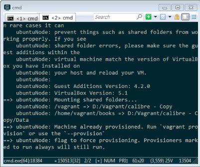
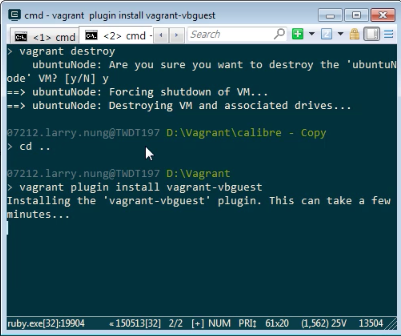
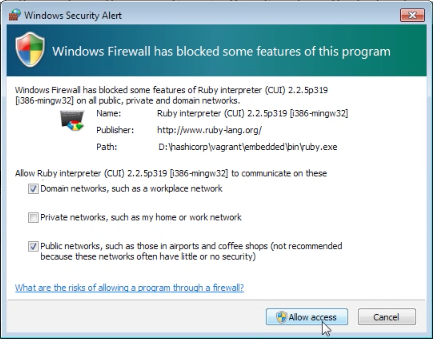
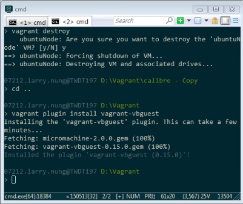
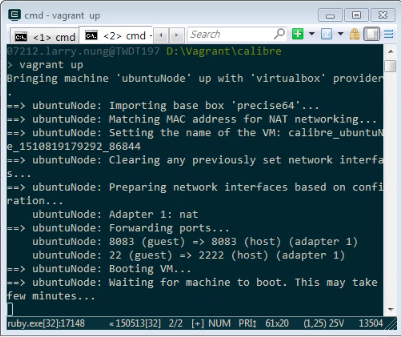

OS Kernal 更新，可能會造成 Vagrant 無法正常使用，像是筆者切換了不同 Domain 的 AD帳號後，嘗試使用 Vagrant 就會出錯。  

<!-- More -->

 
 

這時我們可以嘗試重新安裝 VirtualBox Guest Additions。  

    vagrant plugin install vagrant-vbguest

 
 

 
 

 
 

重新安裝完 Vagrant 就可以正常使用了。  

 
 
