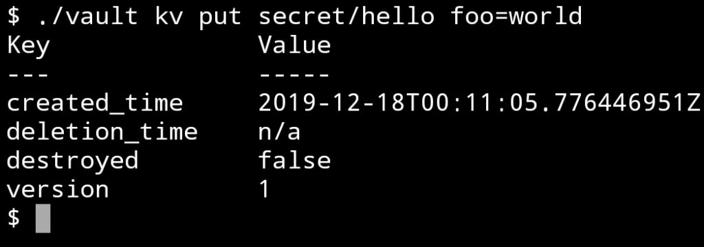
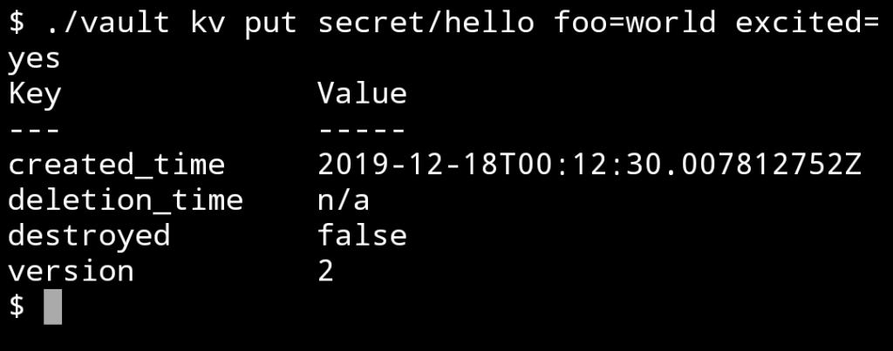
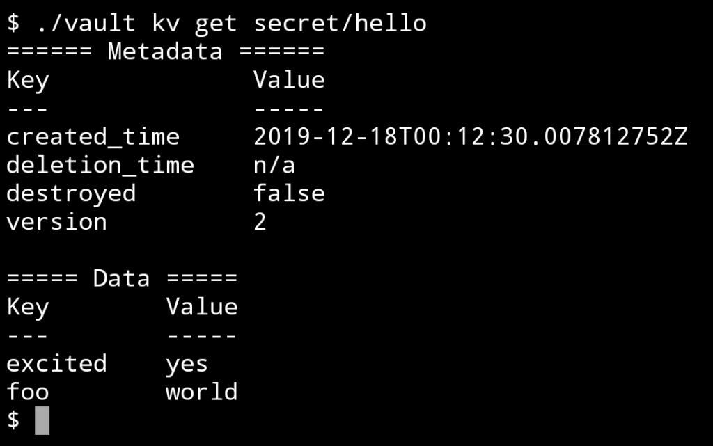
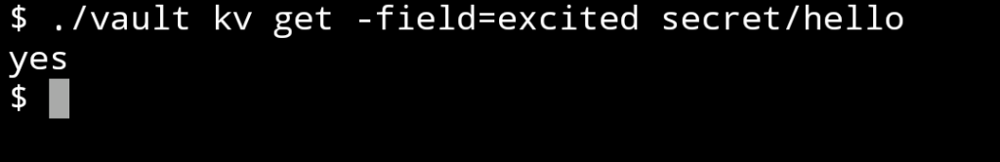
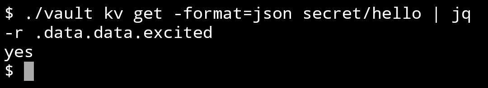
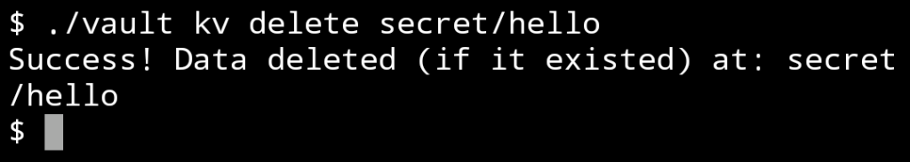
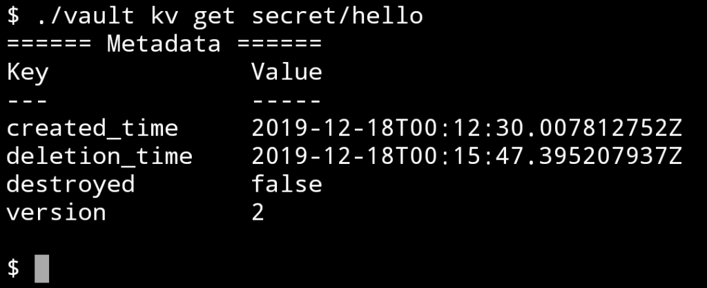

Vault server 起動後，實際做些資料的操作看看。  

<!-- More -->

 

透過 vault kv put 可將資料存放到指定的 kv store。  

    vault kv put secret/hello foo=world

 

支援存放多筆資料。  

    vault kv put secret/hello foo=world excited=yes

 

放入 kv store 的資料可用 vault kv get 查看。

    vault kv get secret/hello

 

若要查詢特定值可加帶 -field 參數指定。

    vault kv get -field=excited secret/hello

 

也可加帶 -format 參數指定輸出格式做些進階處理。  

    vault kv get -format=json secret/hello | jq -r .data.data.excited

 

資料不要時可透過 vault kv delete 自 kv store 移除。  

    vault kv delete secret/hello

 

    vault kv get secret/hello

 

Link
====
* [Your First Secret](https://learn.hashicorp.com/vault/getting-started/first-secret)
