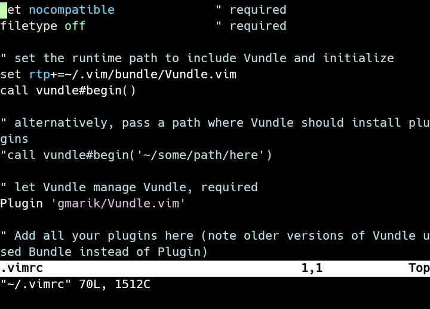
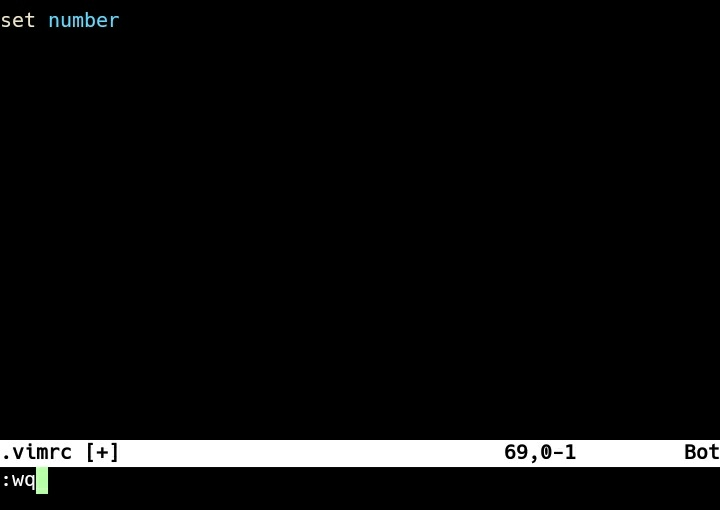
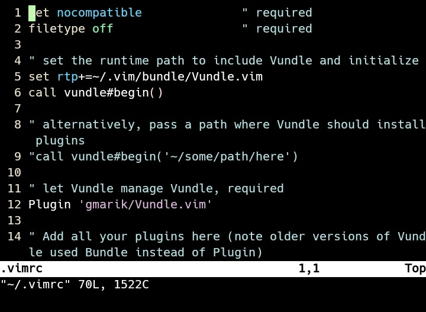
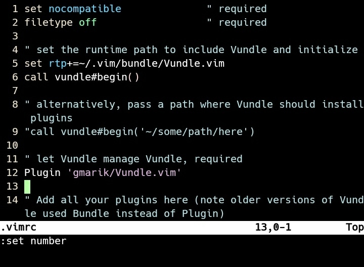
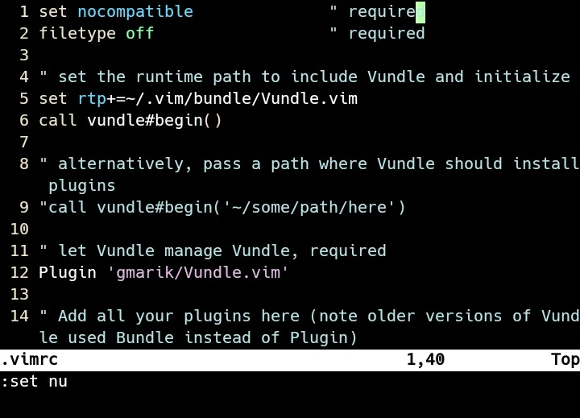
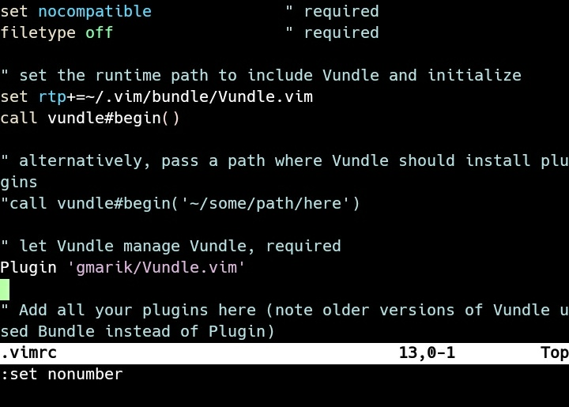
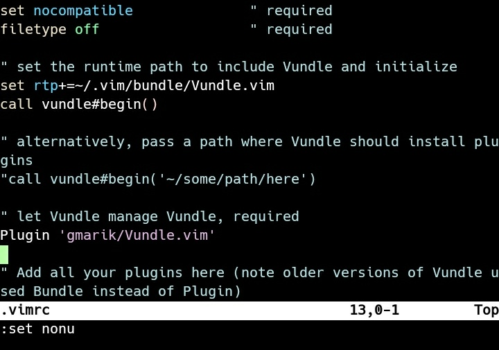

Vim 預設 Line number 是關閉的。   

<!-- more -->

 

如有需要將開啟 Vim 的設定檔。  

    vi ~/.vimrc

 

在設定檔內加上設定開啟 Line number。  

    set number

 

再次進入 Vim 就會看到 Line number 已被開啟。  

 

如果只是暫時要開關 Line number，可以不用修改到設定檔。    

 

可以直接輸入命令暫時開啟。  

    set number

 

    set nu

 

或是直接輸入命令暫時關閉。  

    set nonumber

 

    set nonu

 

Link
----
* [Display line numbers](http://vim.wikia.com/wiki/Display_line_numbers)
