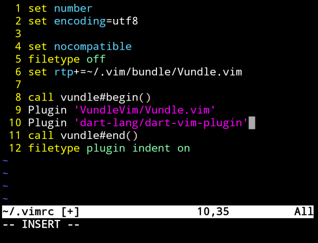
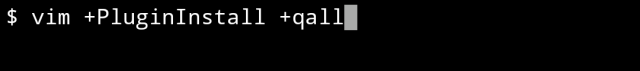
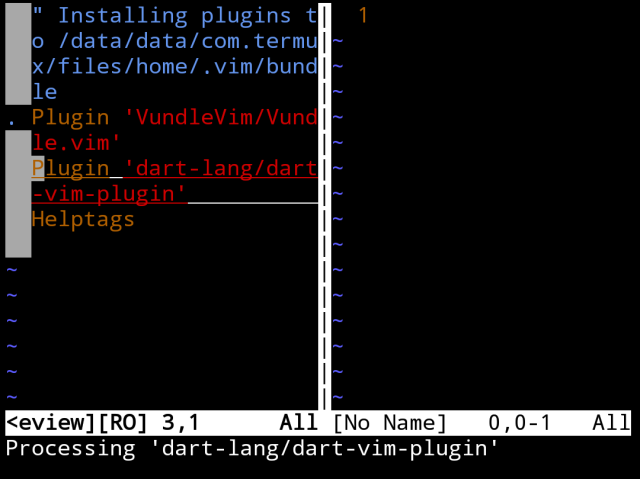
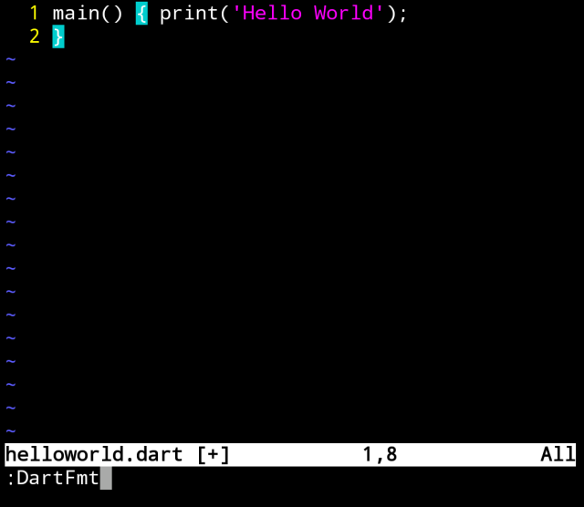
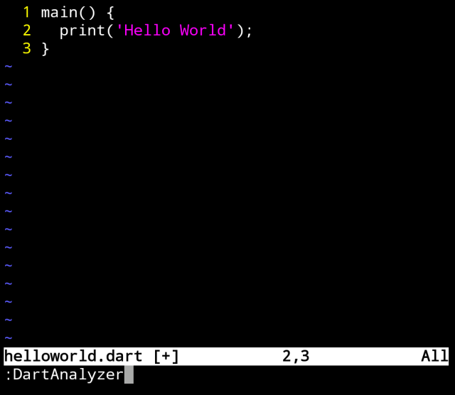
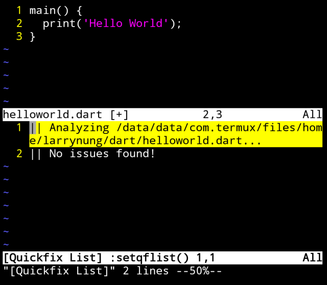

使用 Vim 撰寫 Dart，可透過 Vundle 安裝 dart-vim-plugin 套件。  

<!-- More -->

</br>


開啟 ~/.vimrc 檔。  

    vim ~/.vimrc

</br>


設定 Vundle 與 dart-vim-plugin。  

```
...
set nocompatible
filetype off                               
set rtp+=~/.vim/bundle/Vundle.vim

call vundle#begin()
Plugin 'VundleVim/Vundle.vim'
Plugin 'dart-lang/dart-vim-plugin'
call vundle#end()
filetype plugin indent on
...
```



</br>


然後調用命令進行 Vim plugin 的安裝。  

    vim +PluginInstall +qall



</br>




</br>


安裝好後 Dart 程式碼會支援 Highlight。  

</br>


也支援排版的功能。  

    :DartFmt



</br>


</br>


甚至是程式碼的分析。  

    :DartAnalyzer



</br>



