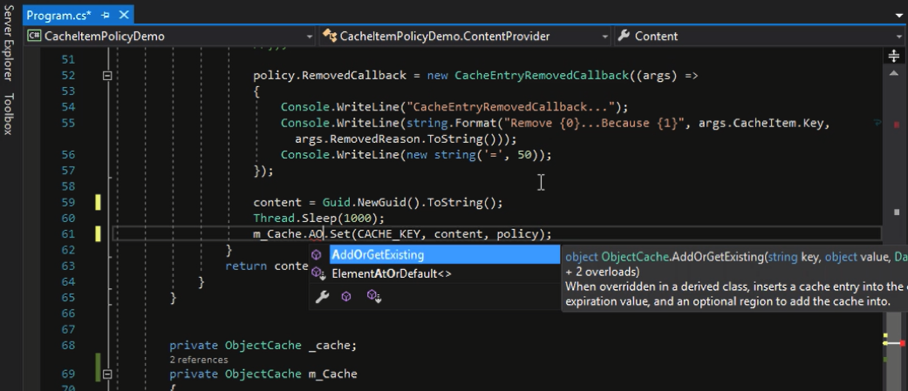

Visual Studio 2017 以前在使用 IntelliSense 時，有時我們會搞不清楚出來的成員是因為匹配到什麼才會顯示出來。  

<!-- More -->

 

Visual Studio 2017 以後支援 Match highlighting，當使用 IntelliSense 時匹配到的字元會被 Highlight，可以清楚知道為什麼 IntelliSense 會將該成員列出。  

