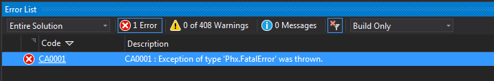
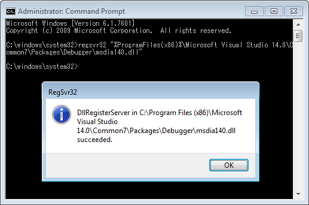

如果 Visual Studio 出現 "Exception of type 'Phx.FatalError' was thrown" 這樣的錯誤。  

<!-- More -->

 

可以重新註冊 dll 來修復這問題，不同版本的 Visual Studio 需要註冊不同的 dll。    

|Visaul Studio|Command|
|:-----------:|:------|
|Visual Studio 2010|regsvr32 "%ProgramFiles(x86)%\Microsoft Visual Studio 10.0\Common7\Packages\Debugger\msdia100.dll"|
|Visual Studio 2012|regsvr32 "%ProgramFiles(x86)%\Microsoft Visual Studio 11.0\Common7\Packages\Debugger\msdia110.dll"|
|Visual Studio 2013|regsvr32 "%ProgramFiles(x86)%\Microsoft Visual Studio 12.0\Common7\Packages\Debugger\msdia120.dll"|
|Visual Studio 2015|regsvr32 "%ProgramFiles(x86)%\Microsoft Visual Studio 14.0\Common7\Packages\Debugger\msdia140.dll"|

 

像是筆者出問題的是 Visual Studio 2015，所以要像下面這樣註冊。  

 

註冊完問題就排除了。  

 

Link
----
* [Error in FxCop Phoenix analysis engine - Stack Overflow](http://stackoverflow.com/questions/30490358/error-in-fxcop-phoenix-analysis-engine)
* [FxCop error CA0001 on build server – Altug Sahin's Blog](https://altugsahin.me/2011/11/18/fxcop-error-ca0001-on-build-server/)
