VisualCV 能將 LinkedIn Profile 匯入套用模版變成漂亮的個人化履歷。  

<!-- More -->

 

使用時可按下首頁的 Import from LinkedIn 按鈕。  

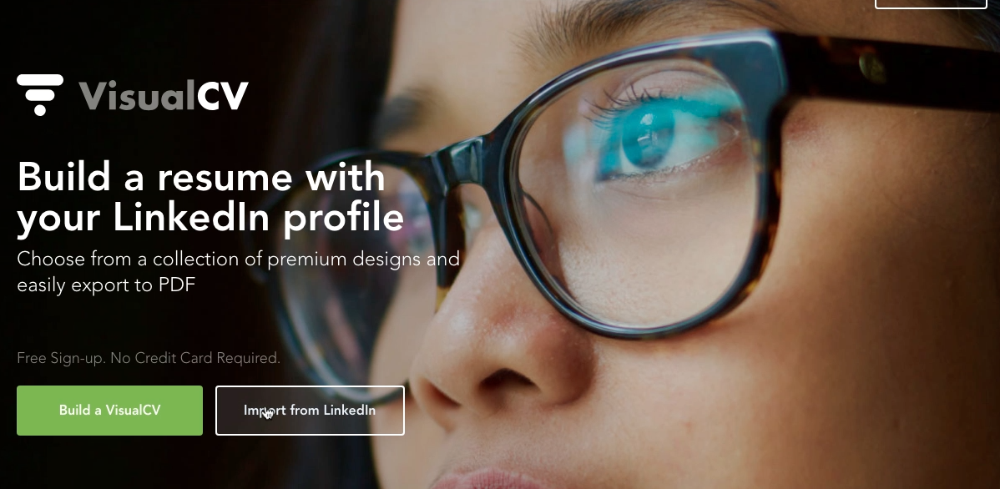
 
 

登入 VisualCV。  

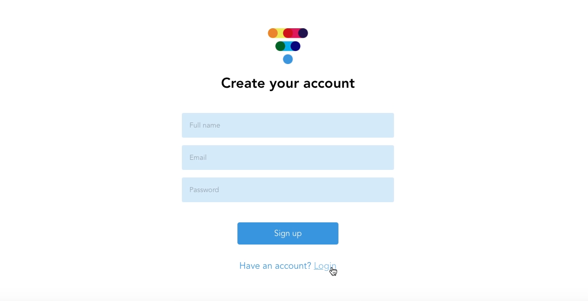
 
 

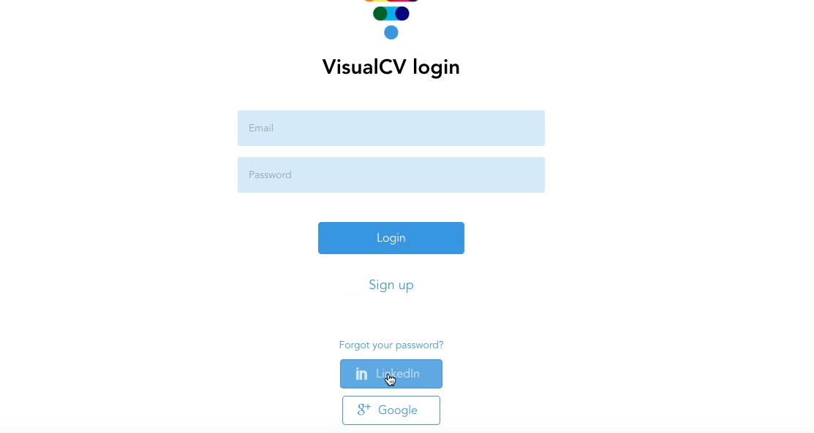
 
 

然後就可以開始進行履歷的編輯。  

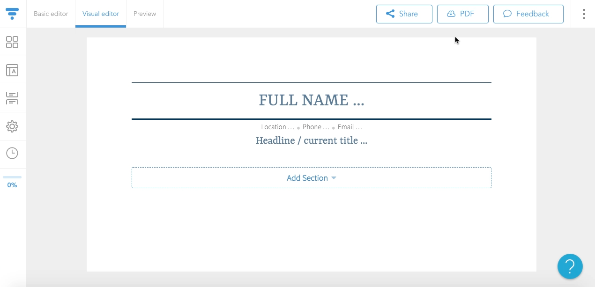
 
 

如果有在使用 LinkedIn，這邊可以回到 Dashboard。  

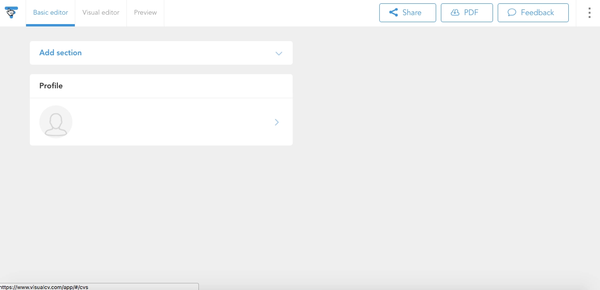
 
 

按下 + New 按鈕。  

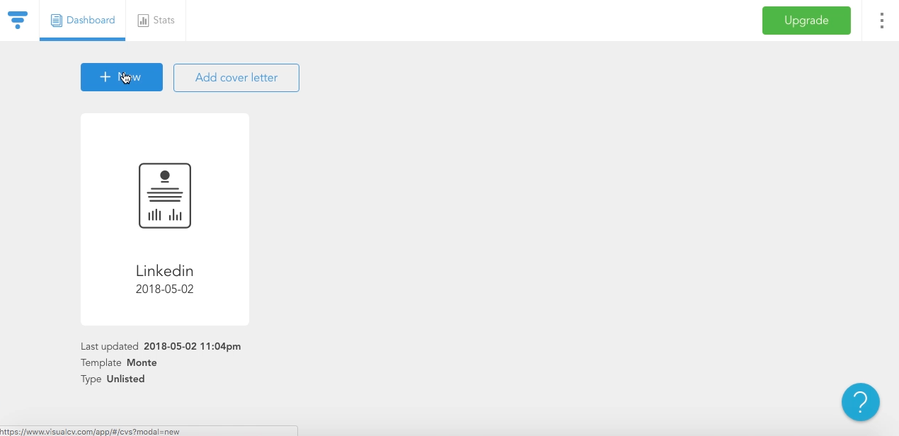
 
 

點選 Import resume/CV 按鈕。  

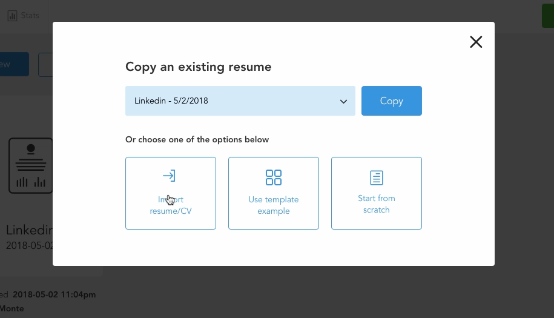
 
 

選取匯入從 LinkedIn 匯出的 Profile。  

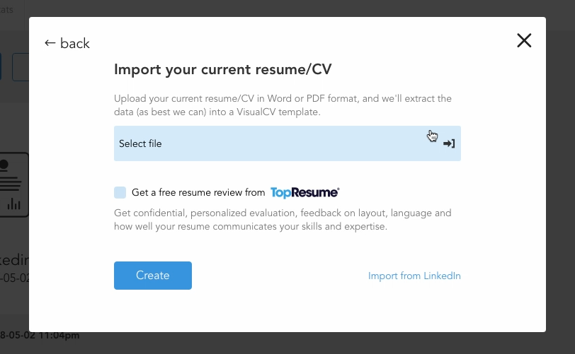
 
 

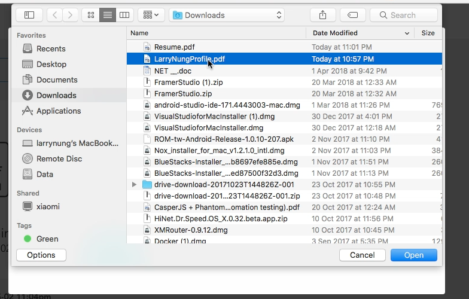
 
 

 
 

選取要套用的範本。  

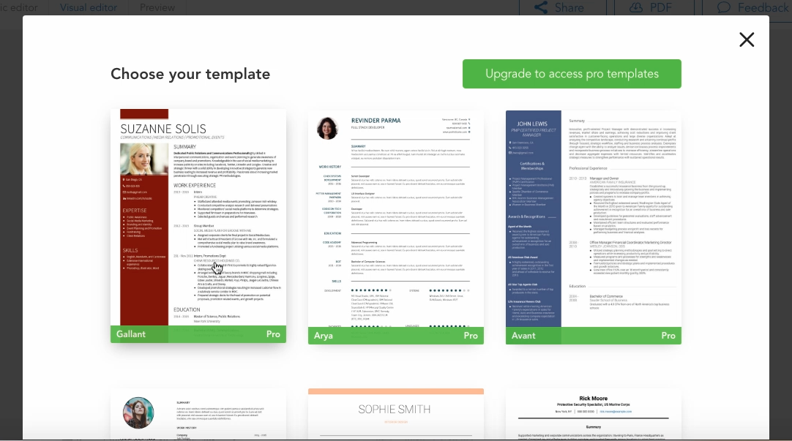
 
 

即會看到 VisualCV 幫我們產生好的 Resume，點選上方的 PDF 按鈕即可下載來使用。   

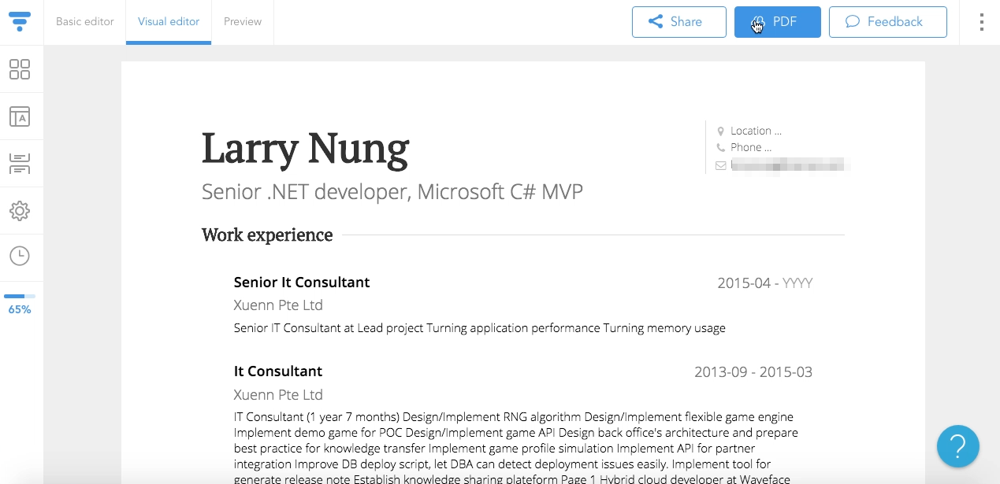
 
 

Link
----
* [Online CV Builder and Professional Resume CV Maker - VisualCV](https://www.visualcv.com/)
