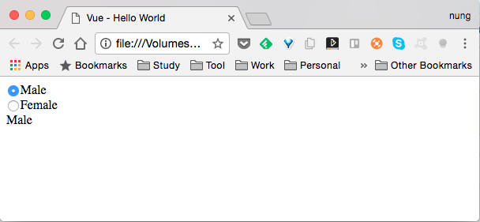
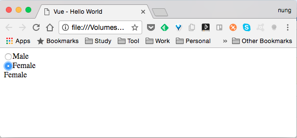

Radio 的繫結一樣是在 Vue 建立時連帶設定要用來繫結的屬性，然後在 Radio 元素這邊透過 value 指定被選取的值，並用 v-model 指定所要繫結的屬性，設定完後資料屬性與控制項之間即會連動。

<!-- More -->

<br/>


像是下面這樣的程式：

```html
<!DOCTYPE html>
<html>
<head>
  <title>Vue - Hello World</title>
  <script src="https://unpkg.com/vue/dist/vue.js"></script>
</head>
<body>
  <div id="app">
    <input type="radio" value="Male" v-model="sex">Male<br/>
    <input type="radio" value="Female" v-model="sex">Female<br/>
    {{ sex }}
  </div>

  <script>
    new Vue({
      el: '#app',
      data:{
        sex: "Male"
      }      
    })
  </script>
</body>
</html>
```

<br/>


其運行結果如下：  



<br/>




<br/>
