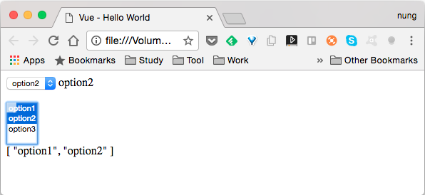

Select 的繫結一樣是在 Vue 建立時連帶設定要用來繫結的屬性，然後在 Select 元素這邊透過 value 指定被選取的值，並用 v-model 指定所要繫結的屬性，設定完後資料屬性與控制項之間即會連動。  

<!-- More -->

<br/>


如果要支援多選，只要在 Select 元素上加上 multiple，並用陣列去設定繫結用的 Vue 屬性即可。  

<br/>


像是下面這樣的程式：  

```html
<!DOCTYPE html>
<html>
<head>
  <title>Vue - Hello World</title>
  <script src="https://unpkg.com/vue/dist/vue.js"></script>
</head>
<body>
  <div id="app">
    <select v-model="option">
      <option>option1</option>
      <option>option2</option>
      <option>option3</option>
    </select>
    {{ option }}
    <br/><br/>

    <select v-model="options" multiple>
      <option>option1</option>
      <option>option2</option>
      <option>option3</option>
    </select>
    <br/>
    {{ options }}
  </div>

  <script>
    new Vue({
      el: '#app',
      data:{
        option: "option1",
        options: []
      }      
    })
  </script>
</body>
</html>
```

<br/>


運行起來就會像下面這樣：  



<br/>
