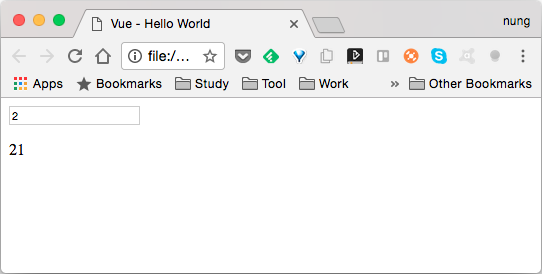
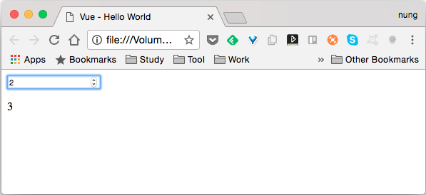

Vue.js 的 .number modifier 可以讓繫結的屬性值轉換成數值型態。  

<!-- More -->

<br/>


以下面這段程式為例，若不使用 .number modifer，輸入的資料會被視為字串，如果要拿繫結的屬性值去做數值的處理就會不如我們的預期。  

```html
<!DOCTYPE html>
<html>
<head>
  <title>Vue - Hello World</title>
  <script src="https://unpkg.com/vue/dist/vue.js"></script>
</head>
<body>
  <div id="app">
    <input v-model="value" type="number">
    <p>{{value + 1}}</p>
  </div>
  <script>
    new Vue({
      el: '#app',
      data:{
        value: 0
      }      
    })
  </script>
</body>
</html>
```

<br/>
  



<br/>


這時候需要使用 .number modifier 來解決這樣的問題，將繫結的屬性值轉換成數值型態，後續的數值處理才會正常。  

```html
<!DOCTYPE html>
<html>
<head>
  <title>Vue - Hello World</title>
  <script src="https://unpkg.com/vue/dist/vue.js"></script>
</head>
<body>
  <div id="app">
    <input v-model.number="value" type="number">
    <p>{{value + 1}}</p>
  </div>
  <script>
    new Vue({
      el: '#app',
      data:{
        value: 0
      }      
    })
  </script>
</body>
</html>
```

<br/>




<br/>
