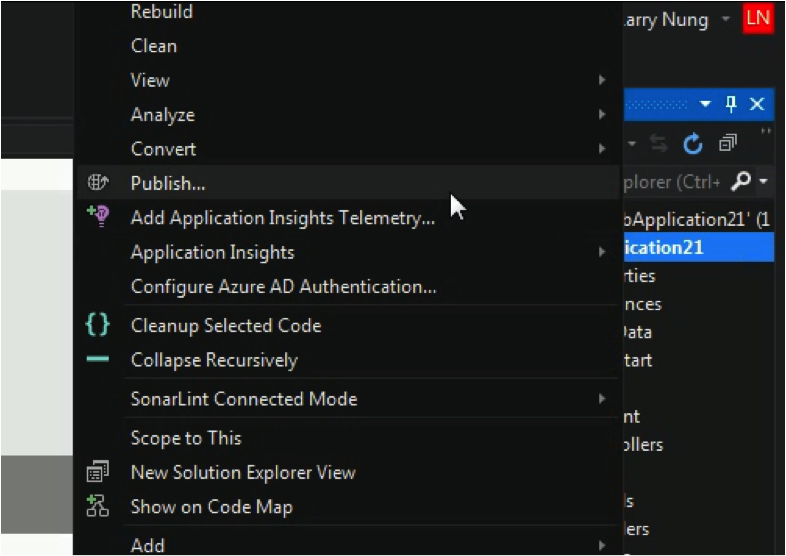
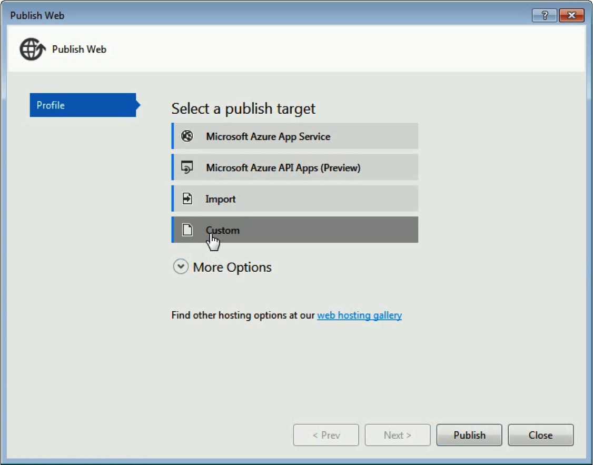
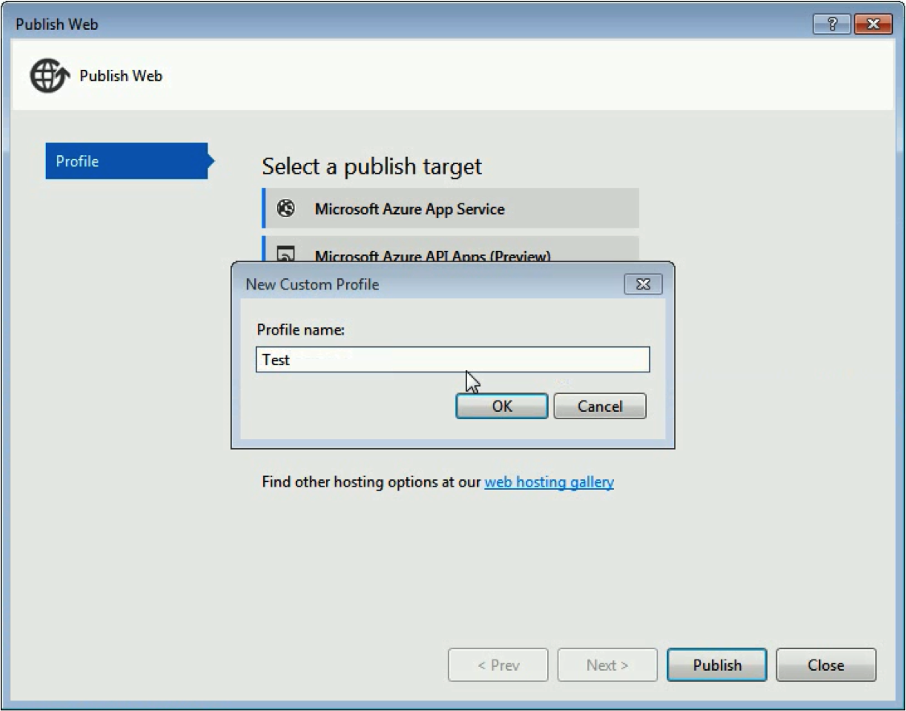
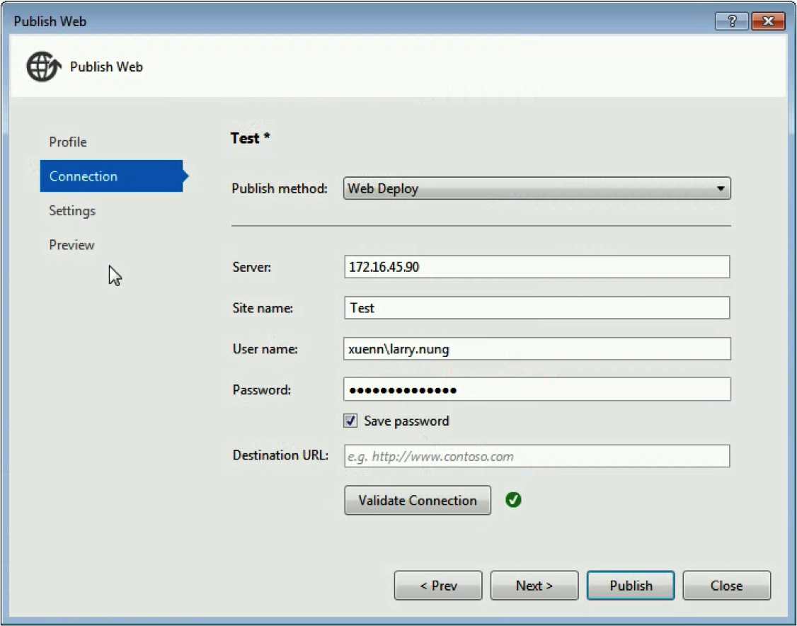
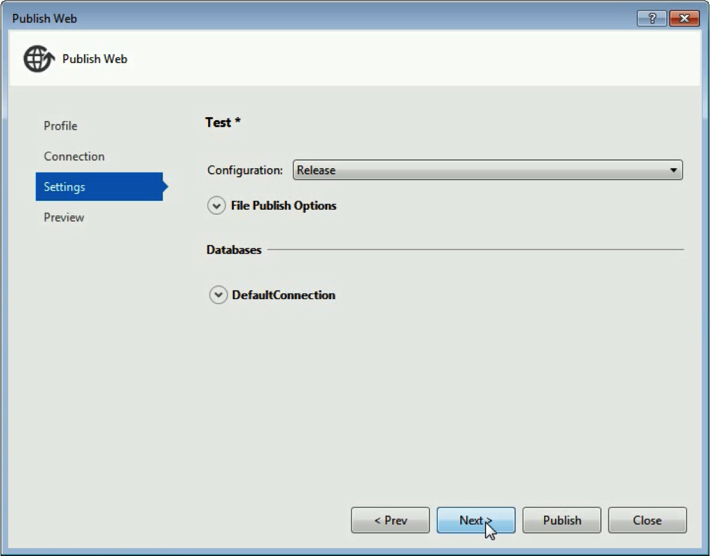
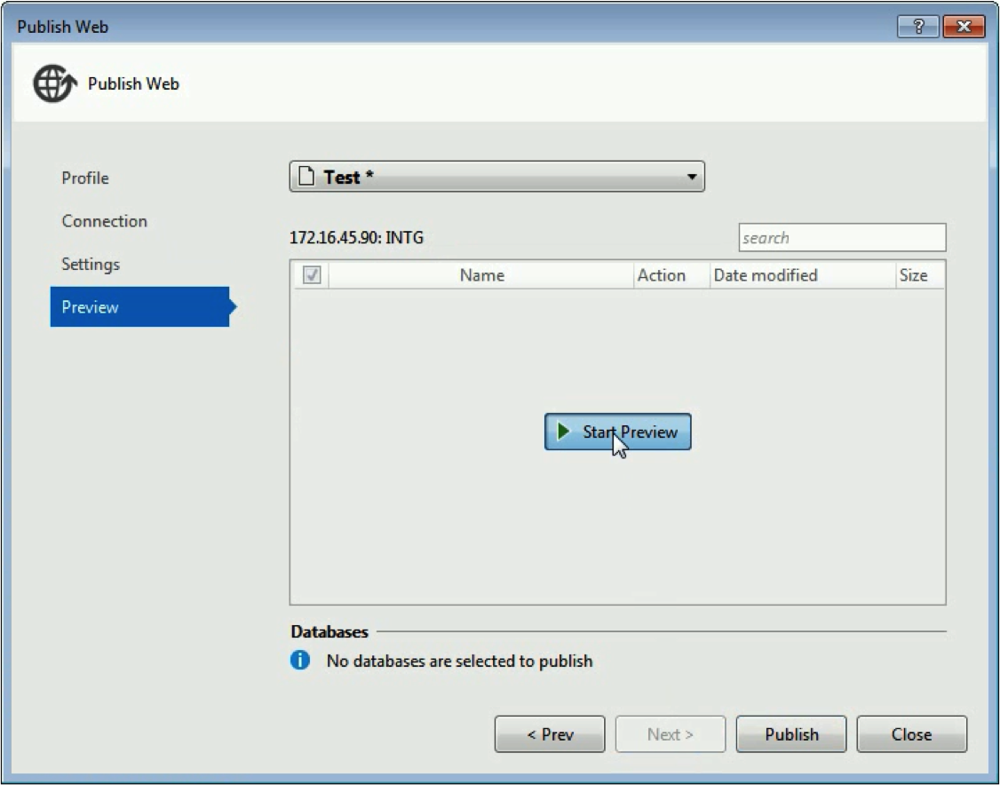
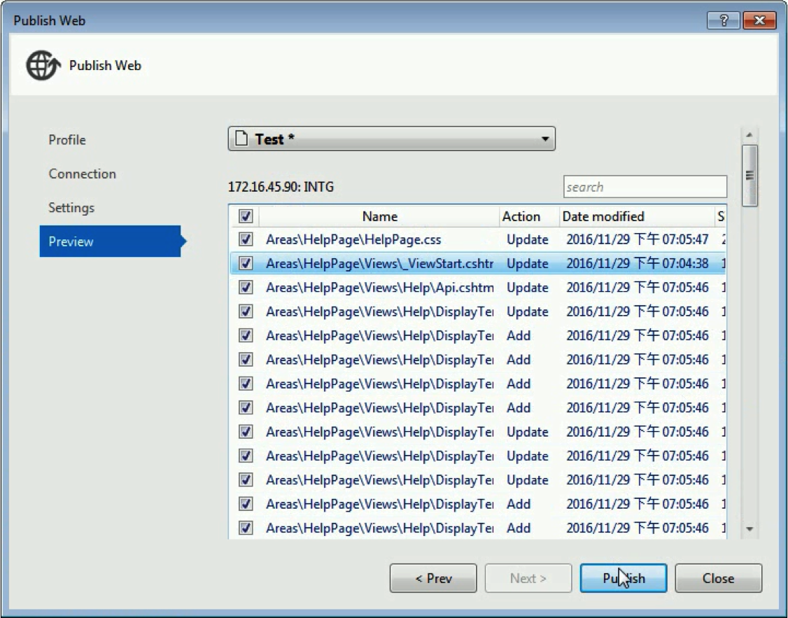
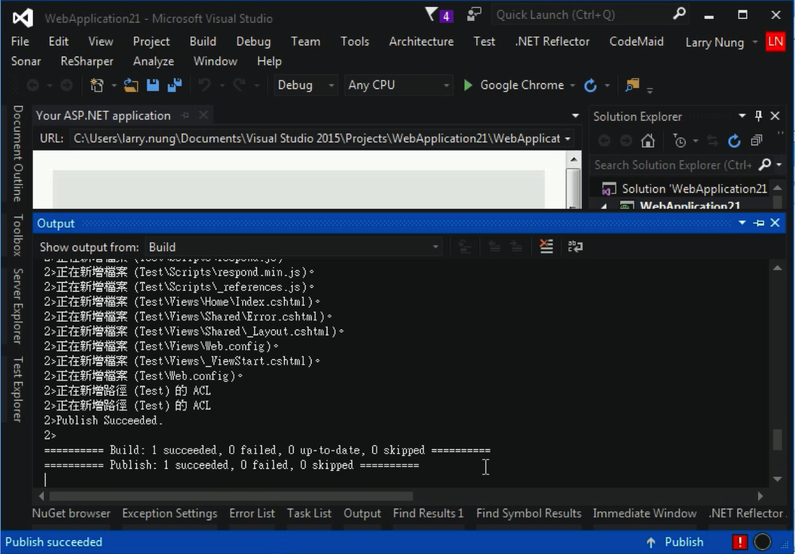

要直接用 Visual Studio 使用 Web Deploy 去做佈署，首先在方案總管的專案上按下滑鼠右鍵，點選 `Publish...` 滑鼠右鍵選單選項。  

<!-- More -->

 

在 Publish Web 視窗中選取 Cuetom Profile。  

 

設定 Profile 的名稱。  

 

接著 Publish method 選定 Web Deploy，設定要佈署的 Server 及帳號資訊。  

 

再來選定要建置的 Configuration。  

 

若想在發佈前查看一下會做哪些更動，可透過預覽的功能查看。  

 

 

沒問題就可以進行發佈的動作。  

 
