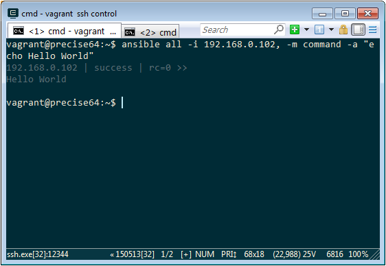
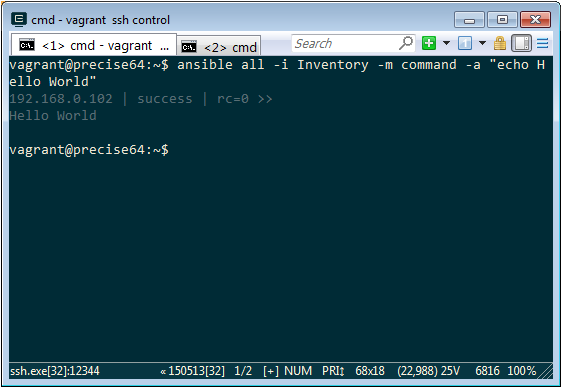
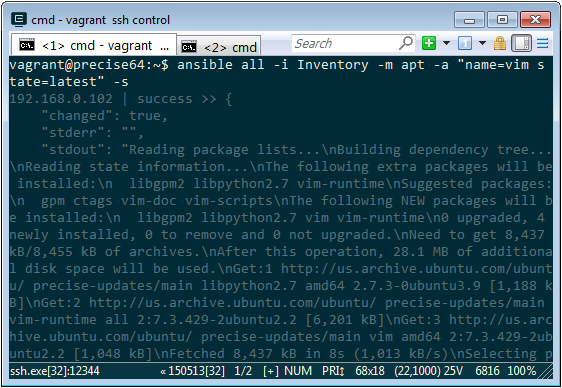

Ansible 安裝完且 SSH 環境準備好後就可以開始使用 Ansible CLI 去使用 Ansible。  

<!-- More -->

 

Ansible CLI 的使用方式如下：  

    Usage: ansible <host-pattern> [options]
    
    Options:
      -a MODULE_ARGS, --args=MODULE_ARGS
                            module arguments
      -k, --ask-pass        ask for SSH password
      -K, --ask-sudo-pass   ask for sudo password
      -B SECONDS, --background=SECONDS
                            run asynchronously, failing after X seconds
                            (default=N/A)
      -C, --check           don't make any changes; instead, try to predict some
                            of the changes that may occur
      -c CONNECTION, --connection=CONNECTION
                            connection type to use (default=smart)
      -f FORKS, --forks=FORKS
                            specify number of parallel processes to use
                            (default=5)
      -h, --help            show this help message and exit
      -i INVENTORY, --inventory-file=INVENTORY
                            specify inventory host file
                            (default=/etc/ansible/hosts)
      -l SUBSET, --limit=SUBSET
                            further limit selected hosts to an additional pattern
      --list-hosts          outputs a list of matching hosts; does not execute
                            anything else
      -m MODULE_NAME, --module-name=MODULE_NAME
                            module name to execute (default=command)
      -M MODULE_PATH, --module-path=MODULE_PATH
                            specify path(s) to module library
                            (default=/usr/share/ansible)
      -o, --one-line        condense output
      -P POLL_INTERVAL, --poll=POLL_INTERVAL
                            set the poll interval if using -B (default=15)
      --private-key=PRIVATE_KEY_FILE
                            use this file to authenticate the connection
    
      -s, --sudo            run operations with sudo (nopasswd)
      -U SUDO_USER, --sudo-user=SUDO_USER
                            desired sudo user (default=root)
      -T TIMEOUT, --timeout=TIMEOUT
                            override the SSH timeout in seconds (default=10)
      -t TREE, --tree=TREE  log output to this directory
      -u REMOTE_USER, --user=REMOTE_USER
                            connect as this user (default=vagrant)
      -v, --verbose         verbose mode (-vvv for more, -vvvv to enable
    
                            connection debugging)
      --version             show program's version number and exit

 

比較常用的參數有 -i、-m、-a、-s，-i 用來指定 inventory file 或是管理機的位置，-m 用來指定要使用的模組，-a 用來指定模組所需要的參數，-s 用來指定需要用 sudo 運行。  

 

像是用 IP 指定電腦去運行指定模組的動作，可以像這樣調用。  

    ansible <Group> -i <IP>, -m <Module> -a "<ModuleOptions>"
	  

 

要用 Inventory file 指定電腦去運行指定模組的動作，可以像這樣調用。  

    ansible <Group> -i <InventoryFile>, -m <Module> -a "<ModuleOptions>"

 

可加上 -s 指定使用 sudo 運行。  

    ansible <Group> -i <InventoryFile>, -m <Module> -a "<ModuleOptions>" -s

 	  
