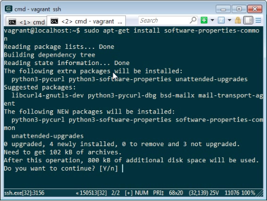
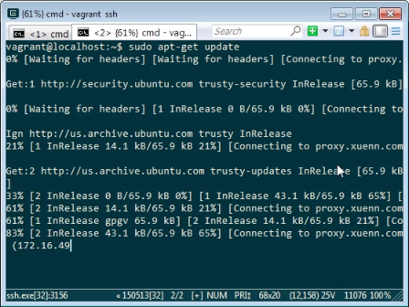
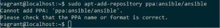
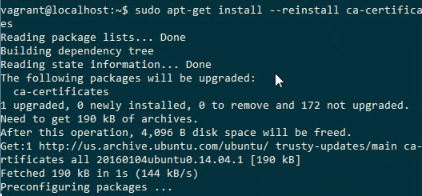
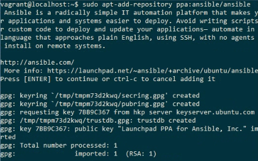
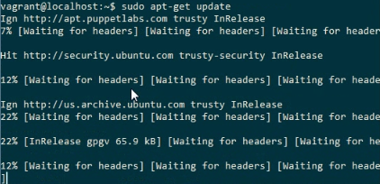
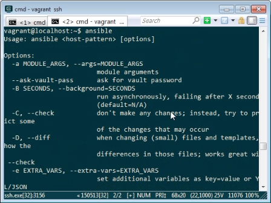

要在 Ubuntu 下使用 apt 安裝 Ansible。

可先用 apt-get 安裝 software-properties-common。

sudo apt-get install software-properties-common

然後進行 apt-get 的更新，避免後面的 apt-add-repository 命令找不到。

sudo apt-get update

接著用 apt-add-repository 新增套件庫。

sudo apt-add-repository ppa:ansible/ansible

套件庫新增時可能會出現 Cannot add PPA: 'ppa:ansible/ansible'. Please check the PPA name or format is correct. 錯誤。

可以運行下列命令。

sudo apt-get install --reinstall ca-certificates

再次調用 apt-add-repository 新增套件庫。

套件庫加完後再次運行 apt-get 更新。

sudo apt-get update

就可以用 apt-get 安裝 ansible 了。

sudo apt-get install ansible

安裝完後最後輸入 ansible 確認安裝無誤。

Link
----
* [Installation — Ansible Documentation](http://docs.ansible.com/ansible/intro_installation.html)
* [Cannot add PPA. Please check that the PPA name or format is correct - Ask Ubuntu](https://askubuntu.com/questions/429803/cannot-add-ppa-please-check-that-the-ppa-name-or-format-is-correct)