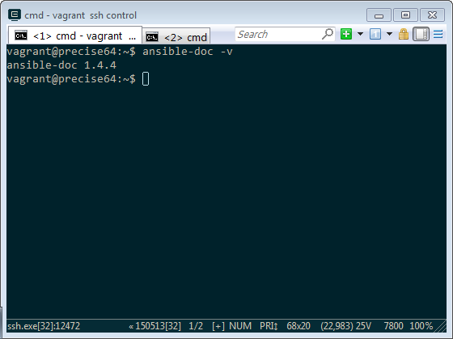
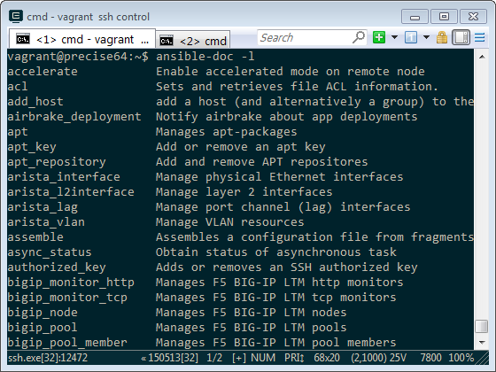
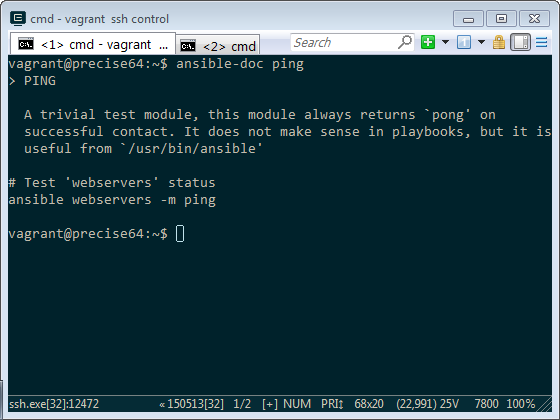
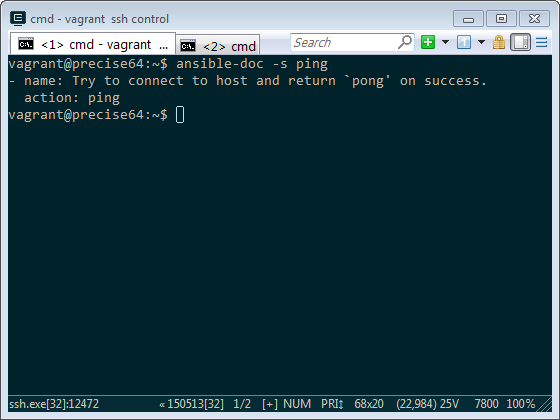

Ansible 有許多模組，每麼模組有不同的用途、不同的參數、不同的使用方式，要查閱模組的使用方式除了透過網路查詢外，也可以用 ansible-doc 離線查詢。  

<!-- More -->

 

ansible-doc 的使用方式如下：  

    Usage: ansible-doc [options] [module...]
    
    Options:  
      -h, --help            show this help message and exit
      -l, --list            List available modules
      -M MODULE_PATH, --module-path=MODULE_PATH
                            specify path(s) to module library
                            (default=['./library/'])
      -s, --snippet         Show playbook snippet for specified module(s)
      -v, --verbose         verbose mode (-vvv for more, -vvvv to enable
                            connection debugging)
      --version             show program's version number and exit

 
	  

要查詢上面顯示的使用方式可以直接輸入 ansible-doc，或是帶入 -h，抑或是帶入 --help 參數。  

    ansible-doc
	ansible-doc -h
    ansible-doc --help
	
 	
	

要查閱 ansible-doc 的版本，可使用 -v 或是 --version 參數。  
	
    ansible-doc -v
	ansible-doc --version

 

要查詢所有可用的模組，可使用 -l 或是 --list 參數。  

    ansible-doc -l
	ansible-doc --list

 

要查詢指定模組在 AD-Hoc 模式下的使用方式，可用 ansible-doc 帶入指定的模組名稱。  

    ansible-doc [ModuleName]

 

要查詢指定模組在 Playbook 下的使用方式，可用 ansible-doc 帶入指定的模組名稱。  

    ansible-doc -s [ModuleName]
	ansible-doc --snippet [ModuleName]
	

 

Link
----
* [Offline docs with ansible-doc](https://ansibledaily.com/offline-docs-with-ansible-doc/)
