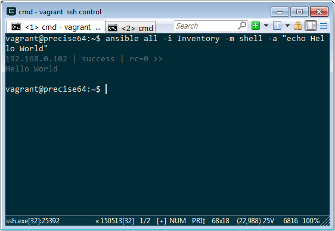
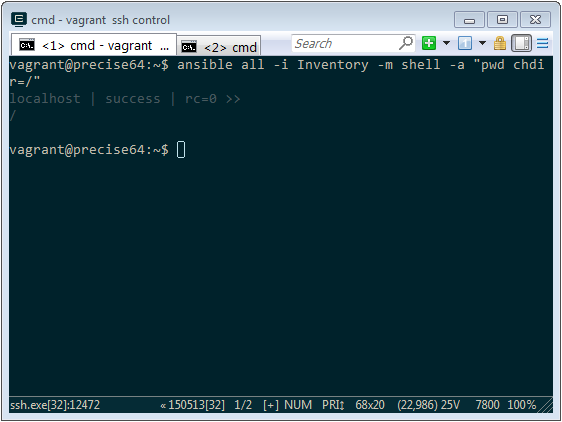
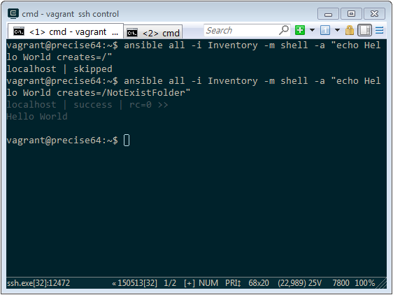
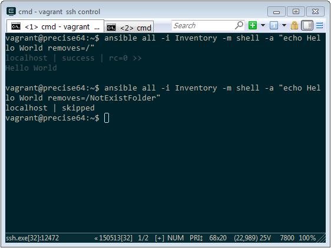

Ansible 的 Shell module 可以用來執行命令。

可用的參數如下：

| parameter | required | default | choices | comments |
|:-------------:|:-------------:|:-------------:|:-------------:|:-------------:|
| chdir | no | | | cd into this directory before running the command |
| creates | no | | | a filename, when it already exists, this step will not be run. |
| executable | no | | | change the shell used to execute the command. Should be an absolute path to the executable. |
| free_form | yes | | | The shell module takes a free form command to run, as a string. There's not an actual option named "free form". See the examples! |
| removes | no | | | a filename, when it does not exist, this step will not be run. |
| warn | no | True | | if command warnings are on in ansible.cfg, do not warn about this particular line if set to no/false. |

以 Ad-Hoc 模式為例...

要讓指定電腦運行指定的命令，可以直接用 -m 指定使用 Shell module，並用 -a 指定命令。

ansible  -i , -m Shell -a ""
ansible  -i  -m Shell -a ""

要先切換至指定工作目錄再執行命令，可加帶 chdir 參數指定要切換至的工作目錄。

要在指定的目錄或檔案存在的時才運行指定的命令，可加帶 creates 參數指定目錄或檔案。

ansible  -i , -m Shell -a " creates="
ansible  -i  -m Shell -a " creates="

要在指定的目錄或檔案不存在時才運行指定的命令，可加帶 removes 參數指定目錄或檔案。

ansible  -i , -m Shell -a " removes="
ansible  -i  -m Shell -a " removes="

Link
----
* [shell - Execute commands in nodes. — Ansible Documentation](http://docs.ansible.com/ansible/shell_module.html)