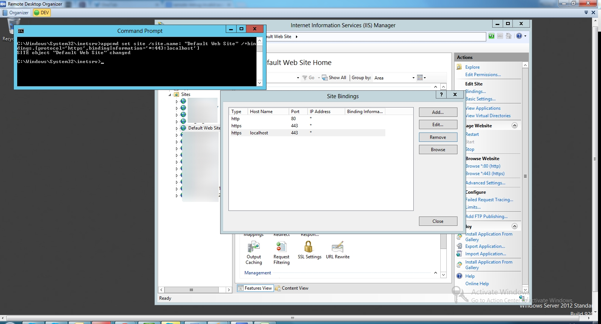

要使用 appcmd 設定站台的 Binding，可以使用 appcmd set site，使用 /site.name 指定要綁定的站台名稱，用 /+bindings 指定 Binding 的資訊，像是 Protocol、IP、Port、與 Host 名稱。  

<!-- More -->

    appcmd set site /site.name: "${SiteName}" /+bindings.[protocol='${Protocol}',bindingInformation='${IP}:${Port}:${HostName}']

 

像是要幫 Default Web Site 綁定本地用的 SSL，就可以像下面這樣輸入命令。    

    appcmd set site /site.name: "Default Web Site" /+bindings.[protocol='https',bindingInformation='*:443:localhost']

 

命令運行後站台的 Binding 就做完了。  

 

Link
----
* [Setting Host name on SSL Binding on IIS7](https://sarafianalex.wordpress.com/2010/08/04/setting-host-name-on-ssl-binding-on-iis7/)
