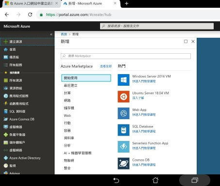
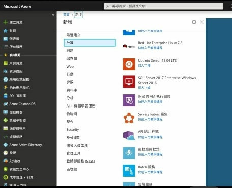
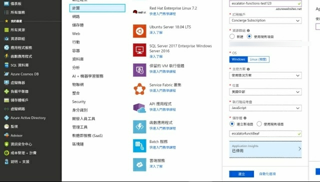
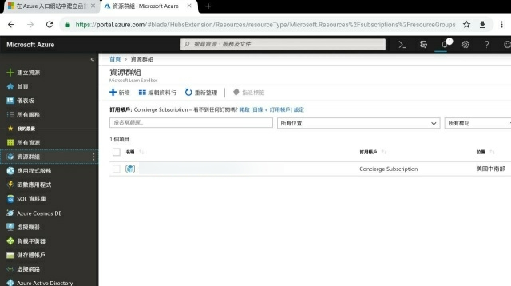
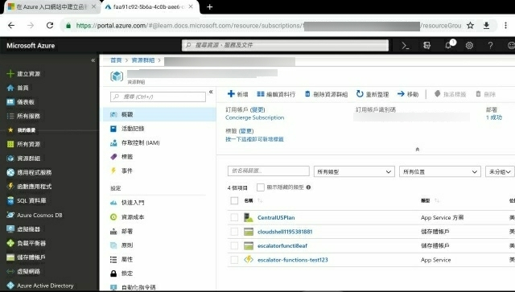

使用 Azure portal 建立函數應用程式，要先選取建立資源。  

<!-- More -->

 

在計算資源這邊找到函數應用程式。  

 

輸入資源的名稱、資源群組、作業系統、主機位置、儲存體等資訊後按下建立按鈕。  

 

建立完成後，所建立的函數應用程式可在資源群組中查閱。  

 

 

Link
----
* [Create a function app from the Azure portal](https://docs.microsoft.com/en-us/azure/azure-functions/functions-create-function-app-portal)
