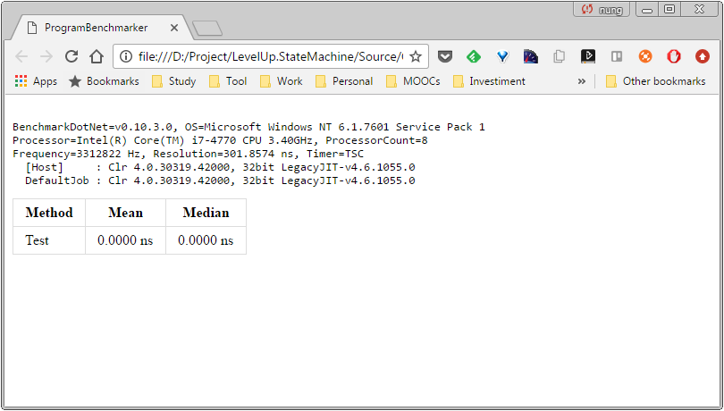
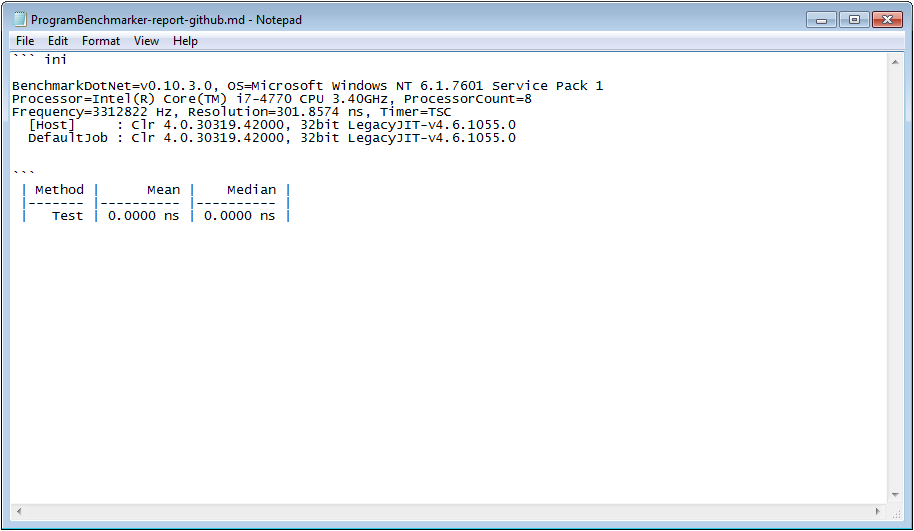
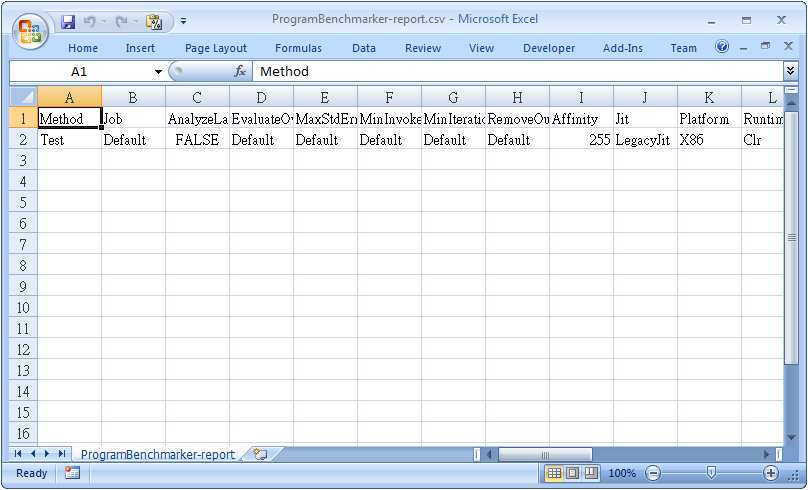
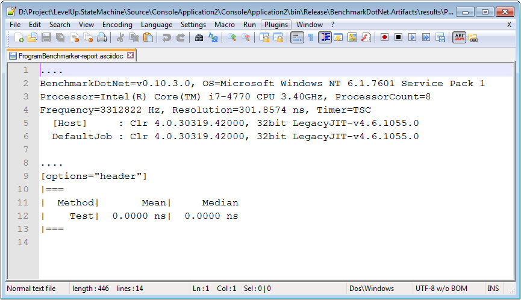
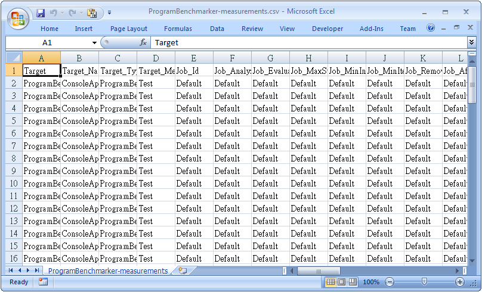
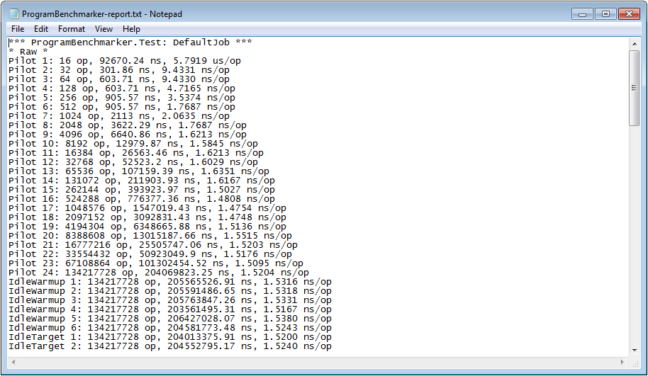
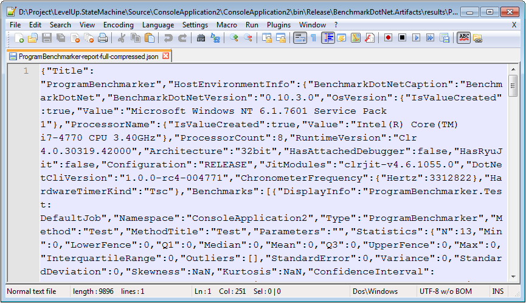

Exporter 會將 benchmark 的結果輸出成不同的格式。

內建可使用的 Exporter 有：
- HtmlExporter
- CsvExporter
- MarkdownExporter
- AsciiDocExporter
- CsvMeasurementsExporter
- PlainExporter
- JsonExporter

使用上只要透過 Attribue 掛上 benchmark 類別即可：
```c#
using BenchmarkDotNet.Attributes.Exporters;
…
[AsciiDocExporter]
[CsvMeasurementsExporter]
[PlainExporter]
[JsonExporter]
public class ProgramBenchmarker {
…
}
```
或是透過 config 的方式設定也可以。
```c#
using BenchmarkDotNet.Configs;
using BenchmarkDotNet.Exporters;
using BenchmarkDotNet.Exporters.Csv;
using BenchmarkDotNet.Exporters.Json;
…
[Config(typeof(Config))]
public class ProgramBenchmarker {
private class Config : ManualConfig {
public Config() {
Add(AsciiDocExporter.Default);
Add(CsvMeasurementsExporter.Default);
Add(PlainExporter.Default);
Add(JsonExporter.Default);
}
}
…
}
```
預設輸出的檔案會被放置於 `.\BenchmarkDotNet.Artifacts
esults` 下°

HtmlExporter 的輸出會像這樣：



MarkdownExporter 的輸出會像這樣：



CsvExporter 的輸出會像這樣：



AsciiDocExporter 的輸出會像這樣：



CsvMeasurementsExporter 的輸出會像這樣：



PlainExporter 的輸出會像這樣：



JsonExporter 的輸出會像這樣：

