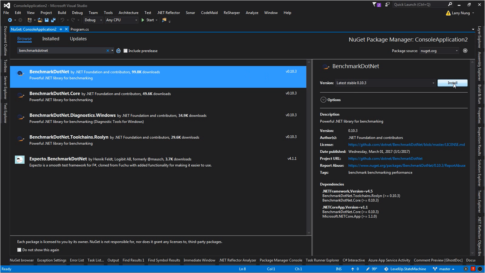
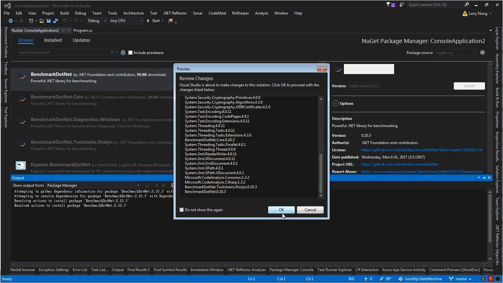
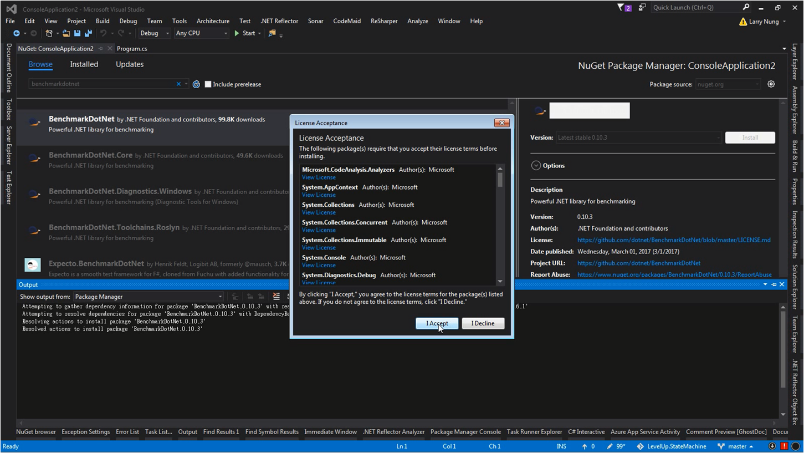
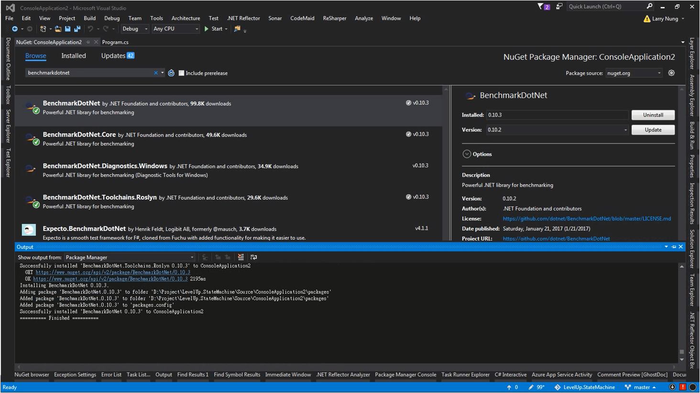
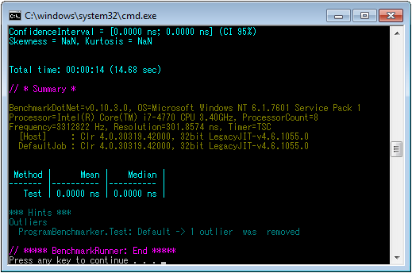

要使用 BenchmarkDotNet 去做 .NET 程式的 benchmark，可先透過 NuGet 安裝 BenchmarkDotNet 套件。  

<!-- More -->



<br/>




<br/>




<br/>




<br/>


套件安裝好後進行 benchmark 程式的撰寫，撰寫方式只要寫個 benchmark 的方法，方法內去叫用要測的方法，最後在方法上面加上 BenchmarkAttribute 即可。  

```c#
using BenchmarkDotNet.Attributes; 
…
  public class ProgramBenchmarker { 
    protected Program m_Program { get; set; } = new Program(); 
    [Benchmark] 
	public void Test() { 
      m_Program.Test(); 
    } 
  } 
…
```

<br/>


benchmark 程式寫好後撰寫 benchmark 運行的部份，只要透過 BenchmarkRunner.Run 帶入 benchmark 類別就可以了。  

```c#
using BenchmarkDotNet.Running; 
…
  public class Program { 
    static void Main(string[] args) { 
      var summary = BenchmarkRunner.Run<ProgramBenchmarker>(); 
    } 
    public void Test() {… } 
  } 
…
}
```

<br/>


完整的測試程式如下：

```c#
using BenchmarkDotNet.Attributes;
using BenchmarkDotNet.Running;

namespace ConsoleApplication2
{
    public class Program
    {
        static void Main(string[] args)
        {
            var summary = BenchmarkRunner.Run<ProgramBenchmarker>();
        }

        public void Test()
        {
        }
    }
    public class ProgramBenchmarker
    {
        protected Program m_Program { get; set; } = new Program();

        [Benchmark]
        public void Test()
        {
            m_Program.Test();
        }
    }
}
```

<br/>


運行結果如下：  



<br/>
