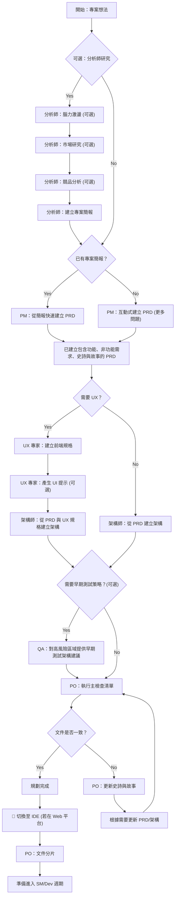
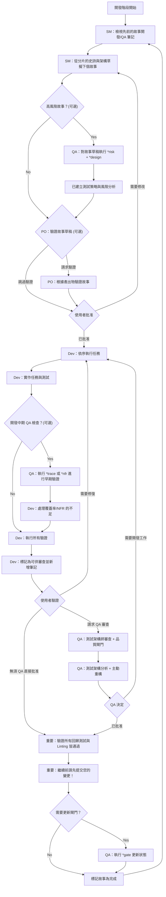

在軟體開發的複雜世界中，團隊時常面臨溝通不良、需求變更混亂、以及規劃與執行脫節的挑戰。為了解決這些痛點，一套名為 BMAD-METHOD 的結構化開發方法應運而生。它將整個開發過程標準化，從最初的專案構想到最終的產品交付，旨在提高效率、確保品質並降低溝通成本。

本文將帶您深入了解 BMAD-METHOD 的核心精神，拆解其兩大主要階段：規劃與執行。無論您是準備啟動一個全新的綠地 (Greenfield) 專案，或是想優化現有的棕地 (Brownfield) 專案，相信都能從中獲得啟發。

## 階段一：規劃工作流程 (Planning Workflow)

在敲下第一行程式碼之前，BMAD-METHOD 強調一個結構化的規劃流程。這個階段的目標是將一個初步的想法，轉化為一份完整且一致的規劃文件，包含產品需求文件 (PRD)、技術架構設計等，為後續的開發工作奠定穩固的基礎。為了達到最佳的成本效益，官方建議此階段可以在 Web UI 環境中完成，利用強大的 AI 代理 (Agent) 協同工作，產出更高品質的規劃成果。



從上圖可以看出，規劃階段涵蓋了從市場分析、需求定義、架構設計到最終一致性檢查的完整流程。每個角色（如分析師、產品經理、架構師）都有明確的職責，確保所有文件在進入開發前都經過充分的討論與審核。

#### 從雲端到本機：規劃與開發的橋樑

當產品負責人 (PO) 確認所有規劃文件都達到一致後，就來到了關鍵的轉換點：從 Web UI 切換到 IDE，準備開始實作。這個過程包含：

1.  **同步文件**：將雲端產出的 `prd.md` 和 `architecture.md` 等文件同步到專案的 `docs/` 資料夾中。
2.  **啟動 IDE**：在您偏好的開發環境中開啟專案。
3.  **文件分片 (Sharding)**：由 PO 角色利用工具將大型的 PRD 和架構文件，拆分成更小、更易於管理的故事 (Stories) 和史詩 (Epics)。
4.  **進入開發**：完成後，團隊便可無縫接軌，進入核心開發週期。

此階段的標準產出物會被整齊地存放在 `docs/` 目錄下，方便團隊成員隨時查閱：
```text
PRD → docs/prd.md
Architecture → docs/architecture.md
Sharded Epics → docs/epics/
Sharded Stories → docs/stories/
QA Assessments → docs/qa/assessments/
QA Gates → docs/qa/gates/
```

## 階段二：核心開發週期 (Core Development Cycle)

當規劃完成且文件分片後，開發團隊便進入一個結構化的迭代週期。這個階段由 Scrum Master (SM) 啟動，他們會從規劃好的使用者故事中提取具體的開發任務，交由開發者 (Dev) 實作。品質保證 (QA) 團隊在此階段扮演著關鍵角色，從早期的風險評估到最終的品質閘門，全程參與以確保每個功能的交付品質。



這個週期體現了敏捷開發的精神，但在 BMAD-METHOD 中，每個步驟都更加明確。開發者、QA 與 PO 之間有著清晰的互動模式和檢查點，例如可選的「開發中期 QA 檢查」和正式的「QA 審查」，這些機制有助於及早發現問題，避免在開發後期才出現重大意外。

## 結語：為什麼選擇 BMAD-METHOD？

BMAD-METHOD 提供了一套從上到下、權責分明且高度結構化的開發框架。它最大的優勢在於：

*   **清晰的角色職責**：明確定義了分析師、PM、架構師、PO、SM、開發者和 QA 在流程中各自的角色與任務。
*   **流暢的工作交接**：透過標準化的文件產出和「文件分片」等機制，有效串連了規劃與開發兩個階段。
*   **內建的品質保證**：將 QA 流程深度整合到開發週期中，從早期風險評估到最終品質閘門，層層把關。
*   **高度的可追溯性**：所有的需求、設計、任務和測試都有跡可循，方便管理與維護。

對於追求更高開發效率、更穩定交付品質的團隊來說，BMAD-METHOD 無疑是一個值得嘗試的選擇。它不僅是一套方法論，更是一種讓團隊成員朝著共同目標、高效協作的文化。
