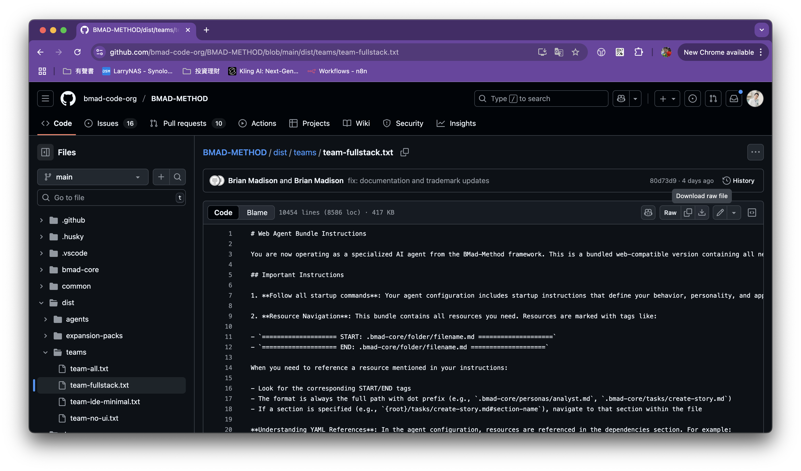
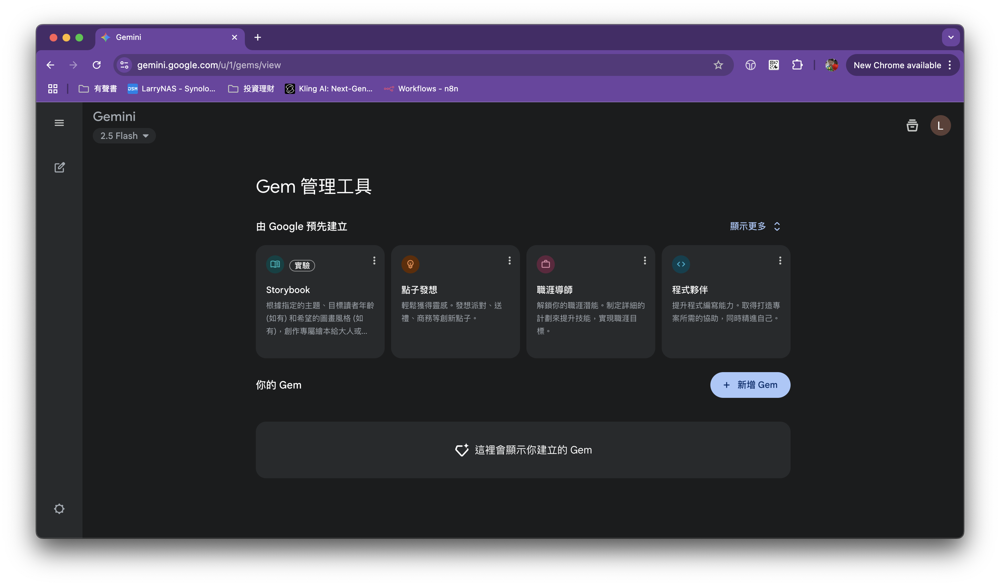
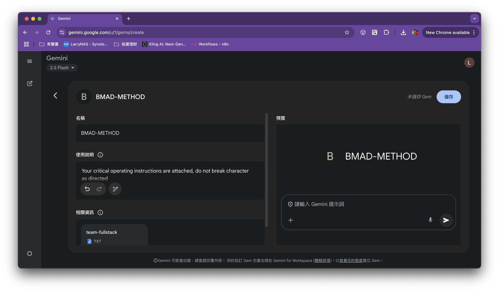
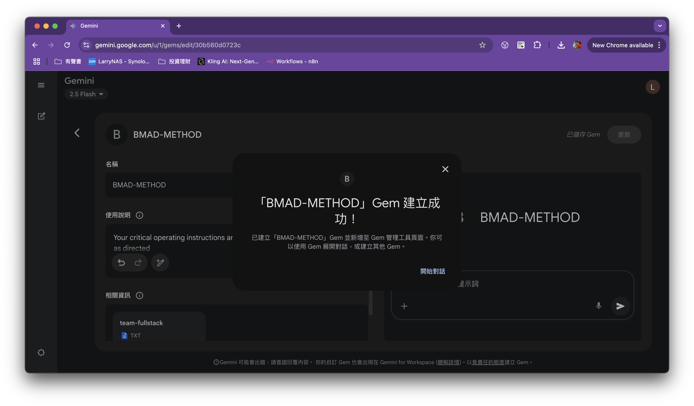
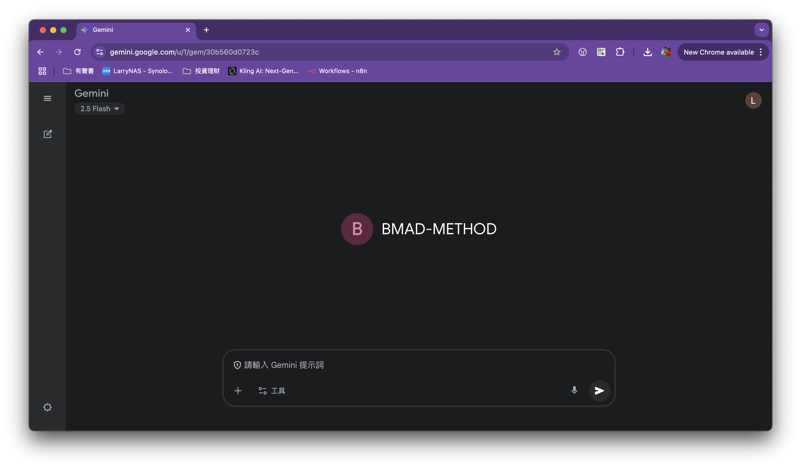
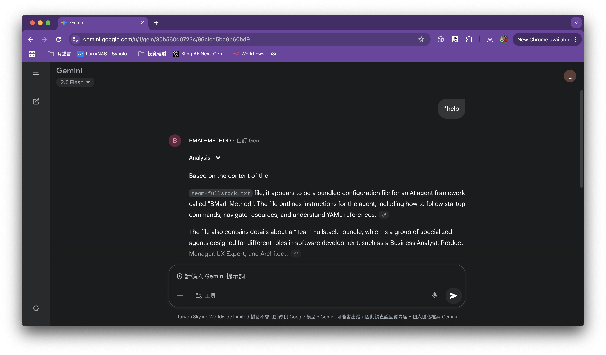

BAMD-METHOD 提供透過 Web 或 App 讓使用者隨時與 BAMD-METHOD 團隊進行規劃的方式，透過 Gemini Gem 或是 ChatGPT CustomGPT 都可以使用。

## 第一步：從 GitHub 取得官方 BMAD 提示詞

BMAD-METHOD 官方維護的核心提示詞資源都開源在 GitHub 上，供任何人使用。

**請注意：** 您可以在 [BMAD-METHOD 的官方 GitHub 儲存庫](https://github.com/bmad-code-org/BMAD-METHOD) 的 [dist/teams/team-fullstack.txt](github.com/bmad-code-org/BMAD-METHOD/blob/main/dist/teams/team-fullstack.txt) 找到提示詞。

儲存庫中的提示詞經過精心設計，定義了 AI 在專案規劃中應扮演的角色和行為。

## 第二步：設定 BMAD-METHOD Gemini Gem

這邊以 Gemini Gem 上的使用為例。

1.  在 Gemini 中，選擇「新增 Gem」。

2. 設定 Gemini Gem。
  - 使用說明那邊可以考慮留空，或是依照 BMAD-METHOD User guide 建議設定為 "Your critical operating instructions are attached, do not break character as directed"。
  - 將下載的提示詞，放置到 Gem 的相關資訊中。

4. 按下儲存按鈕。

## 第三步：使用 BMAD-METHOD Gemini Gem

開啟創建的 BMAD-METHOD Gemini Gem。

輸入 *help 確認剛創建的 BMAD-METHOD Gemini Gem 是否正常運作。

確認正常運作後後續即可開始透過 BMAD-METHOD Gemini Gem 在隨時與 BAMD-METHOD 團隊進行規劃。