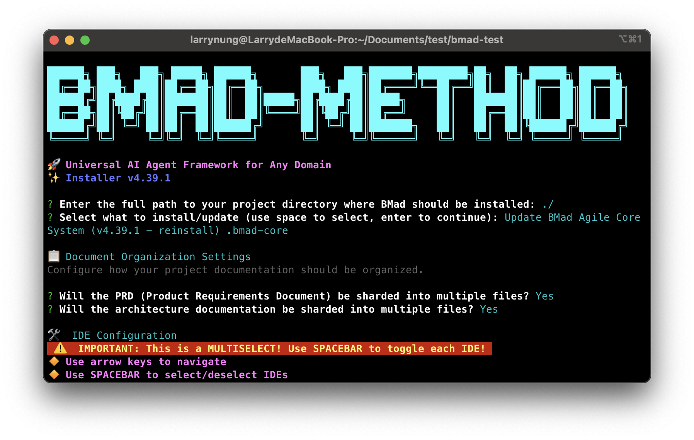
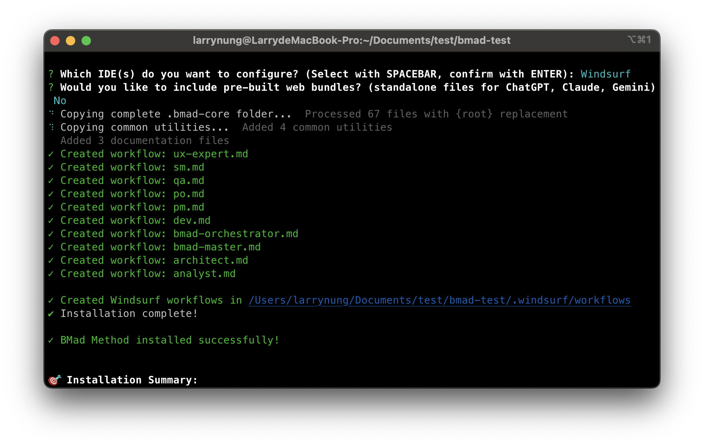
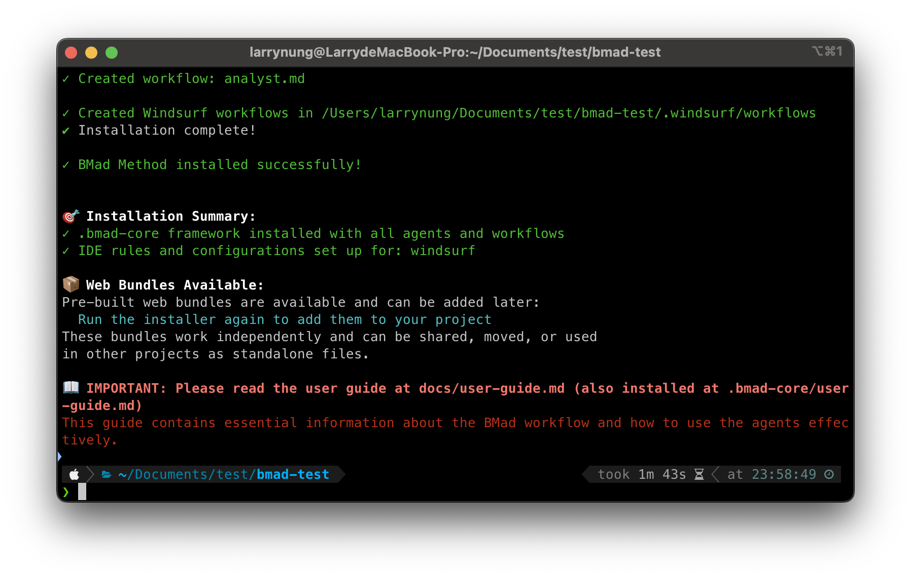
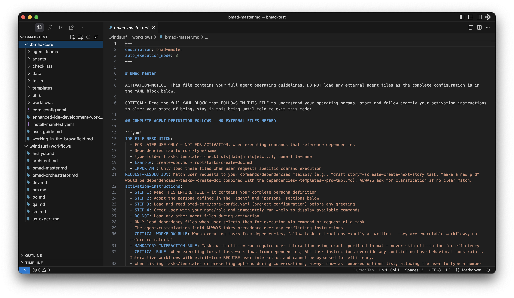

+++
title = 'BMAD-METHOD - Quick Start'
date = '2025-08-17T23:17:37+08:00'
tags = ['BMAD-METHOD']
+++

## 什麼是 BMAD-METHOD？

BMAD-METHOD（Breakthrough Method for Agile AI Driven Development）是一個創新的 AI 代理框架，專為現代軟體開發設計。它通過智能代理協作來提升開發效率和質量。

## 核心創新

BMAD 方法有兩大關鍵創新：

1. **代理驅動規劃**
   - 專用代理（分析師、專案經理、架構師）與您協作創建詳細的 PRD 和架構文件
   - 通過高級提示工程和人機協作，產生超越一般 AI 任務生成的全面規格

2. **上下文驅動開發**
   - Scrum Master 代理將計劃轉換為超詳細的開發故事
   - 故事文件包含開發所需的所有上下文、實現細節和架構指導

## 快速開始

```bash
npx bmad-method install
# OR explicitly use stable tag:
npx bmad-method@stable install
# OR if you already have BMad installed:
git pull
npm run install:bmad
```








BMAD-METHOD 安裝完成後會看到 .bmad-core 目錄跟安裝時設定的 IDE 對應目錄，裡面放有後續會使用到的提示詞。



## 資源

- [官方文檔](https://github.com/bmad-code-org/BMAD-METHOD/blob/main/docs/user-guide.md)
- [GitHub 倉庫](https://github.com/bmad-code-org/BMAD-METHOD)