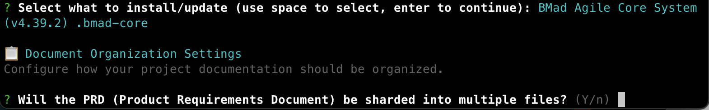
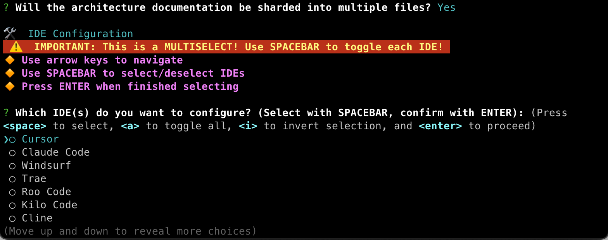
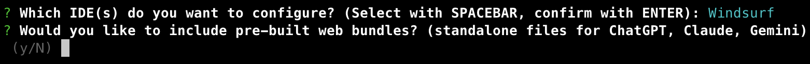
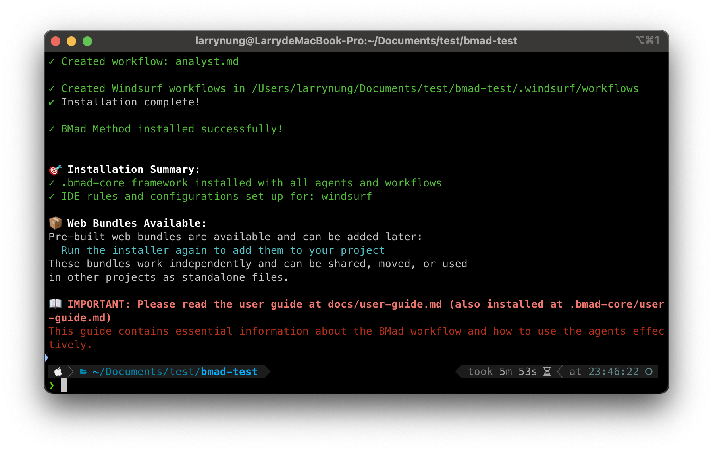

+++
title = 'BMAD-METHOD - Quick Start'
date = '2025-08-17T23:17:37+08:00'
tags = ['BMAD-METHOD']
+++

## 什麼是 BMAD-METHOD？

BMAD-METHOD（Breakthrough Method for Agile AI Driven Development）是一個創新的 AI 代理框架，專為現代軟體開發設計。它通過智能代理協作來提升開發效率和質量。

## 核心創新

BMAD 方法有兩大關鍵創新：

1. **代理驅動規劃**
   - 專用代理（分析師、專案經理、架構師）與您協作創建詳細的 PRD 和架構文件
   - 通過高級提示工程和人機協作，產生超越一般 AI 任務生成的全面規格

2. **上下文驅動開發**
   - Scrum Master 代理將計劃轉換為超詳細的開發故事
   - 故事文件包含開發所需的所有上下文、實現細節和架構指導

## 快速開始

### 先決條件

- Node.js v20 或更新版本

### 安裝步驟

使用以下命令安裝 BMAD-METHOD：

```bash
# 安裝最新版本
npx bmad-method install

# 或安裝穩定版本
npx bmad-method@stable install

# 如果已經安裝過 BMAD，進行更新
git pull
npm run install:bmad
```

執行 `npx bmad-method install` 命令，確認進行安裝。


BMAD-METHOD 啟動畫面，提示輸入專案安裝目錄。


選擇要安裝或更新的組件，包括「BMad Agile Core System」、「Phaser 3 2D Game Dev Pack」等。


配置文件組織設定，詢問 PRD 是否應分片為多個文件。


確認 PRD 分片設定後，詢問架構文件是否也應分片。


IDE 配置多選菜單，顯示可配置的 IDE 選項，例如「Cursor」、「Claude Code」、「Windsurf」等。


接著會詢問是否包含預建的 Web Bundles。


BMAD-METHOD 安裝完成，顯示已創建的工作流文件和已安裝的組件。


### 安裝完成

安裝完成後，您會看到 `.bmad-core` 目錄，其中包含 BMAD-METHOD 的配置文件和提示詞模板。


## 資源

- [BMAD-METHOD User Guide](https://github.com/bmad-code-org/BMAD-METHOD/blob/main/docs/user-guide.md)
- [BMAD-METHOD GitHub Repository](https://github.com/bmad-code-org/BMAD-METHOD)