本文將依據 BMAD-METHOD 的標準流程，一步步展示如何透過與 AI Agent 的對話，從零開始建立一個 ToDo List 應用程式。這個過程被分為「規劃」與「執行」兩大階段。

---

## 階段一：規劃工作流程 (Planning Workflow)

此階段的目標是將一個模糊的想法，轉化為具體、一致且可執行的規劃文件，為開發奠定穩固的基礎。

### 1. Analyst：提出初步想法

開發的第一步，是向 Analyst 提出一個初步的想法。

```text
*analyst 我想建立一個簡單的 ToDo List 應用程式，可以讓使用者新增、刪除、編輯任務，並標記任務完成狀態。
```

Analyst 會根據這個想法，展開對需求的初步分析與塑形，最終產出一份專案簡報。

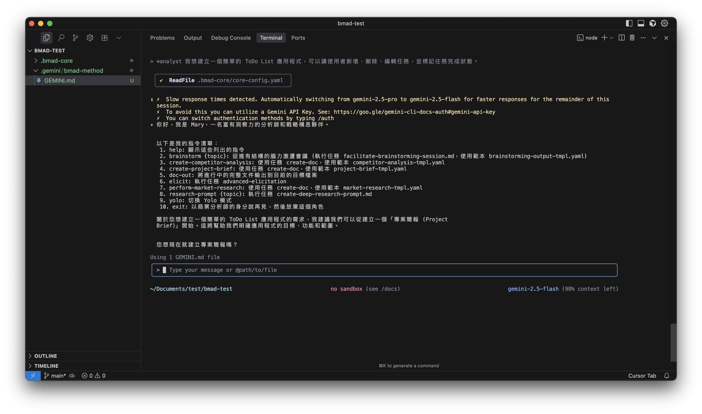

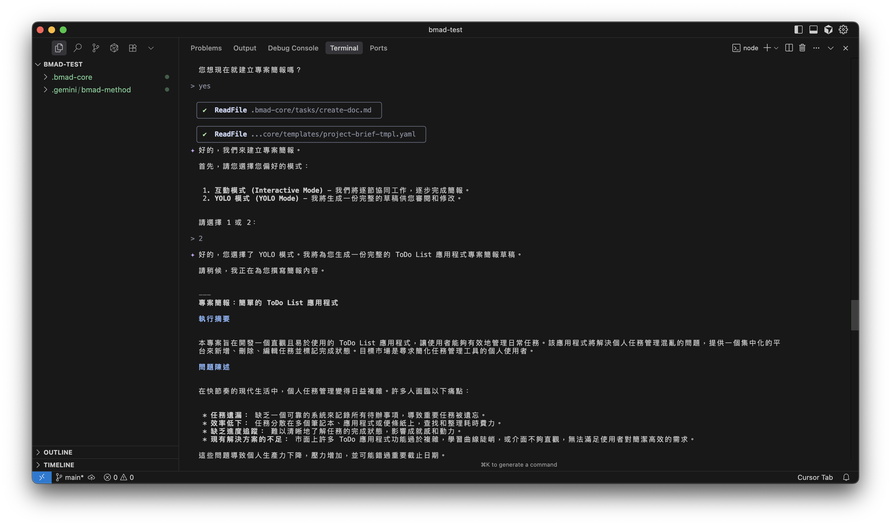

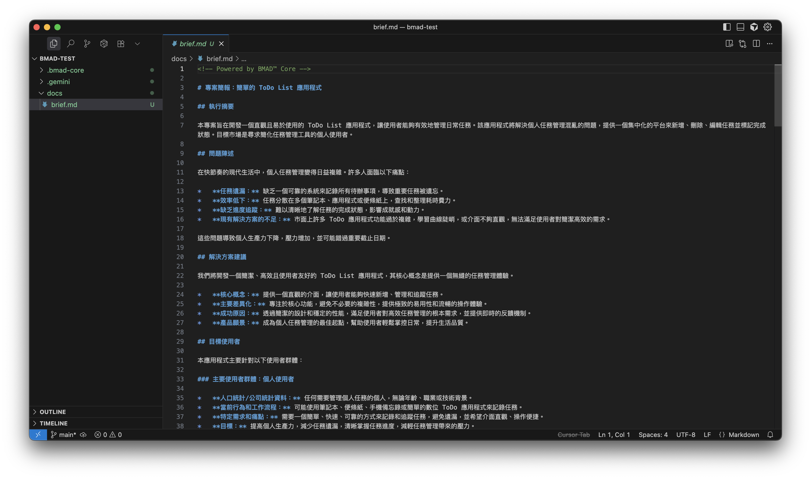

### 2. PM：撰寫產品需求文件 (PRD)

有了專案簡報後，PM（產品經理）會接手，並根據簡報內容，撰寫一份更詳細、更全面的產品需求文件 (PRD)。

```text
*pm 根據專案簡報，為 ToDo List 應用程式建立一份全面的產品需求文件 (PRD)。
```

這份 PRD 將會是後續開發與設計的主要依據，定義了功能需求、非功能需求、史詩 (Epics) 和初步的使用者故事 (User Stories)。

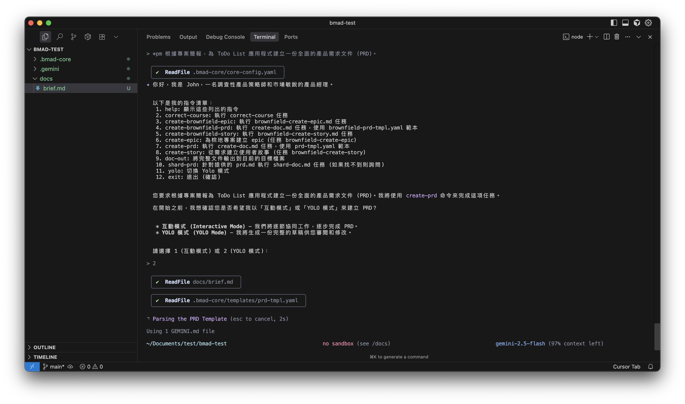

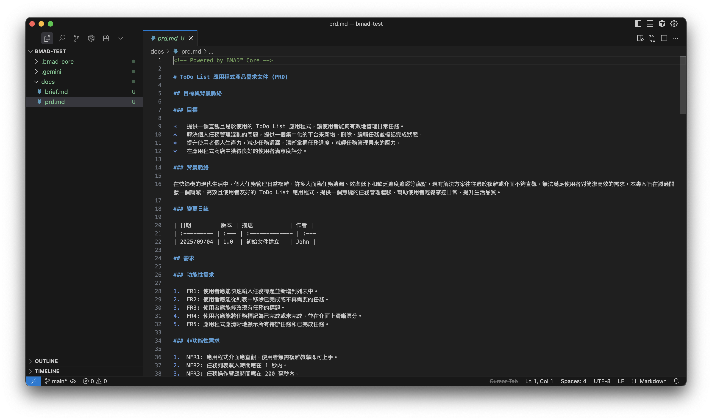

### 3. Architect：設計系統架構

當 PRD 完成後，Architect（架構師）會根據 PRD 的內容，設計出符合需求的系統架構。

```text
*architect 根據 ToDo List 的 PRD，設計系統架構。
```

這份架構文件將會定義所使用的技術堆疊、資料庫結構、API 設計等技術細節。

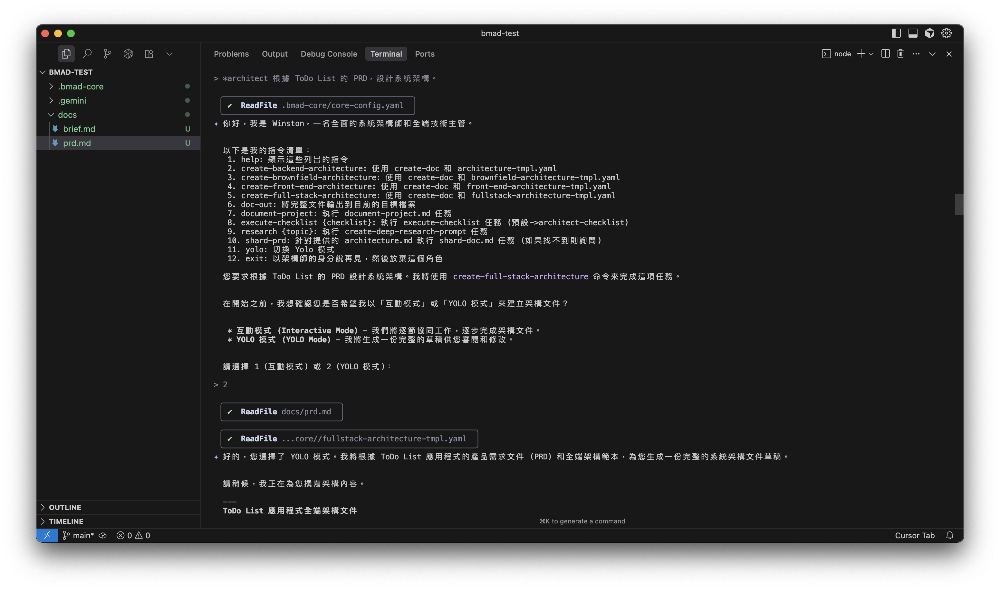

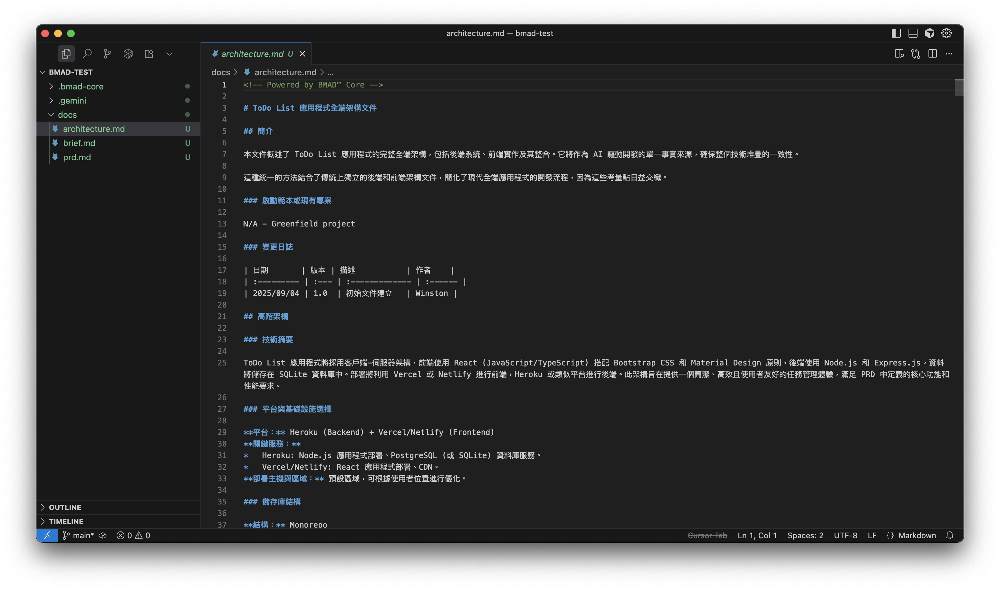

### 4. PO：驗證一致性

在進入開發之前，PO（產品負責人）會進行一次重要的檢查，確保 PRD 和架構文件之間沒有矛盾或遺漏。

```text
*po 執行主檢查清單，驗證 PRD 和架構文件之間的一致性。
```

這個步驟可以有效地避免後續開發過程中可能出現的方向性錯誤，確保所有規劃文件都已對齊。

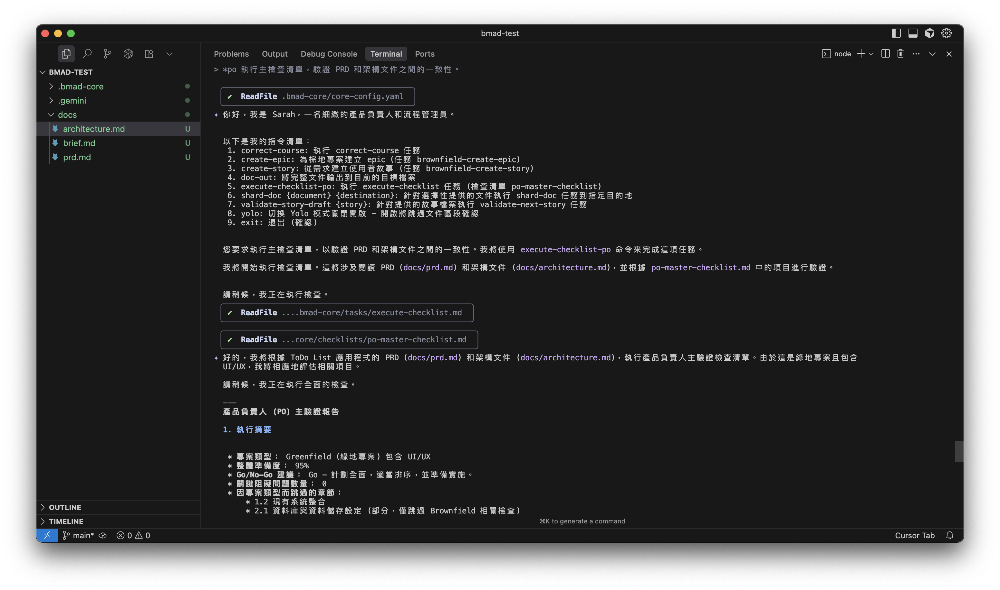

---

## 從規劃到執行：文件分片

當 PO 確認所有規劃文件都達到一致後，就來到了從規劃到開發的關鍵轉換點。此時，大型的規劃文件需要被拆分成更小、更易於管理的開發任務。

### 5. PO：進行文件分片 (Sharding)

PO 會使用工具將 `prd.md` 和 `architecture.md` 中的史詩和故事，拆分成獨立的檔案，存放在 `docs/epics/` 和 `docs/stories/` 目錄下。

```text
*po 根據 prd.md 和 architecture.md 進行文件分片。
```

這個「分片」的動作，讓開發團隊可以一次專注在一個小任務上，也為接下來的開發週期做好準備。

---

## 階段二：核心開發週期 (Core Development Cycle)

文件分片完成後，團隊便進入結構化的迭代開發週期。

### 6. SM：建立使用者故事

SM (Scrum Master) 會從分片後的 `docs/stories/` 目錄中，提取具體的開發任務，草擬成下一個要開發的使用者故事。

```text
*sm 從分片後的文件中，草擬下一個開發故事。
```

這讓開發團隊可以專注在單一、清晰的功能點上。

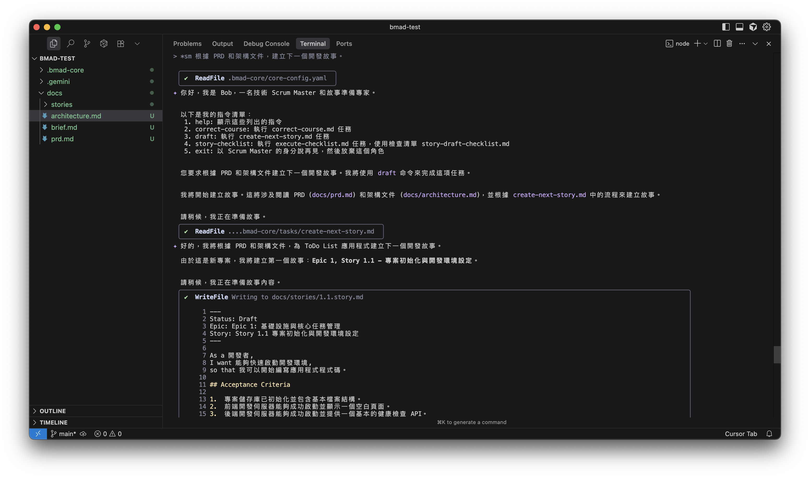

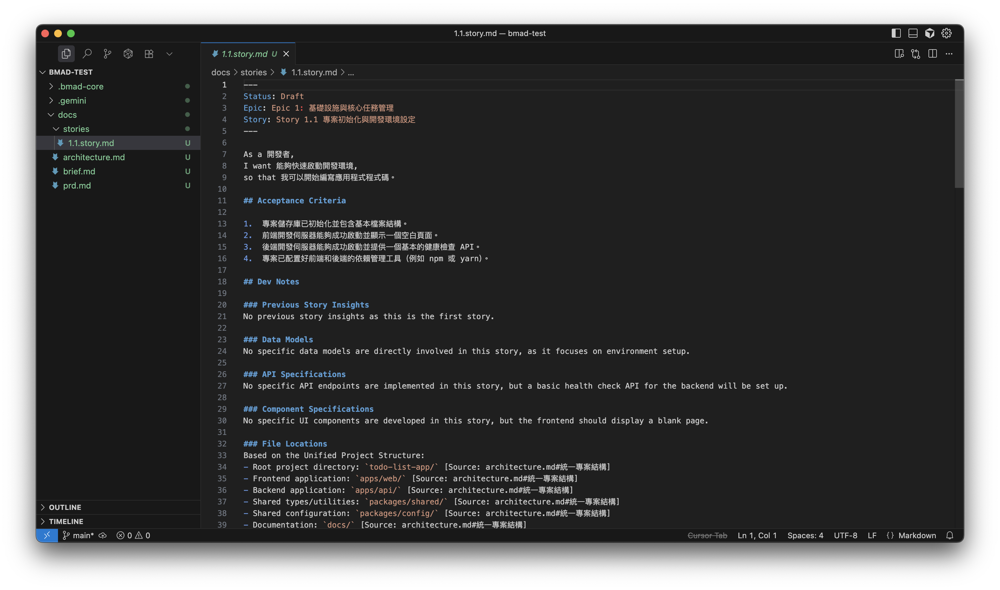

### 7. Dev：實作使用者故事

開發者會根據 SM 產出的使用者故事，進行程式碼的實作。

```text
*dev 實作使用者故事 [1.1.story.md]。
```

這是將設計與文件轉化為實際產品的關鍵步驟。

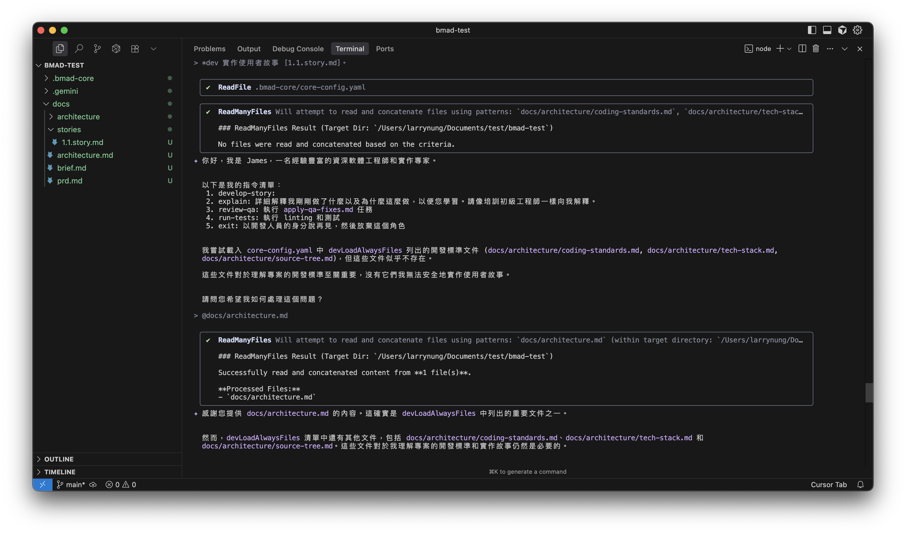

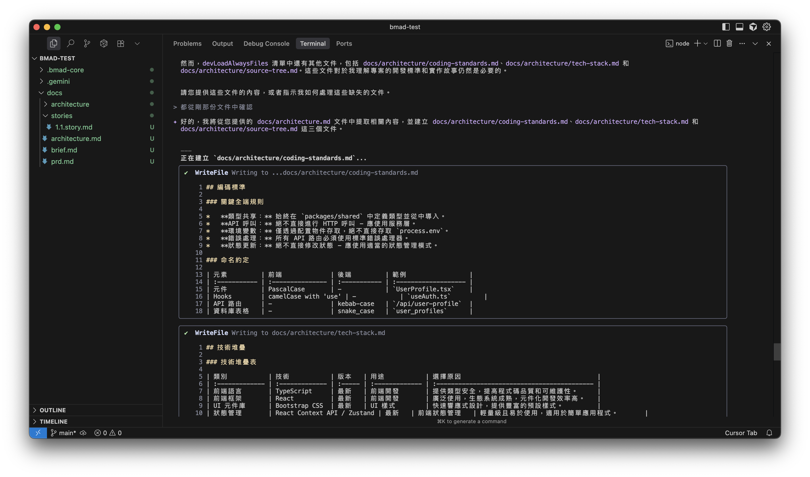

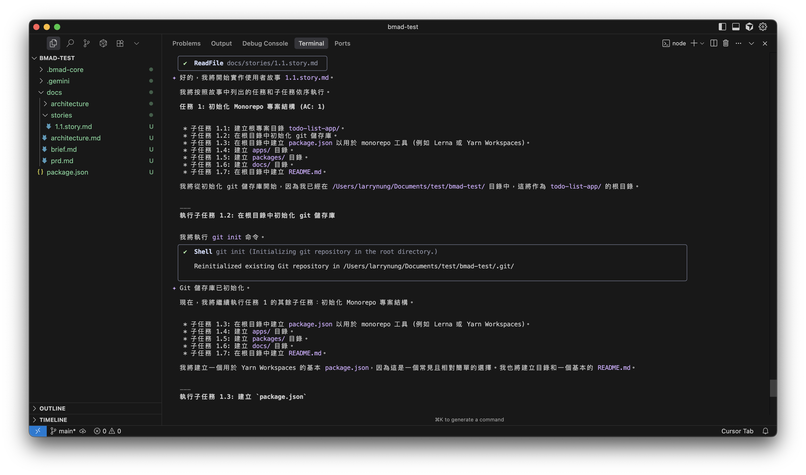

### 8. QA：審查與驗證

最後，QA（品質保證）會對開發者完成的程式碼進行審查與驗證，確保其功能與品質都符合使用者故事的定義。

```text
*qa 審查並驗證使用者故事 [1.1.story.md] 的實作。
```

通過驗證後，這個故事便算完成，團隊可以接著進行下一個故事的開發。

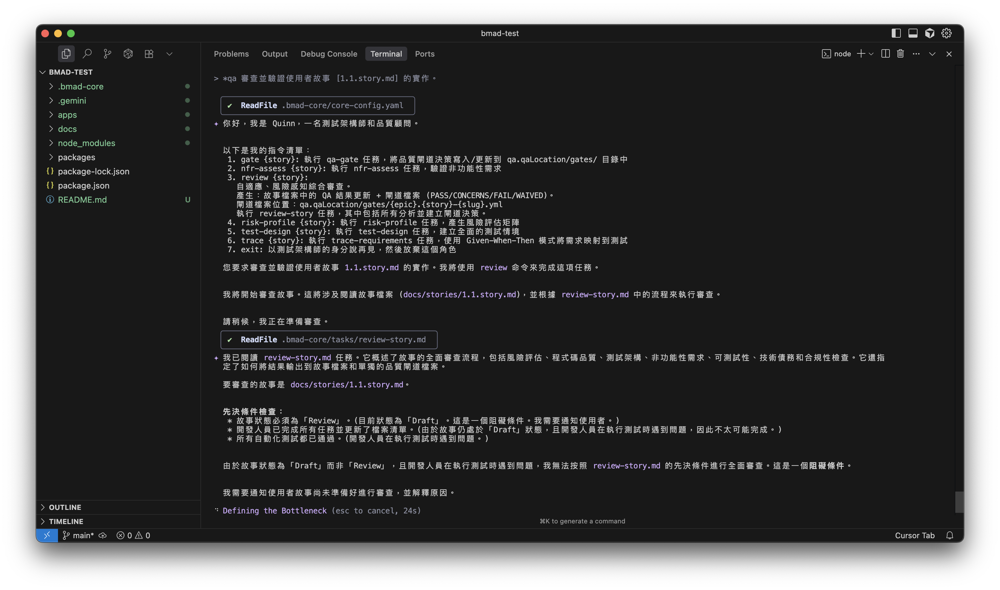