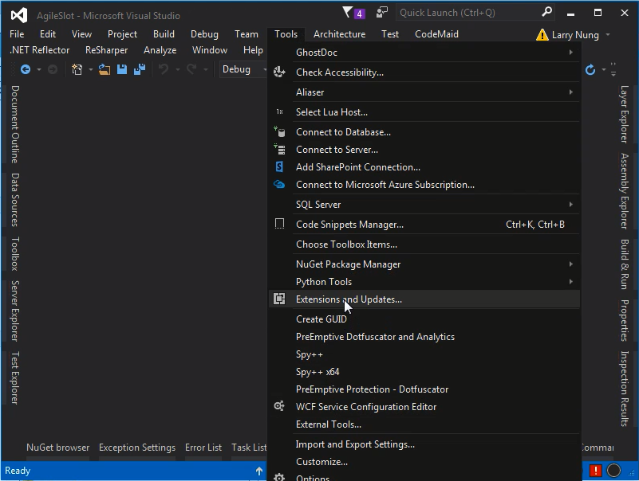
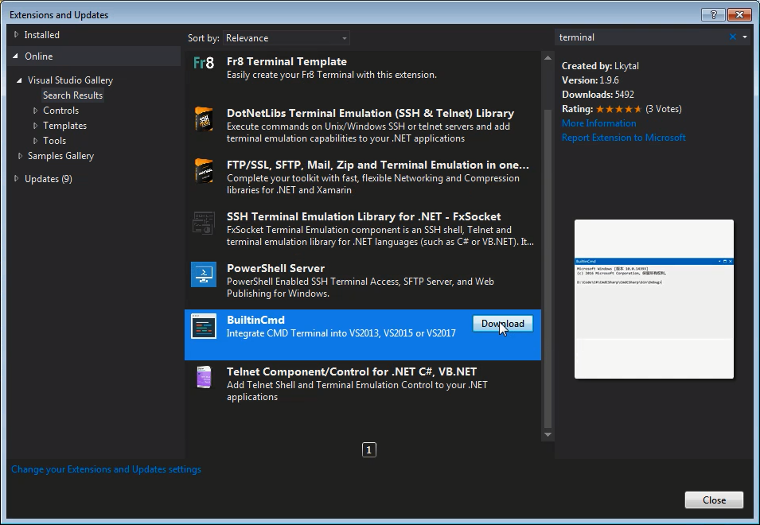
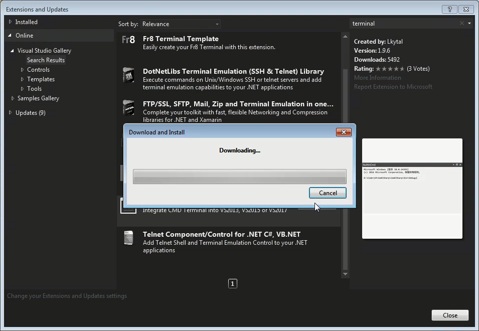
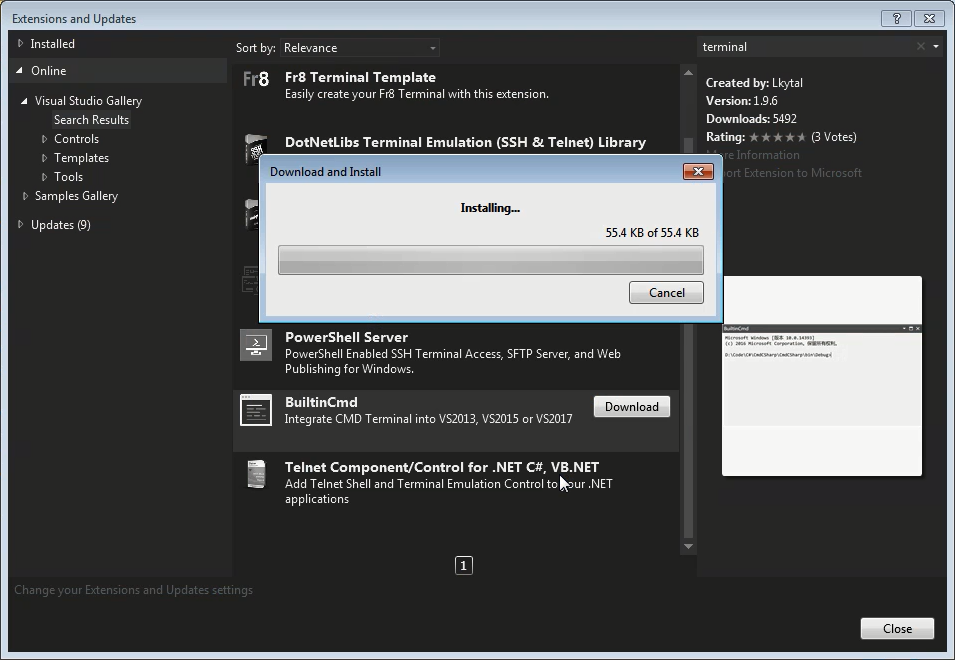
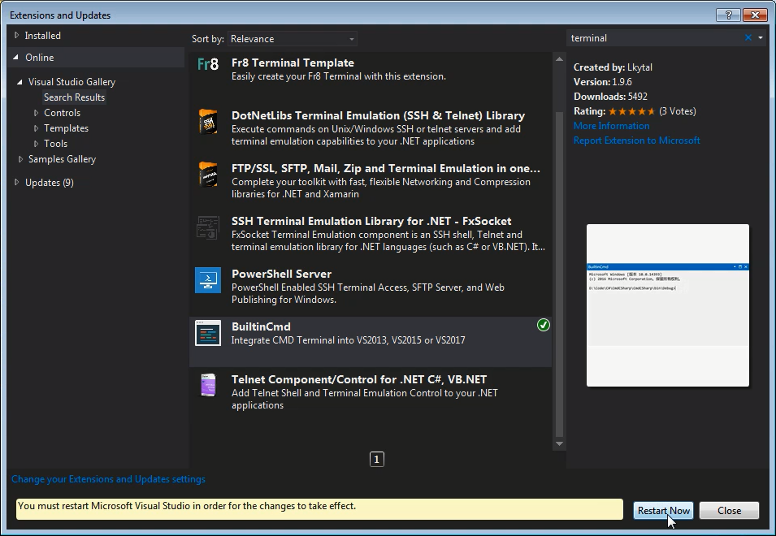
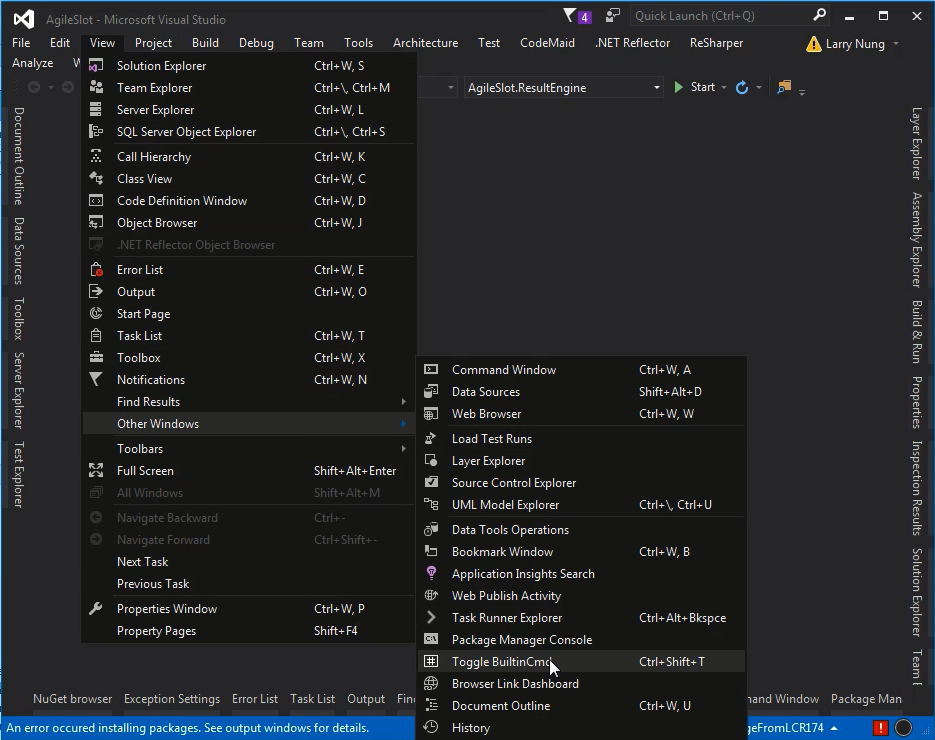
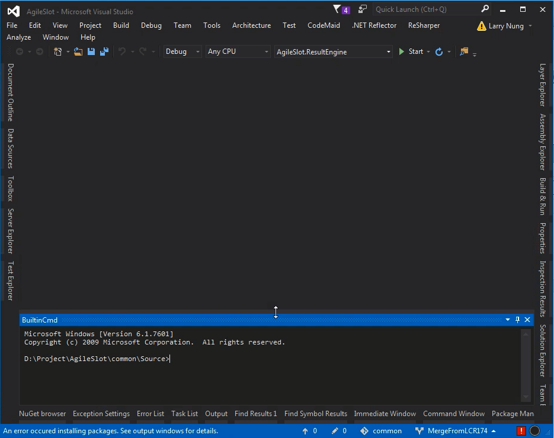

BuiltinCmd 是 Visual Studio 的擴充套件，能整合命令列視窗至 Visual Studio。  

<!-- More -->

 

透過 Extension Manager 安裝套件。  

 

 

 

 

將 Visual Studio 重啟。  

 

點選 [View | Other Windows | Toggle BuiltinCmd] 主選單選項，或是按下熱鍵 Ctrl + Shift + T 即可開啟 BuiltinCmd 視窗。  

 

 

Link
----
* [BuiltinCmd - Visual Studio Marketplace](https://marketplace.visualstudio.com/items?itemName=lkytal.BuiltinCmd)
