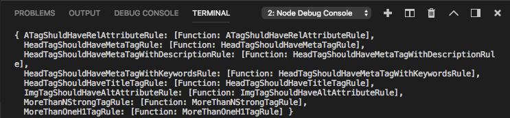

在撰寫 Node.js 時需要的模組我們需要載入才可以使用，bulk-require 套件能讓我們快速的載入目錄內的模組，不需要一個一個載入。  

<!-- More -->

<br/>


使用上需先安裝 bulk-require 套件。  

    npm install bulk-require

<br/>


接著載入 bulk-require 模組。  

```js
const bulk = require('bulk-require'); 
```

<br/>


然後指定模組所在的目錄位置以及要載入的檔案 pattern 即可。  

```js
const sections = bulk(folderPath, ['*.js']);
```

<br/>


像是下面這樣簡單的程式，我們載入了 folderPath 下所有副檔名為 js 的模組，並將載入的資訊顯示出來。  

```js
const bulk = require('bulk-require');
...
const sections = bulk(folderPath, ['*.js']);
console.log(sections);
```

<br/>


可看到載入的資訊會像下面這樣。  


 
<br/>


我們可以進一步利用這些載入的模組資訊，將載入的類別都建置實體，便於後續使用。  

```js
const bulk = require('bulk-require'); 
...
const sections = bulk(folderPath, ['*.js']);
Object.keys(sections).forEach((element) =>
    this.rules.push(new sections[element]())
);
```

<br/>


Link
----
* [substack/bulk-require: require whole directory of trees in bulk](https://github.com/substack/bulk-require)
