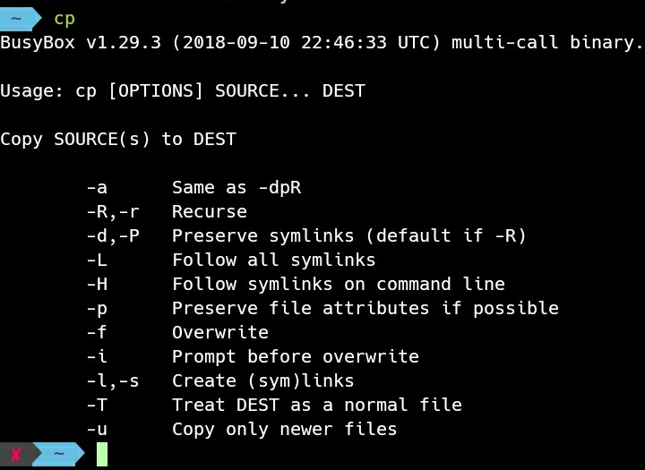
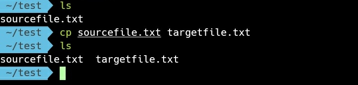
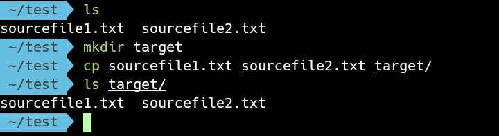
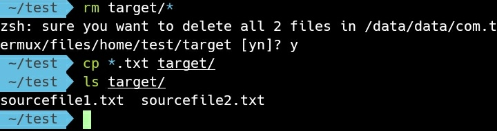
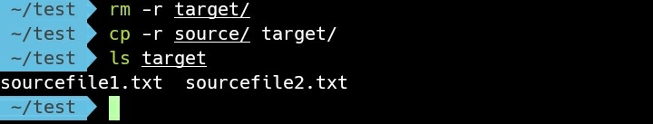

cp 命令可用來做檔案的複製。  

<!-- More -->

 

直接調用命令可查閱使用說明。  

    cp

 

要將單檔複製到指定位置，可直接在命令後帶入來源檔案位置與目的檔案位置調用。  

    cp [SourceFile] [TargetFile]

 

允許使用多組來源檔案，目的位置也可以使用目錄。  

    cp [SourceFile]... [TargetFolder]

 

可使用萬用字元過濾篩選來源檔案。  

    cp [SourceFileFilter] [TargetFolder]

 

來源位置也可以指定目錄，的來源目錄複製到目的目錄。  

    cp [SourceFolder] [TargetFolder]

