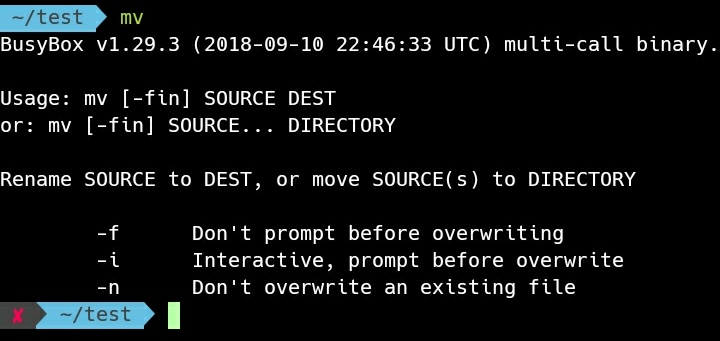
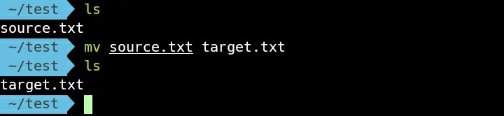
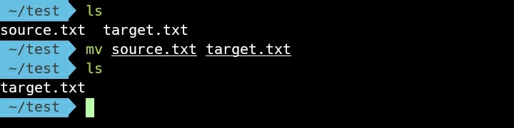
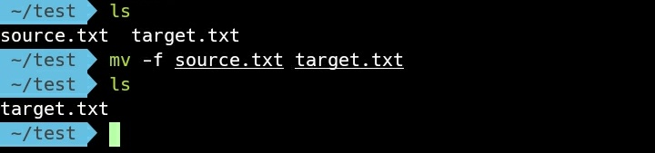
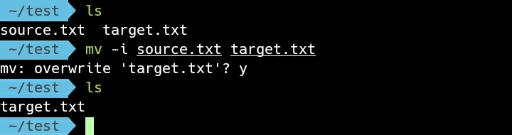
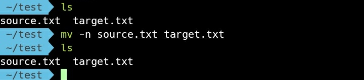
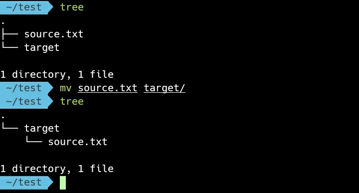
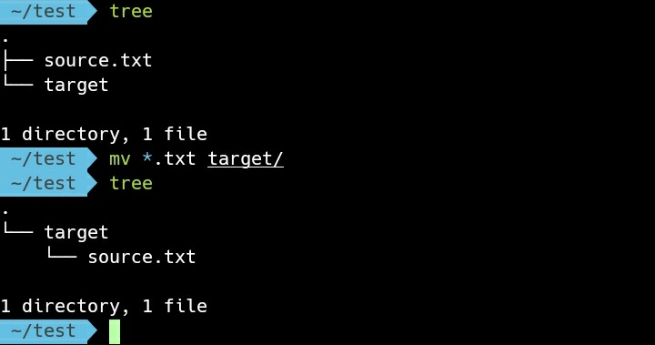

mv 命令可以用來做檔案的搬移或更名。  

<!-- More -->

 

可直接不帶參數調用命令查閱使用方式。  

    mv

 

要搬移檔案或是變更檔名，只要在調用命令時指定檔案的來源位置與目的位置。  

    mv [SourceFile] [TargetFile]

 

如果目的位置有檔案，預設會被覆蓋過去。  

 

跟帶入 -f 參數一樣，檔案會直接覆蓋，不會有任何的提示。  

    mv -f [SourceFile] [TargetFile]

 

如果要在覆蓋前提示，可帶入參數 -i。  

    mv -i [SourceFile] [TargetFile]

 

若是不要做檔案的覆寫，可帶入參數 -n。  

    mv -n [SourceFile] [TargetFile]

 

要是要將檔案大小目錄內，目的位置可指定目錄位置。  

    mv [SourceFile] [TargetFolder]

 

要一次搬移多個檔案，來源位置也可以使用萬用字元的方式指定。  

    mv [SourceFileFilter] [TargetFolder]

