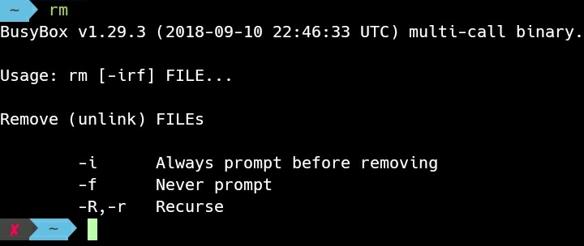
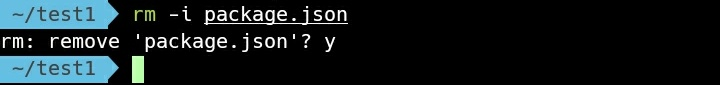
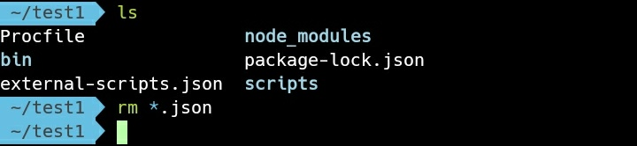

rm 命令提供 Linux 系統檔案刪除的功能。

可直接不帶參數調用命令查閱使用方式。

rm

要移除指定檔案可以直接在命令後帶入檔案位置調用。

rm [File]

加帶參數 -i 讓刪除前再做一次確認。

rm -i [File]

刪除的位置可帶入多組，也可以使用萬用字元的方式模糊指定。

rm [Filter]

若是要刪除目錄，可加帶參數 -r。

rm -r [Folder]

