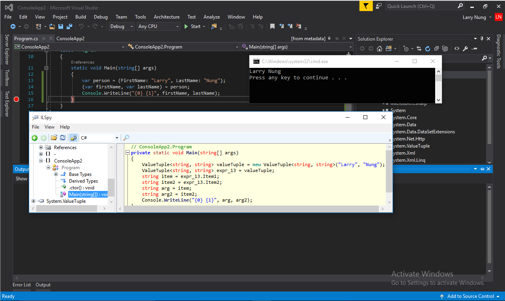
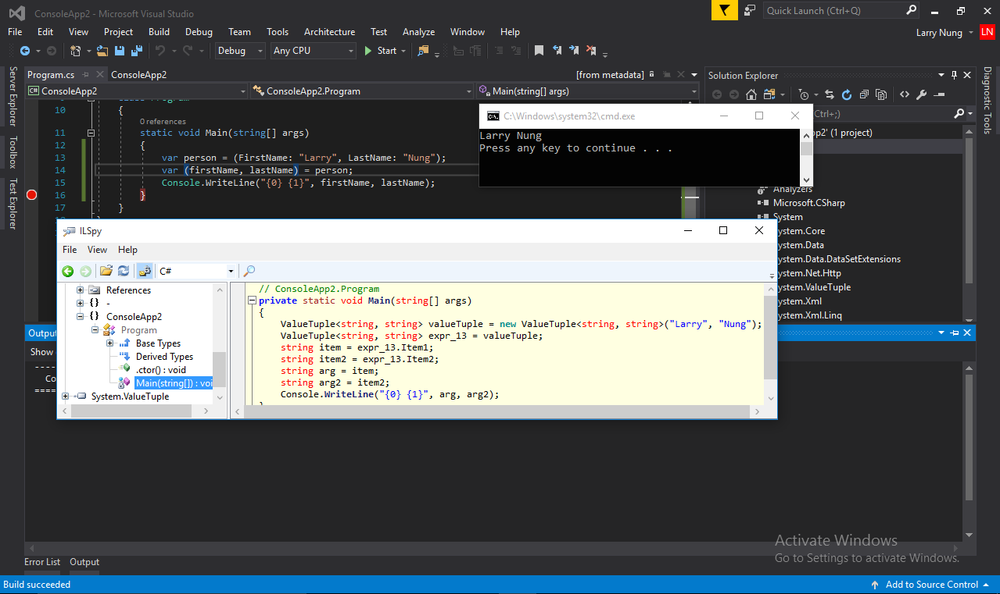
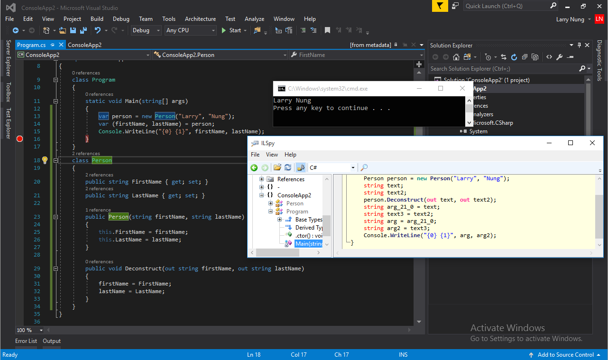
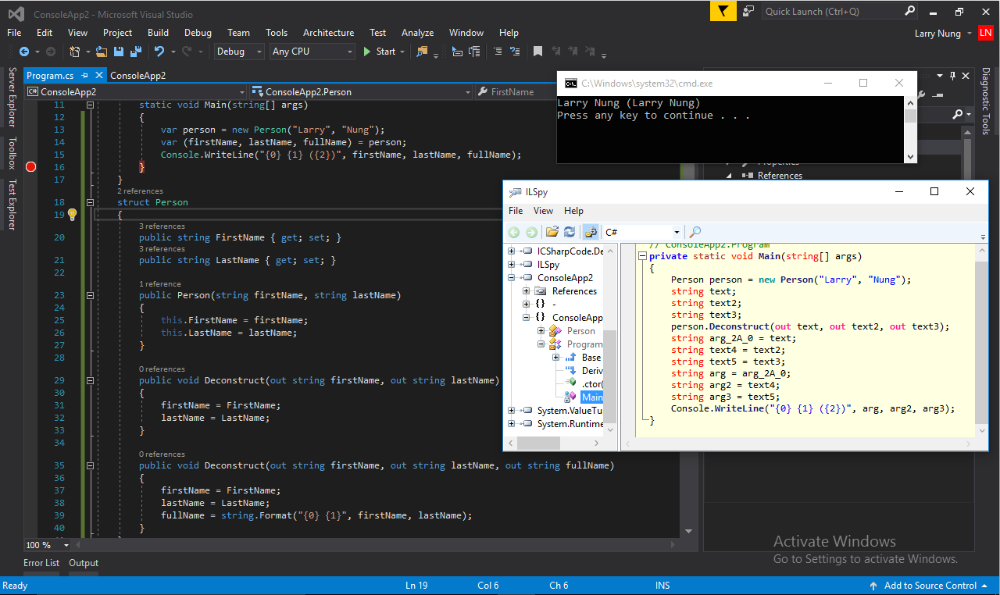

C# 7.0 新增 Deconstruction，可將 Tuple、結構、類別的成員拆解使用。  

<!-- More -->

<br/>


以 Tuple 為例，若想要將 Tuple 值拆解使用，可以用小括弧宣告出多個區域變數，並將 Value Tuple 指派過去，Value Tuple 的屬性值就會依序塞入這些區域變數。  

```C#
(var v1, var v2) = GetTuple();
var (v1, v2) = GetTuple();
```

<br/>




<br/>




<br/>


若是結構或是類別，則要建一個 public 的 Deconstruct 方法，方法的參數用 out 將拆解出來的值依序傳出，編譯時編譯器就會自行幫我們調用 Deconstruct 方法將值拆解。    

```C#
(var v1, var v2) = new MyClass();
...
class MyClass()
{
  ...
  public void Deconstruct(out string v1, out string v2)
  {
    v1 = this.V1;
    v2 = this.V2;
  }
}
```

<br/>




<br/>


若有需要 Deconstruct 也支援多載。  

```C#
(var v1, var v2) = new MyClass();
...
class MyClass()
{
  ...
  public void Deconstruct(out string v1, out string v2)
  {
    v1 = this.V1;
    v2 = this.V2;
  }

  public void Deconstruct(out string v1, out string v2, out string v3)
  {
    v1 = this.V1;
    v2 = this.V2;
    v3 = this.V3;
  }
}
```

<br/>



<br/>


Link
====
* [New Features of C# 7.0 - CodeProject](https://www.codeproject.com/Articles/1131035/New-Features-of-Csharp)
* [C# 7.0 Features - C# Language - Stack Overflow](http://stackoverflow.com/documentation/c%23/1936/c-sharp-7-0-features#t=201703060311065606364)
* [Deconstruction In C# 7.0](http://www.c-sharpcorner.com/article/deconstruction-in-c-sharp-7-0/)
* [What’s New in C# 7.0 | .NET Blog](https://blogs.msdn.microsoft.com/dotnet/2016/08/24/whats-new-in-csharp-7-0/)
