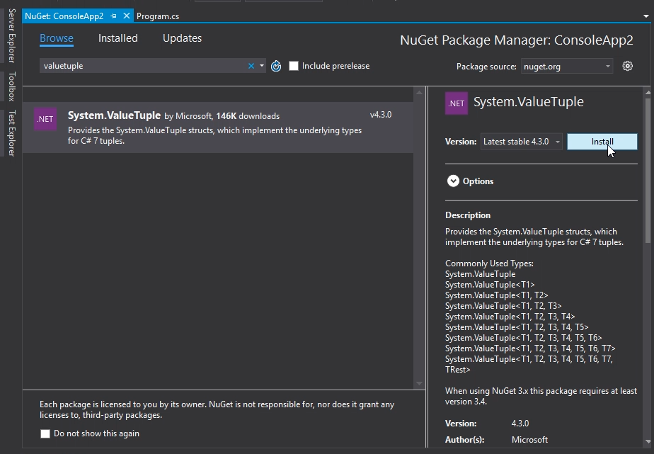
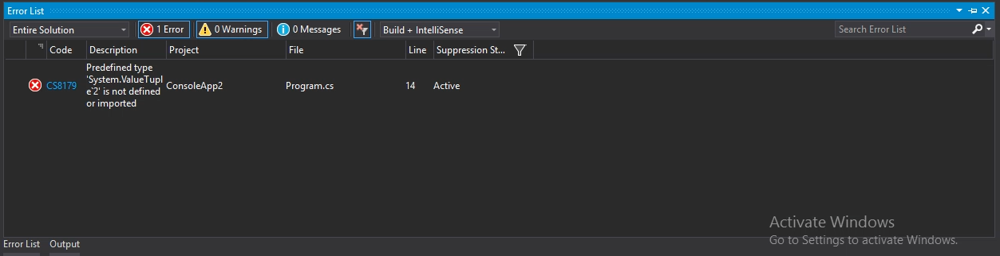
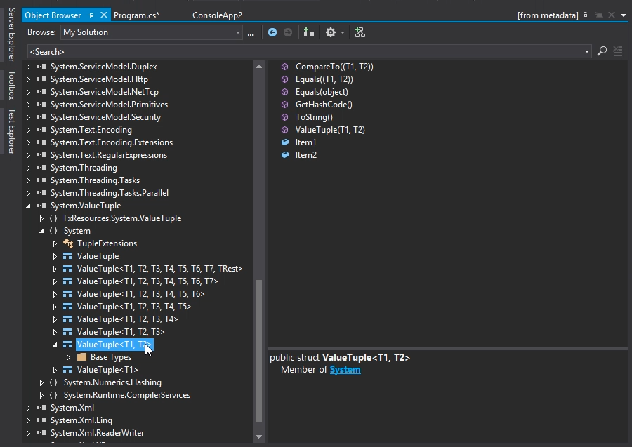
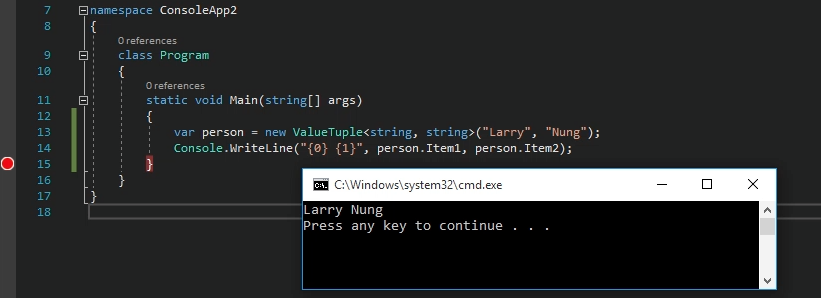
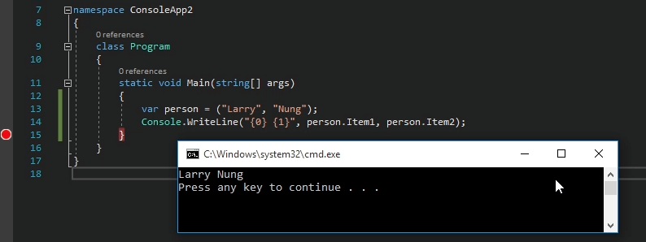
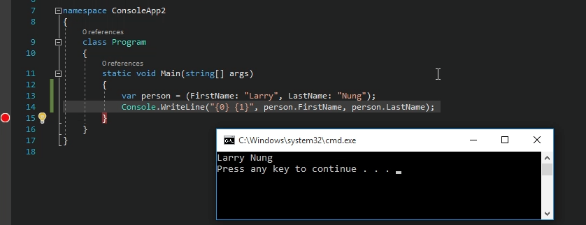
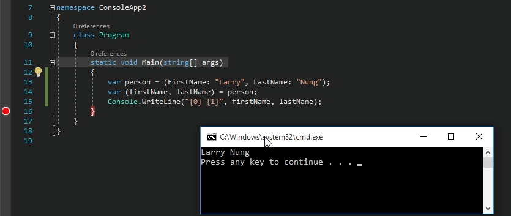
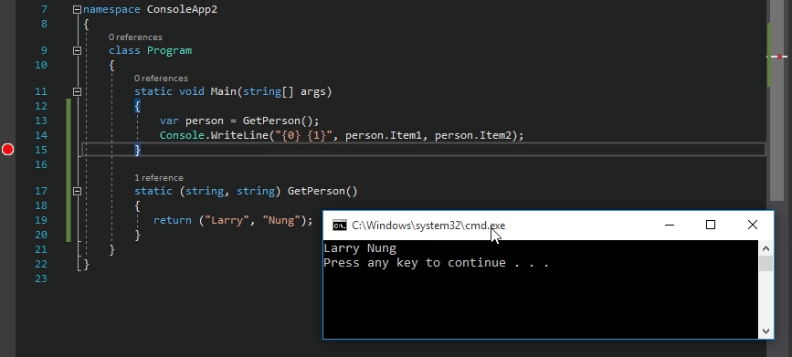
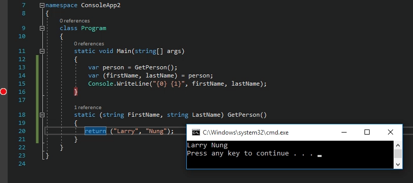

C# 7.0 新增了 Value Type 的 Tuple，因為是 Value Type，所以對 GC 的負擔會比較少。另外增加了一些語法糖，改進了本來 Tuple 類別可讀性不佳的問題。  

<!-- More -->

 

使用上需先加入 System.ValueTuple 套件。   

 

若不加入該套件編譯時會看到 System.ValueTuple is not defined or imported 的錯誤。  

 

套件加入引用後我們可以看一下該套件的內容，可以看到有一堆泛型的 ValueTuple struct，裡面的成員屬性跟以往的 Tuple 一樣都是 Item1 ~ ItemN。  

 

使用上可以直接建立 ValueTuple，然後在建立的同時指定其型態與值，在要取值的地方用 Item1 ~ ItemN 屬性來取值。  

 

也可以用小括弧包住屬性值直接宣告。  

 

但這樣的宣告方式跟舊的 Tuple 類別一樣有著可讀性不佳的問題，因此在用小括弧包住屬性值宣告的同時，我們將屬性名稱也一併指定，取值時就可以用指定的屬性名稱來取值。  

 

編譯器在編譯時會自動幫你將程式轉換成 Item1 ~ ItemN。  

 

若想要將 Tuple 值拆解使用，可以用小括弧宣告出多個區域變數，並將 Value Tuple 指派過去，Value Tuple 的屬性值就會依序塞入這些區域變數。  

 

這些功能即使套用在方法的回傳值上也一樣適用。  

 

 

Link
======
* [Tackling Tuples: Understanding the New C# 7 Value Type - Our ComponentOne](http://our.componentone.com/2017/01/30/tackling-tuples-understanding-the-new-c-7-value-type/)
* [C# 7.0 – Tuples – CsharpStar](http://www.csharpstar.com/csharp-tuples/)
* [Tuple deconstruction in C# 7 | Thomas Levesque's .NET blog](http://www.thomaslevesque.com/2016/08/23/tuple-deconstruction-in-c-7/)
