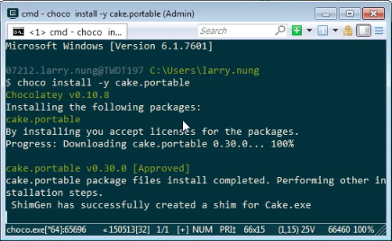
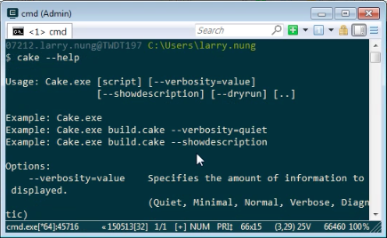
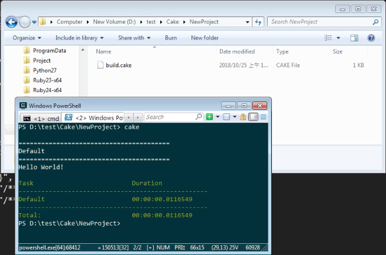

Cake.Portable 是 Cake script runner，可直接透過 chocolatey 安裝。    

<!-- More -->

    choco install cake.portable

 

安裝完可以直接調用 Cake 命令測試看看，像是查閱 Cake 命令的使用方式。  

    cake --help

 

在使用上也就不需要再透過 bootstrapper 下載，可以直接運行 cake script。  

 

Link
----
* [Chocolatey Gallery | Cake.Portable 0.30.0](https://chocolatey.org/packages/cake.portable)
