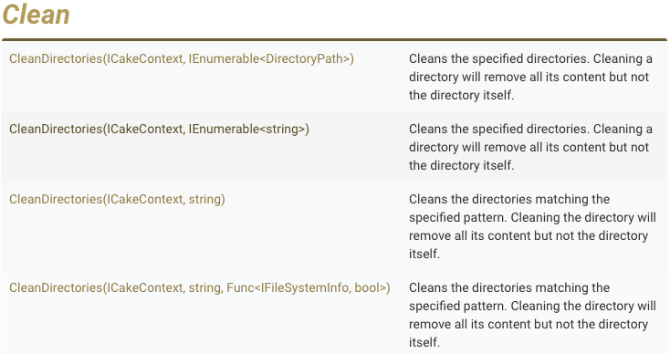
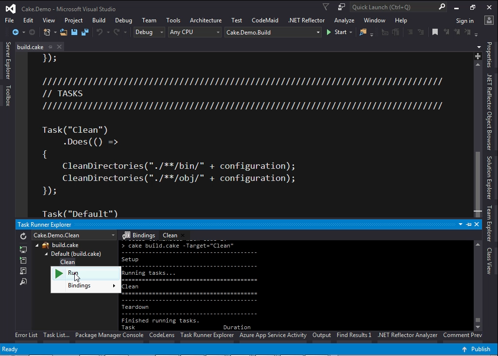
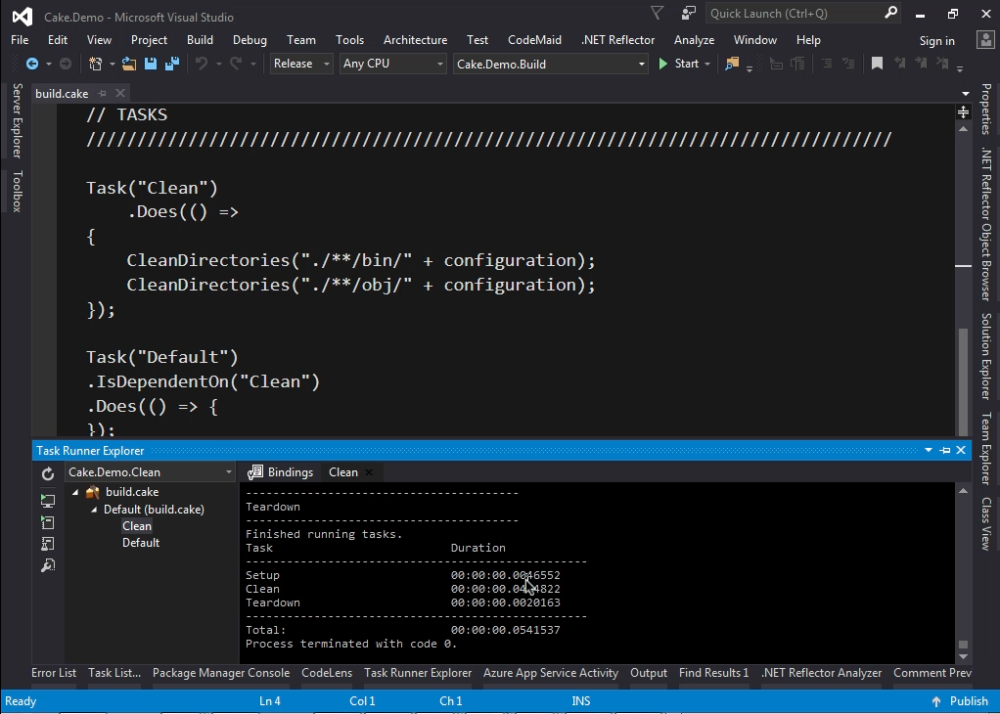
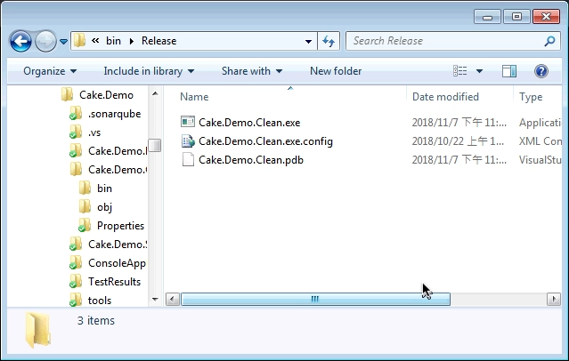
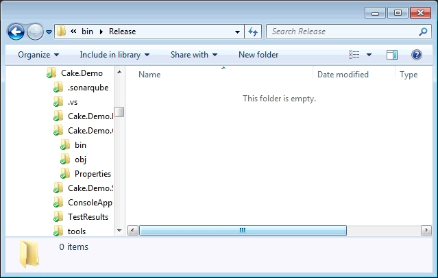

要使用 Cake 清除特定目錄，可以參閱 CleanDirectories 的使用方式。  

<!-- More -->



<br/>


調用上可以直接帶入目錄的集合，或是目錄的 match pattern。  

<br/>


像是用 match pattern 去清除目錄腳本撰寫起來就會像下面這樣。  

```C#
...
Task("Clean")
    .Does(() =>
{
    CleanDirectories("./**/bin/" + configuration);
    CleanDirectories("./**/obj/" + configuration);
});
...
```

<br/>


Cake 任務運行後。  



<br/>




<br/>


指定目錄的檔案就會被清除。  



<br/>




<br/>


最後附上完整的 Cake 腳本。

```C#
///////////////////////////////////////////////////////////////////////////////
// ARGUMENTS
///////////////////////////////////////////////////////////////////////////////

var target = Argument("target", "Default");
var configuration = Argument("configuration", "Release");

///////////////////////////////////////////////////////////////////////////////
// SETUP / TEARDOWN
///////////////////////////////////////////////////////////////////////////////

Setup(ctx =>
{
	// Executed BEFORE the first task.
	Information("Running tasks...");
});

Teardown(ctx =>
{
	// Executed AFTER the last task.
	Information("Finished running tasks.");
});

///////////////////////////////////////////////////////////////////////////////
// TASKS
///////////////////////////////////////////////////////////////////////////////

Task("Clean")
    .Does(() =>
{
    CleanDirectories("./**/bin/" + configuration);
    CleanDirectories("./**/obj/" + configuration);
});

Task("Default")
.IsDependentOn("Clean")  
.Does(() => {
});

RunTarget(target);
```

<br/>


Link
----
* [Cake - Reference - Directory Operations](https://cakebuild.net/dsl/directory-operations/)
