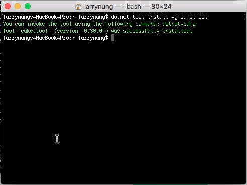
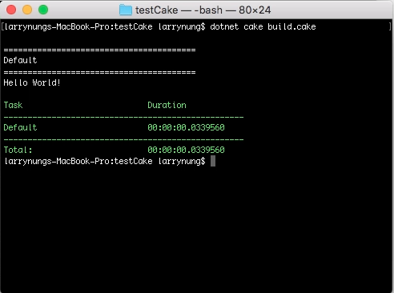

Cake 0.30.0 後開始支援 Global .NET CLI tool，可透過 dotnet tool 安裝。  

<!-- More -->

    dotnet tool install -g Cake.Tool

 

安裝完就可以直接透過 dotnet 命令運行 Cake。  

    dotnet cake <CakeFile>

 

Link
----
* [Cake - Cake v0.30.0 released] (https://cakebuild.net/blog/2018/08/cake-v0.30.0-released)
