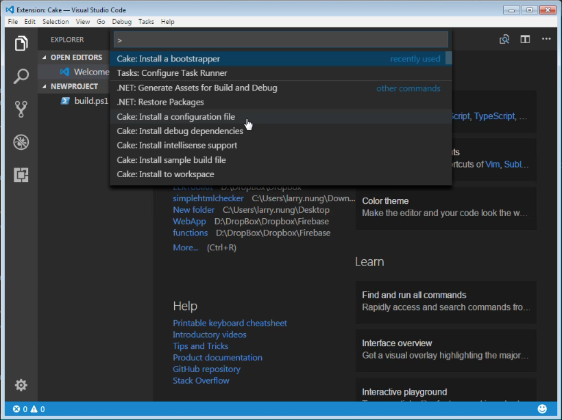

要在 Visual Studio Code 使用 Cake，可以為 Visual Studio 加裝 Cake 擴充套件。   

<!-- More -->

 

安裝完可開啟 Command Palette。   

 

使用 Cake: Install a boostrapper 為專案加入 boostrapper。

 

 

 

使用 Cake: Install a configuration file 為專案加入 Cake 設定檔。  

 

 

使用 Cake: Install sample build file 為專案加入 Cake 腳本的範本。  

 

 

 

如果一次要加入多個項目，可直接使用 Cake: Install to workspace。  

 

 

 

 

 

 

 

要除錯的話可加入 launch.json，直接透過 Visual Studio Code 除錯。  

 

 

 

 

如果要直接運行腳本的任務，可點選 [ Tasks | Run Task... ] 主選單選項。  

 

選取要運行的腳本任務即可。  

 

 

Link
