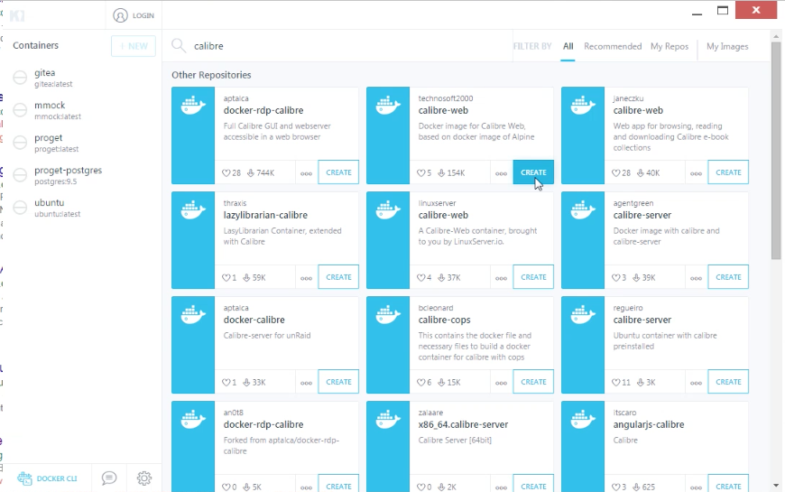
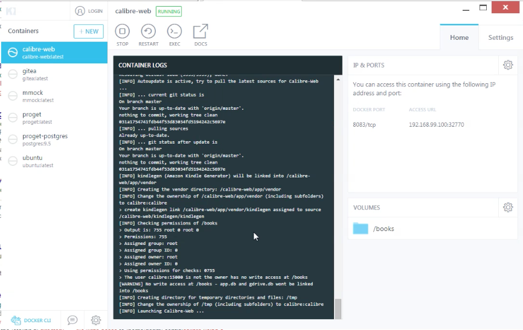
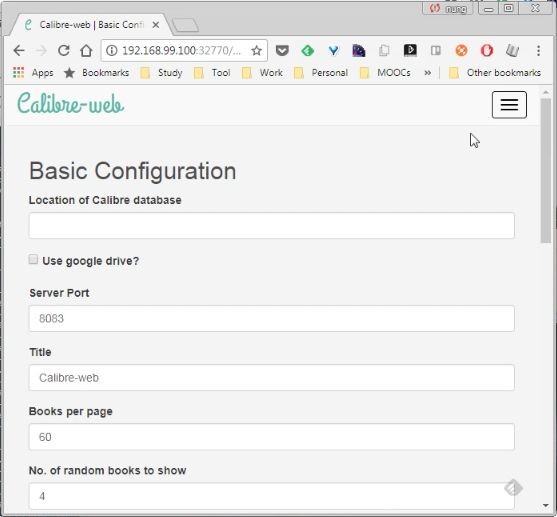

要使用 Kitematic 運行 Calibre Web，可在 Kitematic 搜尋 Calibre Web 的容器，點選 CREATE 按鈕將容器拉回啟用。  

<!-- More -->

 

 

容器啟用後開啟瀏覽器訪問對應的位置，即可看到 Calibre Web 運行起來的畫面。  

 

在 Location of Calibre database 填入 Docker 的 Data Vokumes 設定 /books，然後依需求調整其他設定，像是 Port 號、每頁放置的書本數量、是否支援上傳...等，設定完按下 Submit 按鈕送出。  

 

導回首頁，輸入帳密 admin/admin123 登入即可開始使用。  

Link
----
* [technosoft2000/calibre-web - Docker Hub](https://hub.docker.com/r/technosoft2000/calibre-web/)
