## 前言

ChatGPT Atlas 與新聞聚合服務 Feedly 的整合，展現其強大應用潛力。

### Feedly 新聞智慧分析
ChatGPT Atlas 可作為您的專屬新聞分析師。無論是分析新聞對投資組合的影響，還是深入探討技術趨勢（如 .NET 相關開發），抑或是依照 ChatGPT 針對使用者的了解找出感興趣的主題，它都能提供精闢見解。
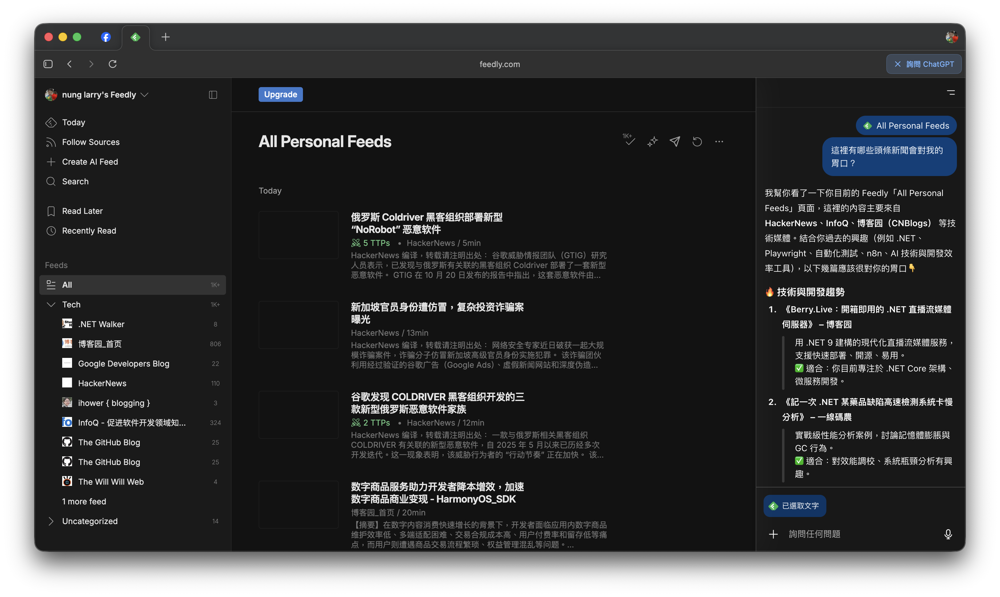

### 客製化技術摘要 Feed
您可以高度客製化技術摘要 Feed，選擇感興趣的主題和更新頻率。設定完成後，ChatGPT 將定期為您推送包含技術焦點、文章摘要和應用建議的個人化報告。

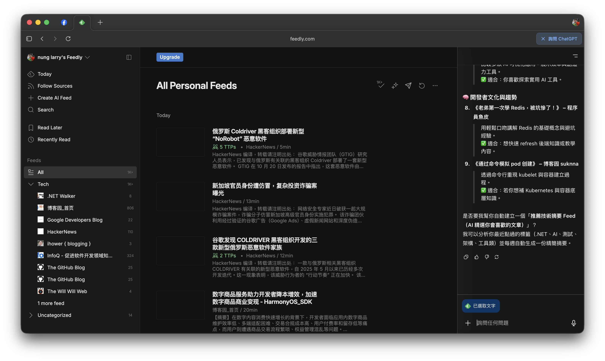
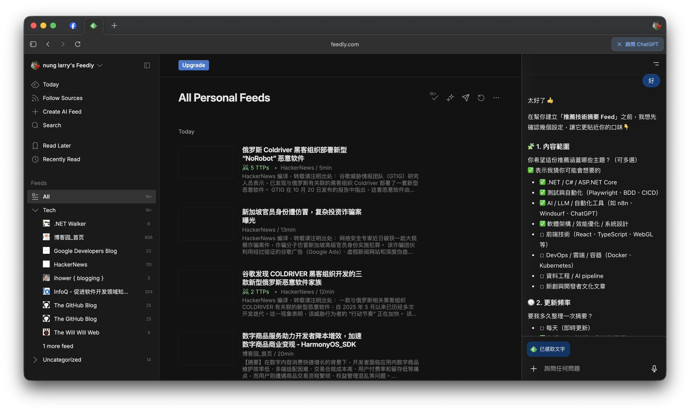
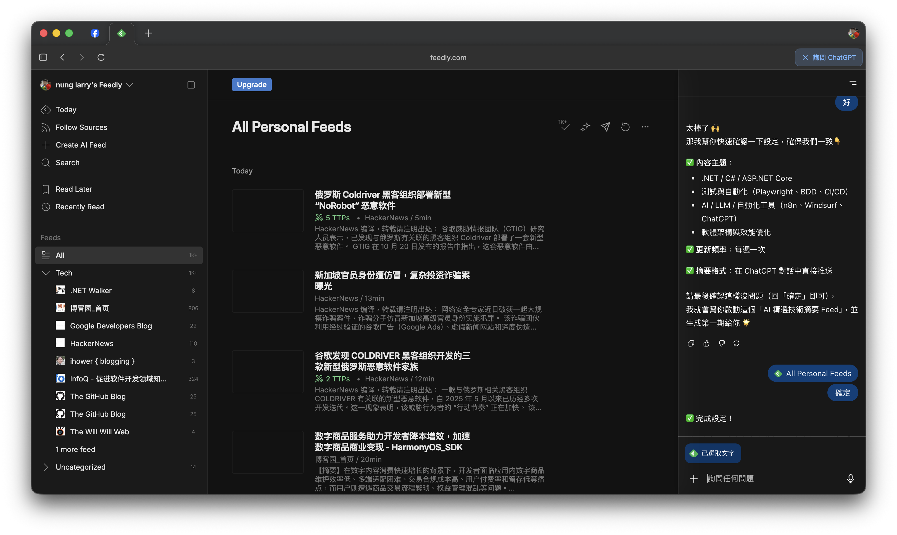
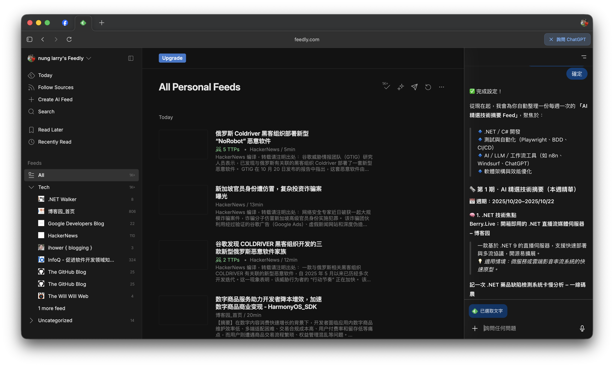
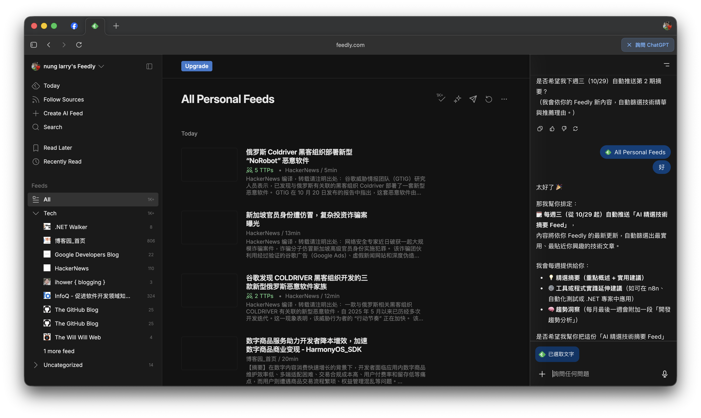

為方便管理，這些摘要還可匯出為 Markdown 格式的週報，輕鬆整合至 Notion 或其他筆記系統。
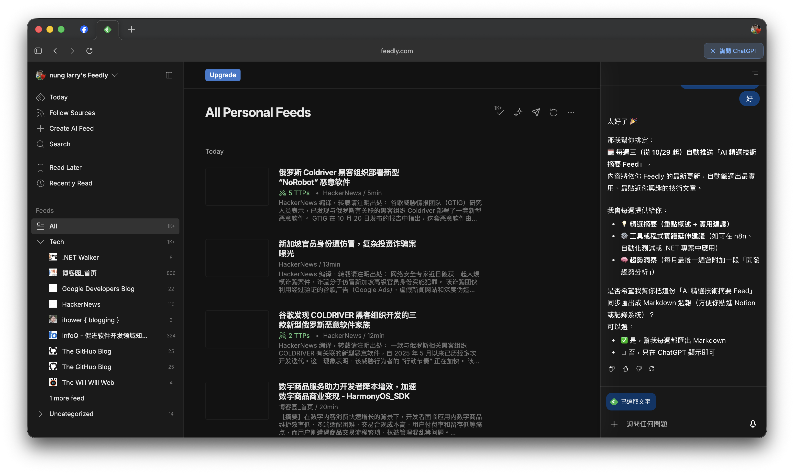
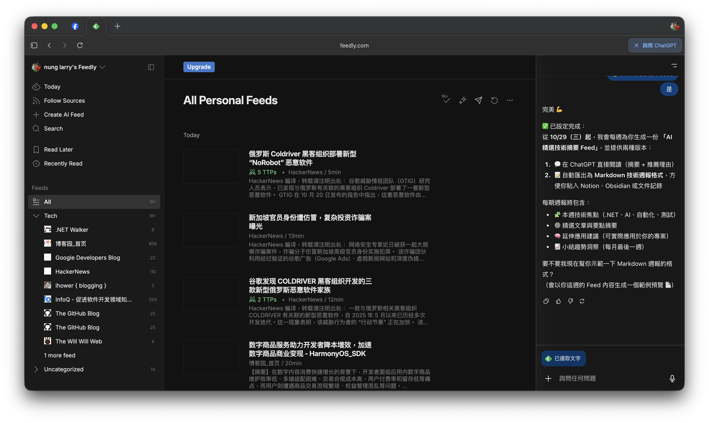

### 熱門主題深度分析
當您對 Feedly 中的熱門主題感興趣時，ChatGPT 能協助識別相關網頁，並提供摘要與應用建議。它能自動截取全文進行深入分析，或讓您手動貼上內容，提供文章背景、技術細節、關鍵概念和應用場景等全面解析。
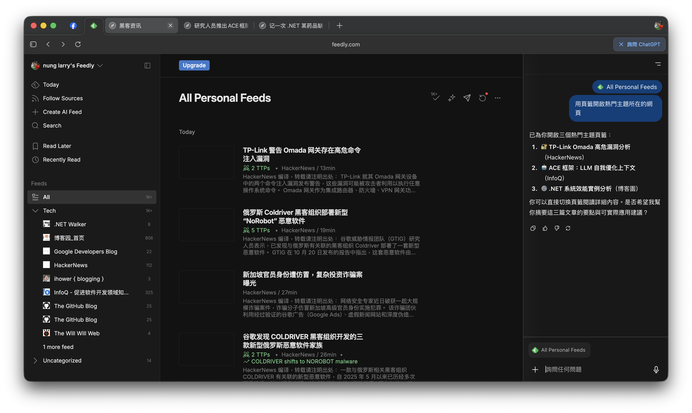
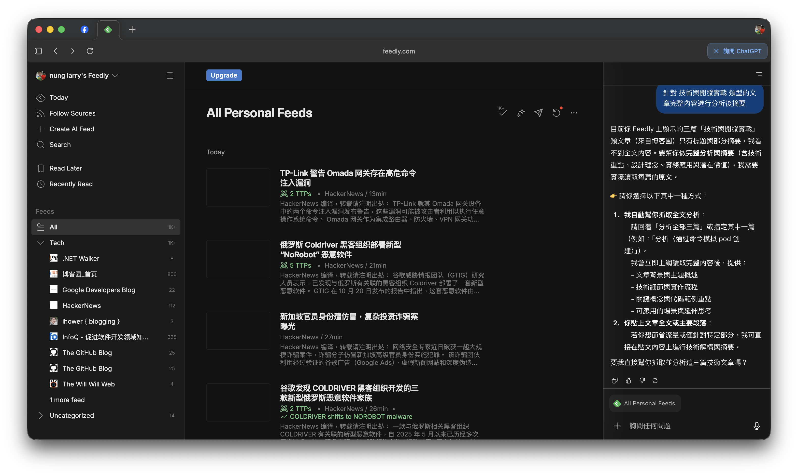
例如，針對 SpringCloud Gateway 的文章，它能提供詳細的主題背景與技術摘要。
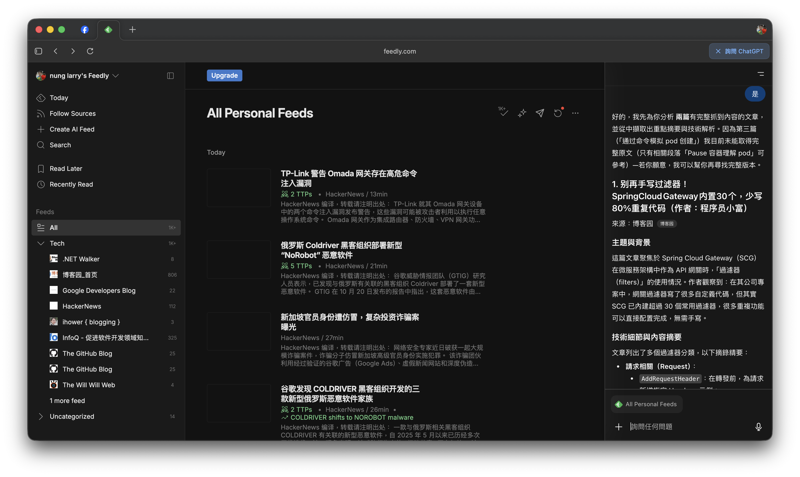

## 參考資料
- [ChatGPT Atlas](https://chatgpt.com/zh-Hant/atlas)
