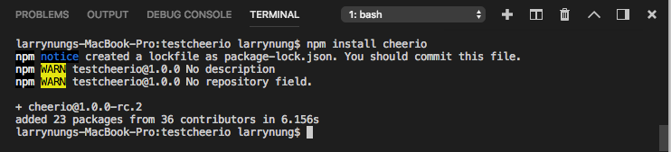
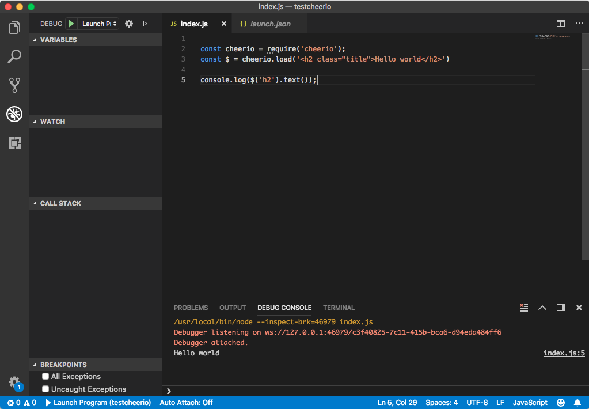
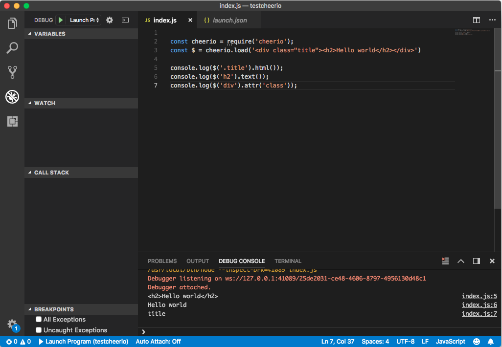
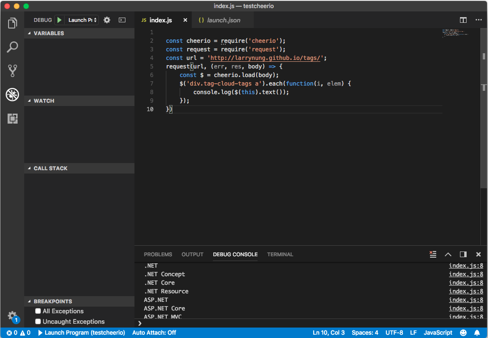

cheerio 是一用來解析 HTML 的套件，該套件使用方式跟 jQuery 類似。  

<!-- More -->

<br/>


使用前需先用安裝套件。  

    npm install cherrio


 
<br/>


安裝完後載入 cherrio 模組。  

```js
const cheerio = require('cheerio');
```

<br/>


然後用 load 方法將 HTML 載入，載入後就可以像一般使用 jQuery 般帶入 Selector 去選取元素操作。  

```js
const $ = cheerio.load(html)
```

<br/>


像是下面這樣：  

```js

const cheerio = require('cheerio');
const $ = cheerio.load('<h2 class="title">Hello world</h2>')

console.log($('h2').text());
```


 
<br/>


使用起來跟在一般網頁上用 jQuery 是差不多的。更多操作可參閱 [cheeriojs/cheerio: Fast, flexible, and lean implementation of core jQuery designed specifically for the server.](https://github.com/cheeriojs/cheerio) 這邊。   

```js
const cheerio = require('cheerio');
const $ = cheerio.load('<div class="title"><h2>Hello world</h2></div>')

console.log($('.title').html());
console.log($('h2').text());
console.log($('div').attr('class'));
```


 
<br/>


如果是用來 Parsing 一般網頁，就會在搭配 request 取得網頁的內容，程式會像下面這樣。這邊的範例是 Parsing 筆者部落格文章的 tag。   

```js
const cheerio = require('cheerio');
const request = require('request');
const url = 'http://larrynung.github.io/tags/';
request(url, (err, res, body) => {
    const $ = cheerio.load(body);
    $('div.tag-cloud-tags a').each(function(i, elem) {
        console.log($(this).text());
    });
})
```


 
<br/>


Link
----
* [cheeriojs/cheerio: Fast, flexible, and lean implementation of core jQuery designed specifically for the server.](https://github.com/cheeriojs/cheerio)
