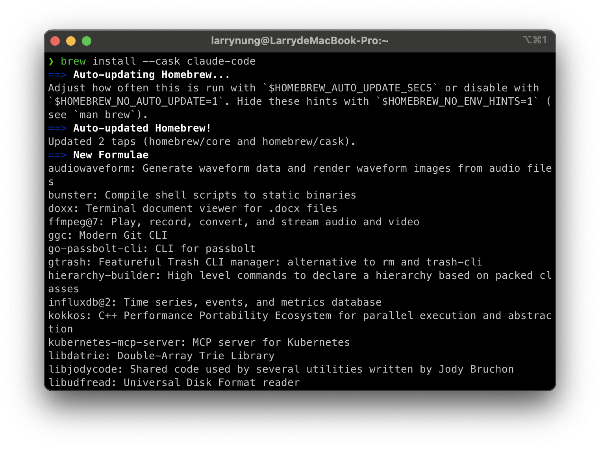
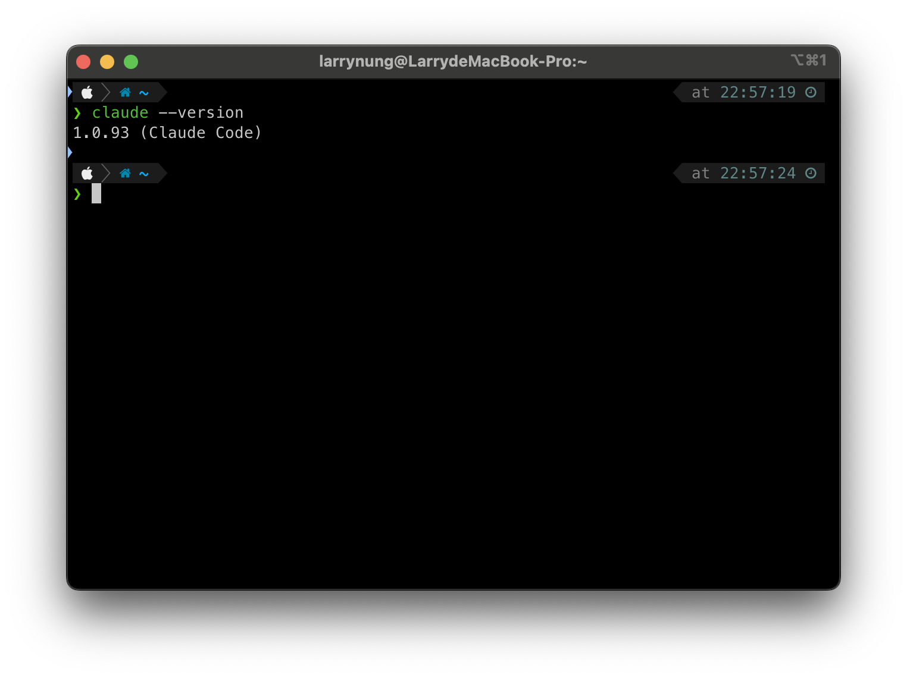

# 使用 Homebrew 安裝 Claude Code

## 安裝步驟

1. 打開終端機 (Terminal)

2. 執行以下命令安裝 Claude Code：

```bash
brew install --cask claude-code
```



3. 安裝完成後，可以執行以下命令確認安裝版本：

```bash
claude --version
```



## 參考資料

- [Claude Code on Homebrew](https://formulae.brew.sh/cask/claude-code)