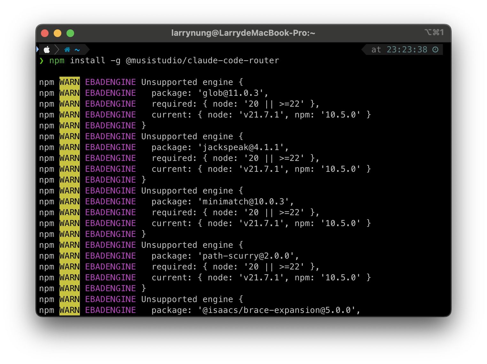
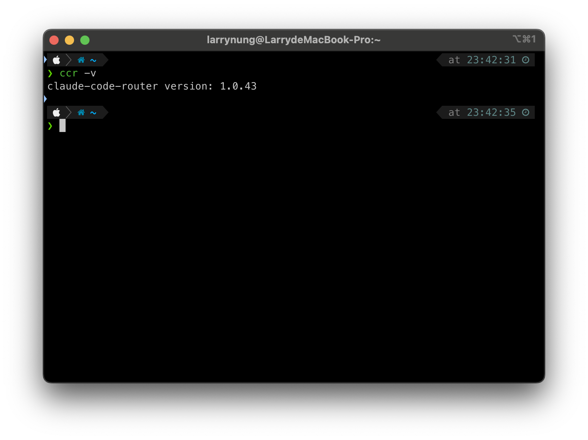
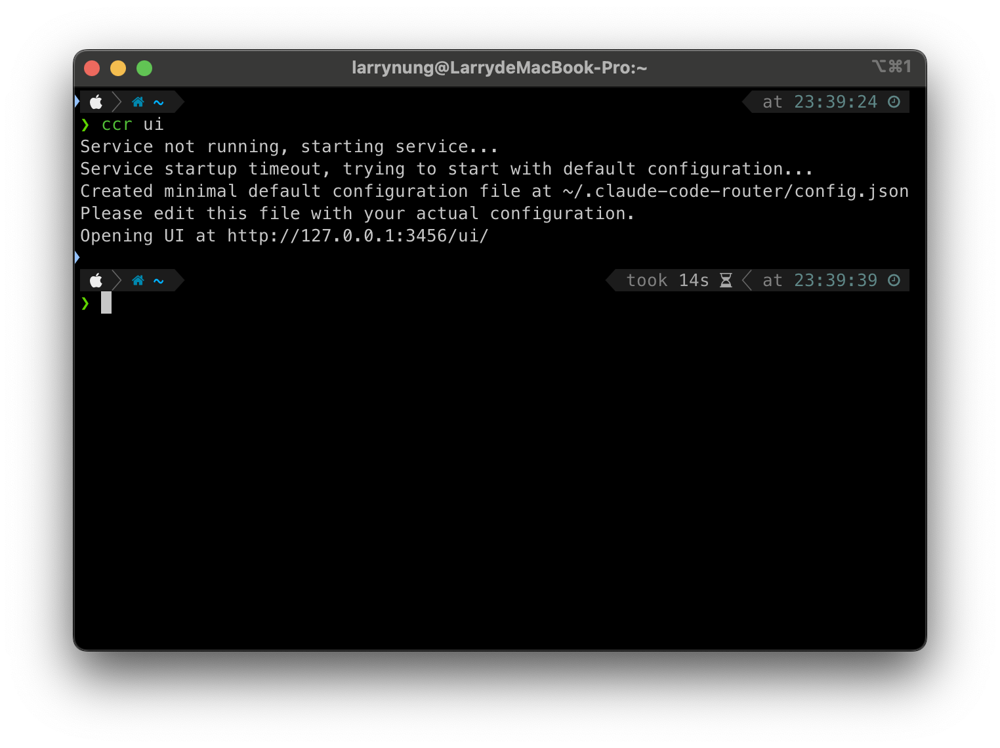
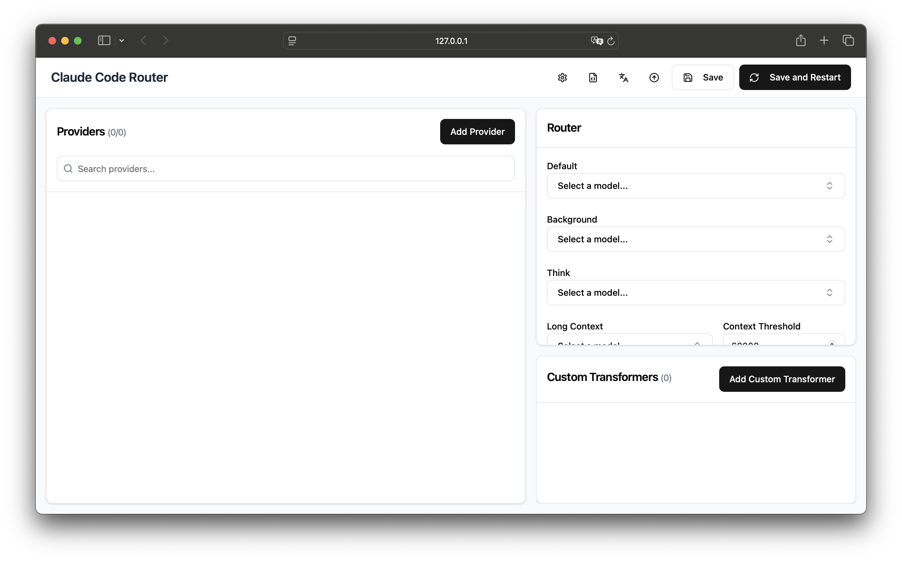
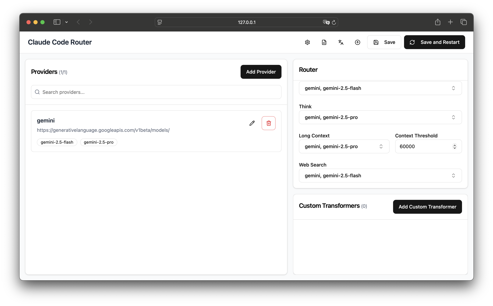
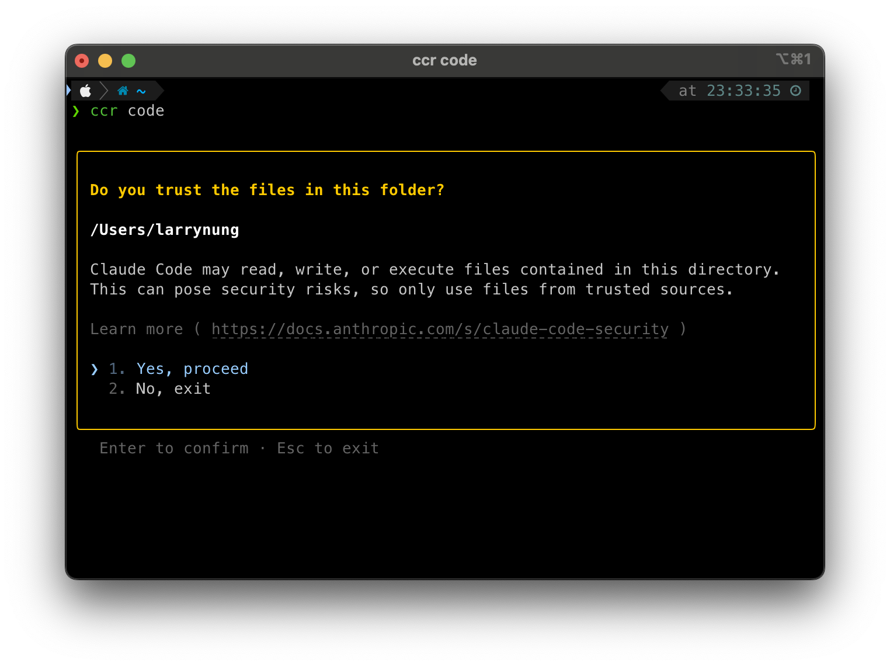

# Claude Code Router 入門指南

## 簡介

Claude Code Router 是一個強大的工具，幫助您管理和路由 Claude API 端點。本指南將帶您了解如何安裝、配置和使用 Claude Code Router。

## 安裝

使用以下命令全局安裝 Claude Code Router：

```bash
npm install -g @musistudio/claude-code-router
```



安裝完成後，您可以檢查版本號確認安裝成功：

```bash
ccr -v
```



## 配置

Claude Code Router 提供兩種配置方式，您可以選擇其中一種方式進行設置：

### 方法一：直接編輯配置文件

1. 創建並編輯 `~/.claude-code-router/config.json` 文件
2. 參考 [config.example.json](https://raw.githubusercontent.com/musistudio/claude-code-router/refs/heads/main/ui/config.example.json) 的範例進行配置
3. 修改完成後，重啟服務使變更生效：
   ```bash
   ccr restart
   ```

### 方法二：使用 Web UI 進行可視化配置

1. 啟動 Web UI：
   ```bash
   ccr ui
   ```
   
2. 在瀏覽器中訪問 [http://127.0.0.1:3456/ui/](http://127.0.0.1:3456/ui/)



3. 在 Web UI 中進行配置，所有變更會自動保存到配置文件中



> **注意**：兩種方式修改的配置會互相同步，Web UI 的變更會即時反映到配置文件中。

## 路由器配置說明

`Router` 物件定義了在不同場景下使用哪種模型：



- `default`：一般任務的預設模型
- `background`：後台任務使用的模型（可選用較小的本地模型以節省成本）
- `think`：用於推理密集型任務的模型（如計劃模式）
- `longContext`：處理長上下文（> 60K tokens）的模型
- `longContextThreshold`（可選）：觸發長上下文模型的 token 閾值（預設 60000）
- `webSearch`：用於網頁搜尋任務的模型（需模型支援，OpenRouter 用戶需在模型名稱後加上 `:online` 後綴）

## 動態切換模型

在 Claude Code 中，您可以使用以下命令動態切換模型：

```
/model provider_name,model_name
```

例如：
```
/model openrouter,anthropic/claude-3.5-sonnet
```

## 啟動 Claude Code 與 Router 整合

使用以下命令啟動 Claude Code 並啟用 Router 功能：

```bash
ccr code
```



> **注意**：修改配置文件後，需要重啟服務使變更生效：
> 
> ```bash
> ccr restart
> ```

## 參考資源

- [GitHub - musistudio/claude-code-router](https://github.com/musistudio/claude-code-router)