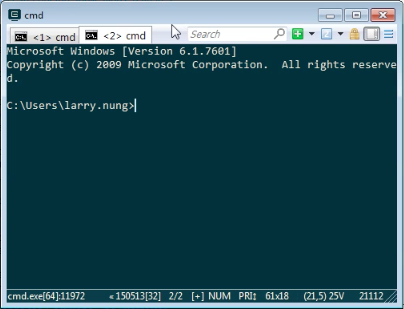

若要強制讓所有非由 Cmder 直接開啟的 Terminal 視窗都由 Cmder 開啟，可開啟 Cmder 的設定頁面。  

<!-- More -->

 
 

切到 [Integration | Default term] 頁面，勾選 Force ConEmu as default terminal for console applications 後存檔離開。  

 
 

這樣當我們開啟 MS-DOS 或是 PowerShell 時就會強制使用 Cmder 開啟。  

 
 

 
 
