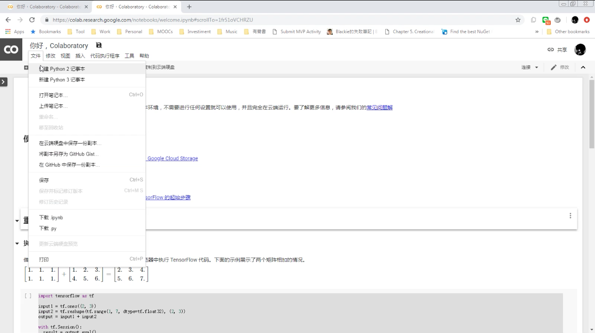
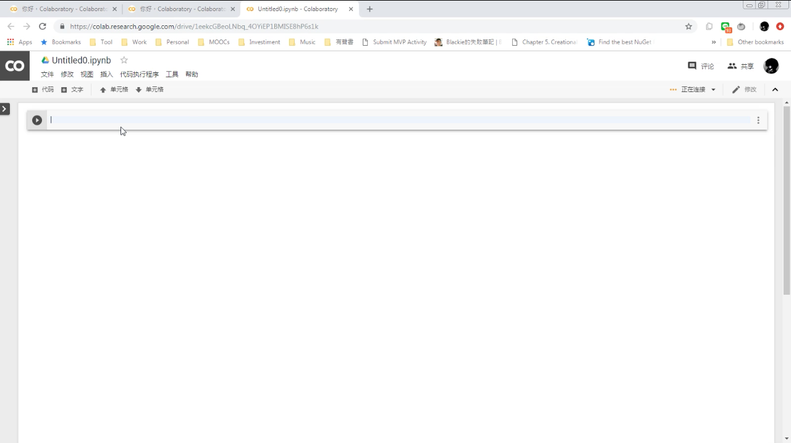
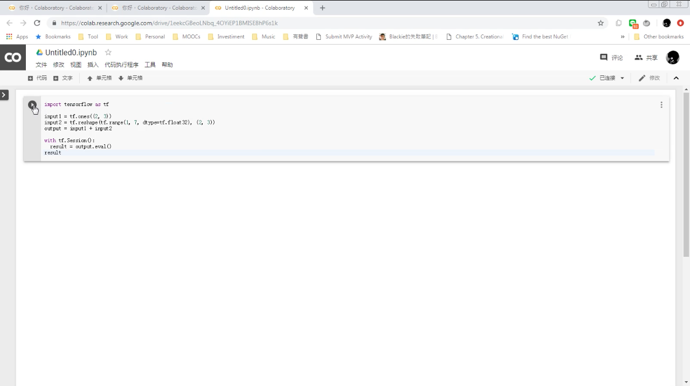
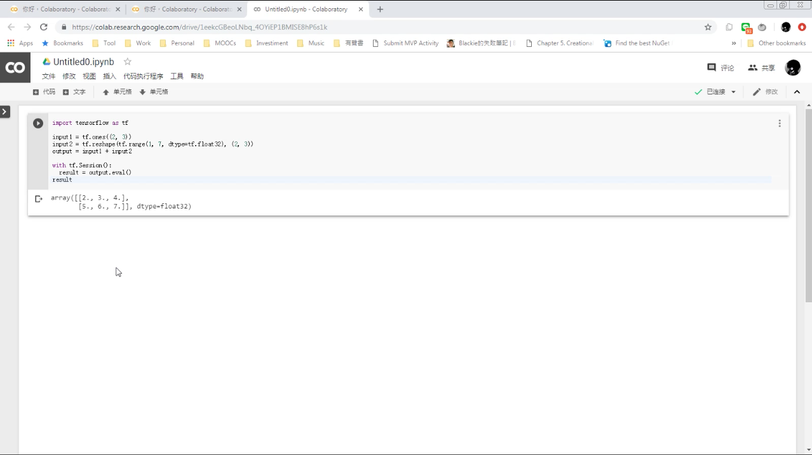
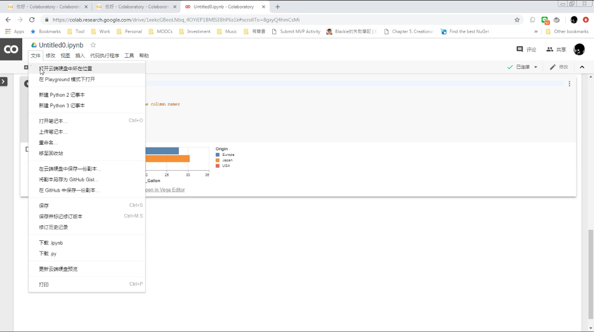
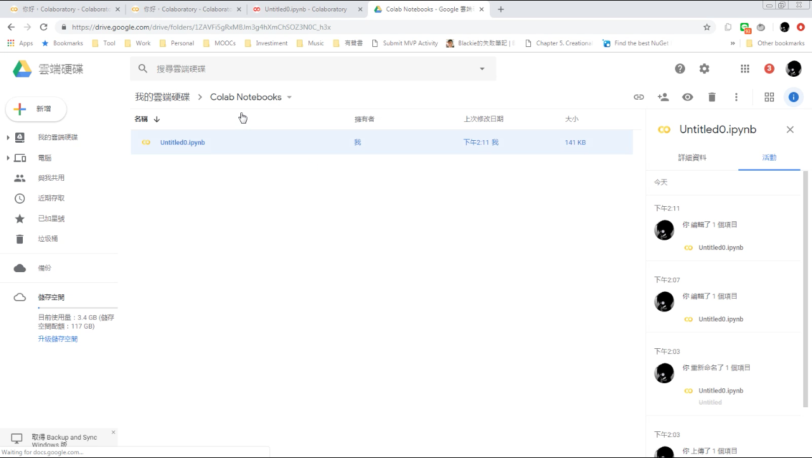

Colaboratory 是免費的 Jupyter Notebook。  

<!-- More -->

 

使用上可先新建記事本。  

 

記事本中內建會有一個代碼區塊，在裡面輸入要運行的程式。  

 

點選代碼區塊前方的執行按鈕。  

 

程式運行的結果就會被顯示在代碼區塊下方。

 

最後一提，Colaboratory 的檔案會被存放在雲端硬碟。  

 

 

Link
----
* [Colaboratory](https://colab.research.google.com)
* [Overview of Colaboratory Features - Colaboratory](https://colab.research.google.com/notebooks/basic_features_overview.ipynb)
