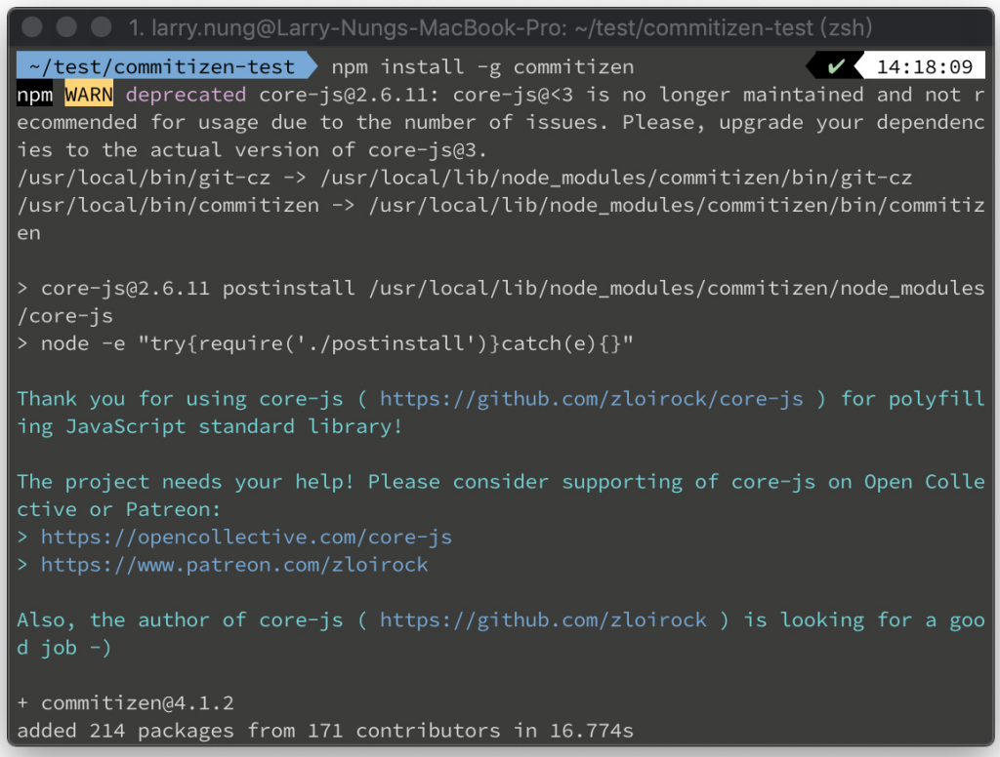
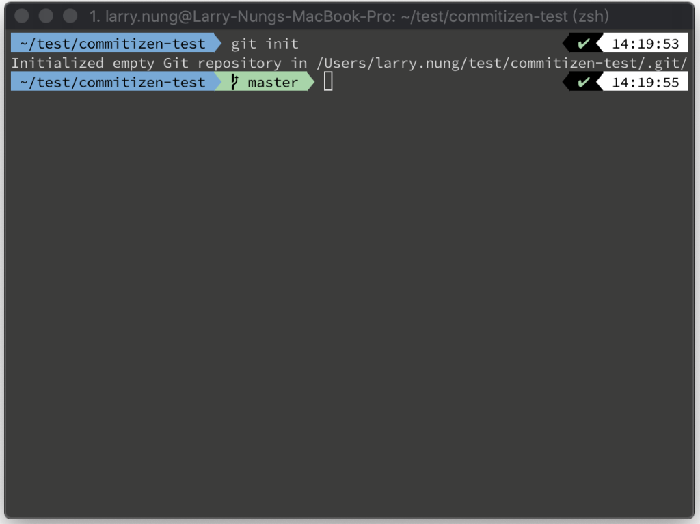
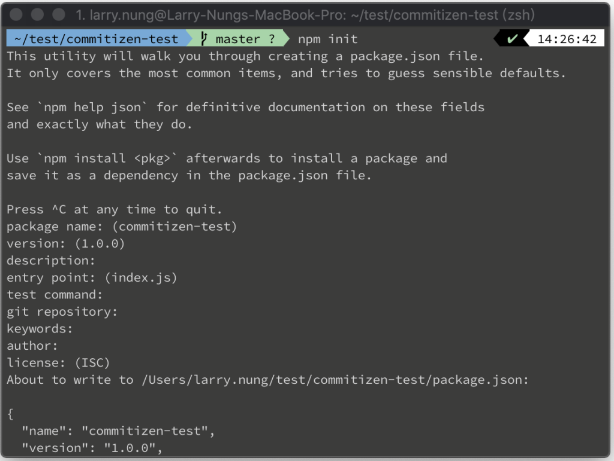
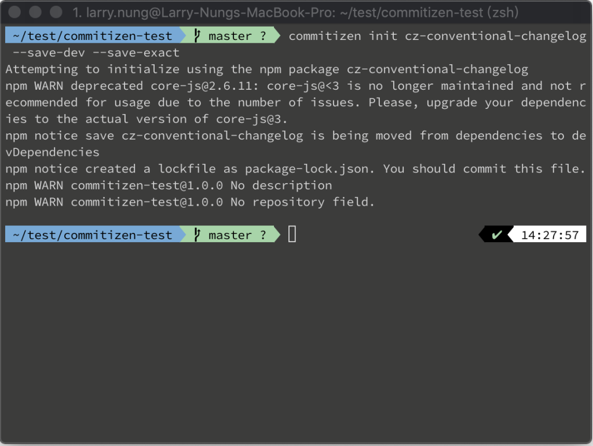
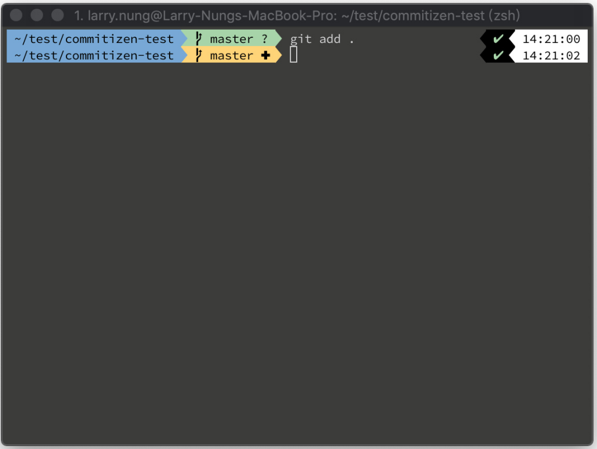
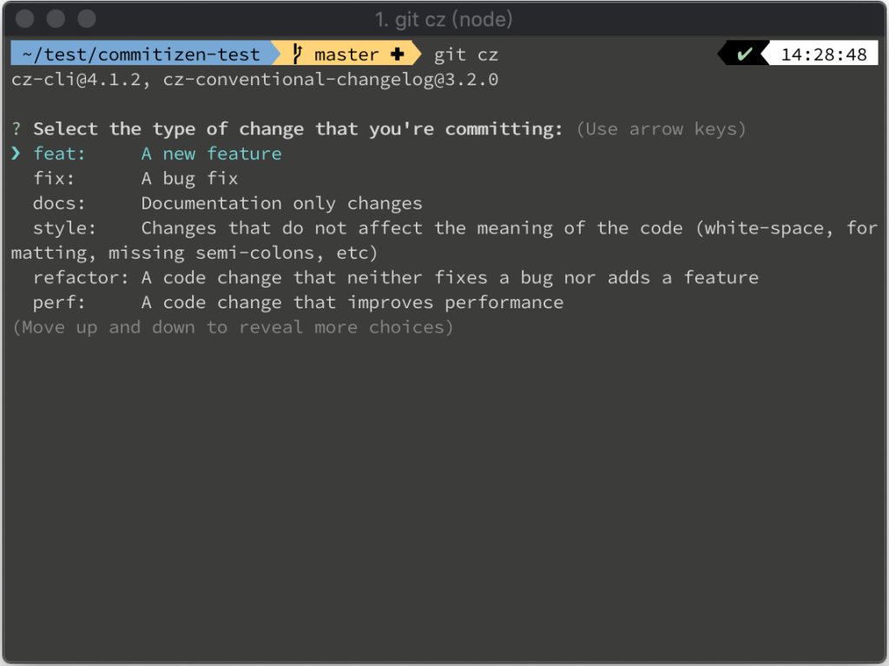
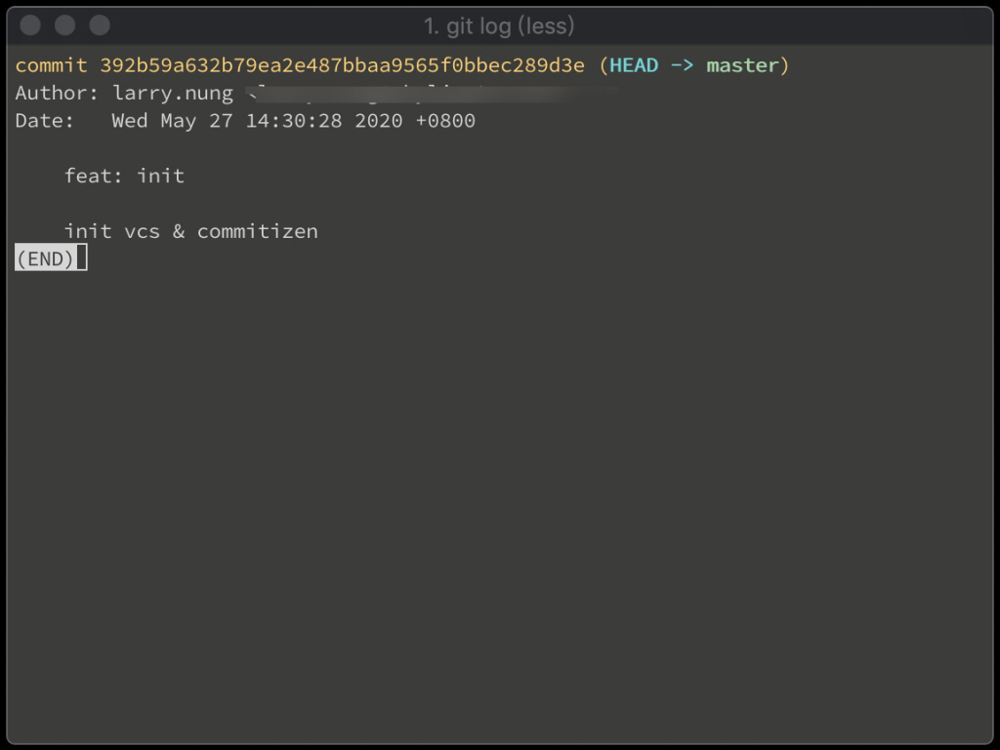

Commitizen 可輔助 git 操作人員使用 commit message 的規範。

使用上先全域安裝 commitizen 命令列工具。

npm install -g commitizen

這邊準備一個 git 版控的專案。

git init

加入 package.json。

npm init

調用命令讓專案符合 commitizen friendly。

commitizen init cz-conventional-changelog --save-dev --save-exact

將修改加入版控實際做個測試。

git add .

commit 時改用 git cz，會改成用互動方式輸入符合規範的 commit message。

git cz

git log

Link
=====
* [Commitizen by commitizen](http://commitizen.github.io/cz-cli/#making-your-repo-commitizen-friendly)