commitlint 是一檢測 commit message 的工具。

<!-- More -->

 

使用上需先全域安裝 commitlint cli。  

    npm install -g @commitlint/cli 

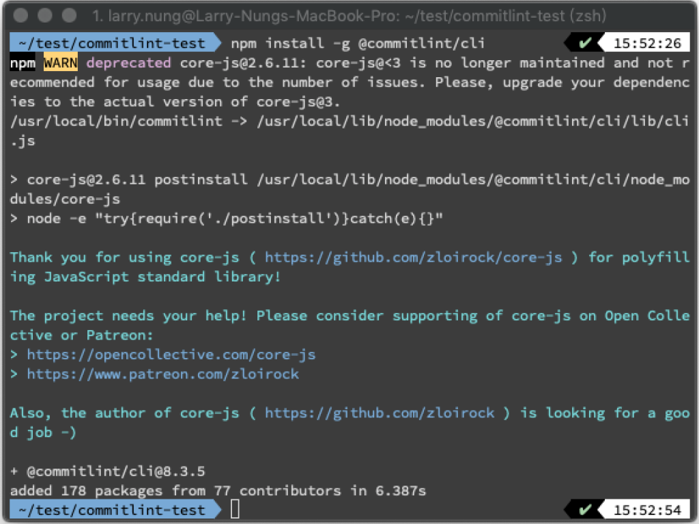

 

加入 package.json。  

    npm init

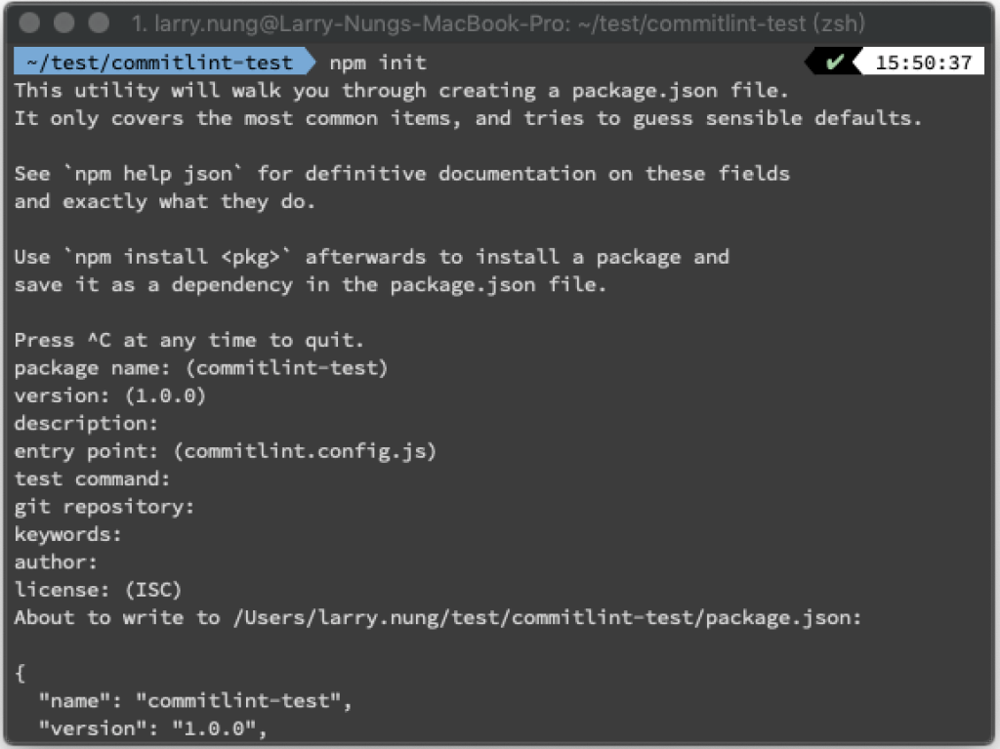

 

加入套件 @commitlint/config-conventional。  

    npm install -save @commitlint/config-conventional

 

加入 commitlint 設定檔。  

    echo "module.exports = {extends: ['@commitlint/config-conventional']}" > commitlint.config.js

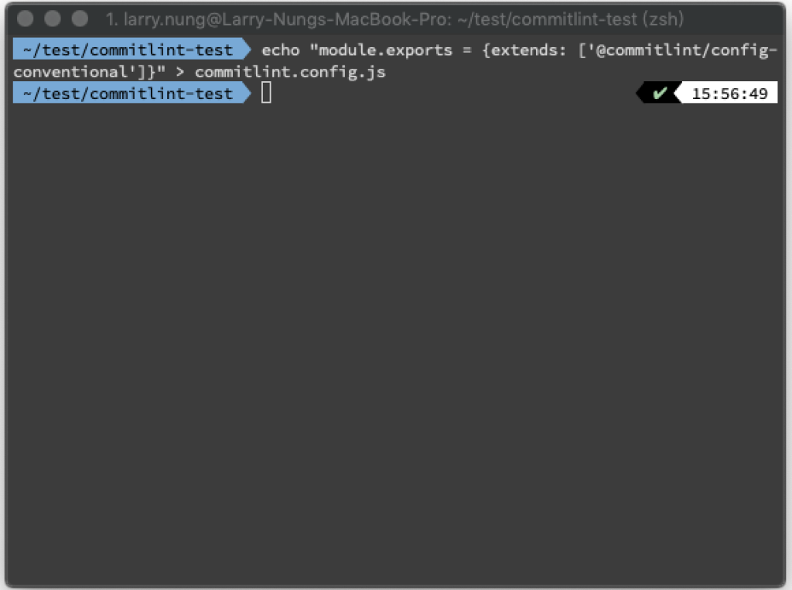

 

準備好後可簡易的用 echo 將訊息透過 pipeline 送到 commitlint 做些測試。  

    echo 'foo: bar' | commitlint

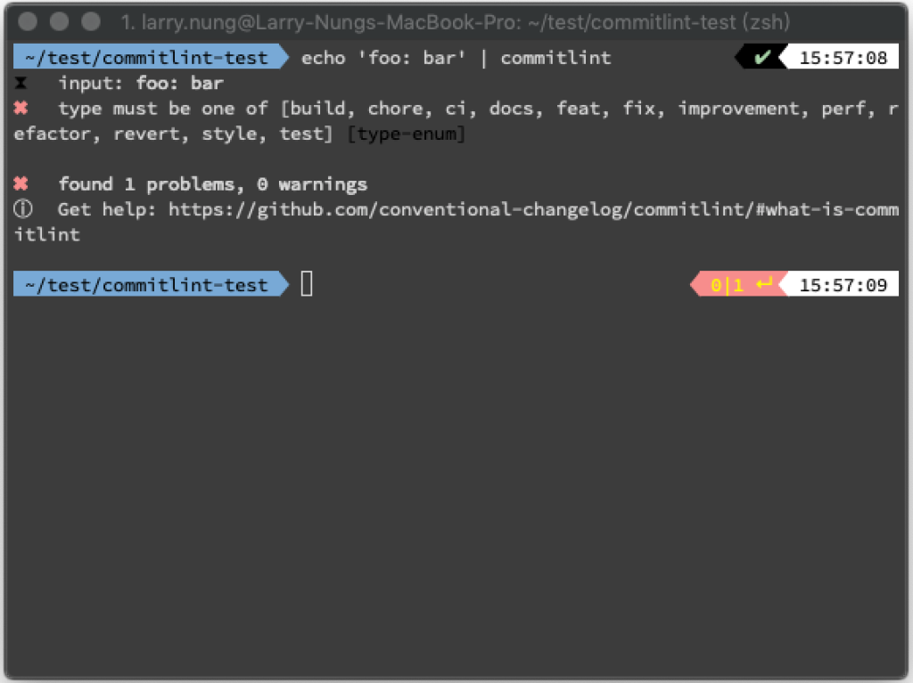

 

    echo 'feat: bar' | commitlint

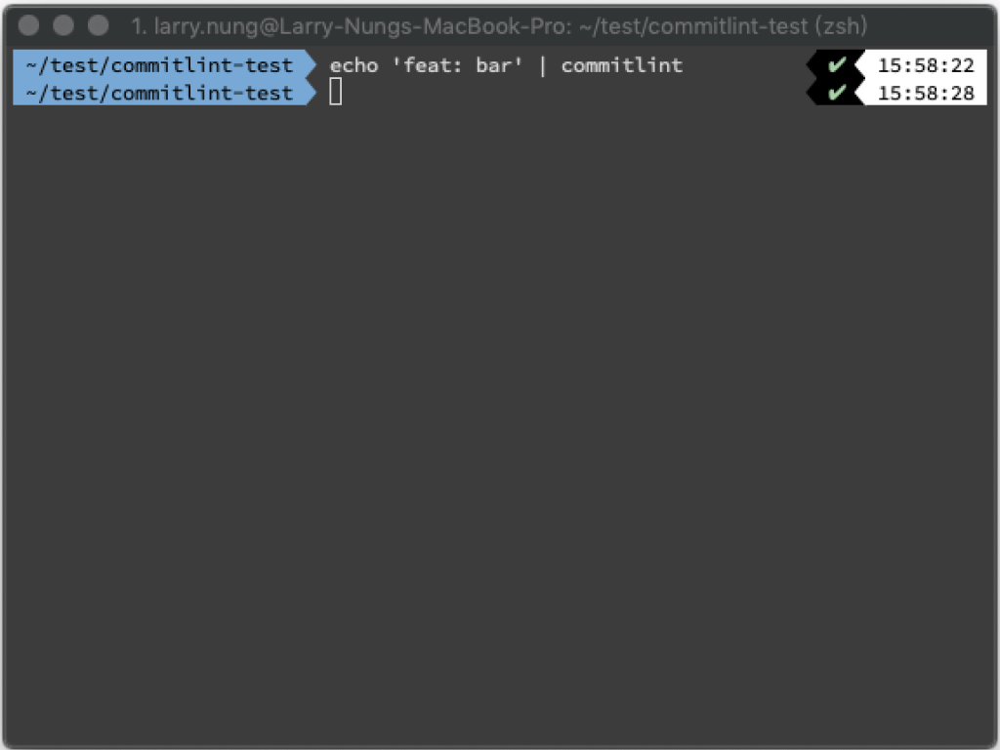

 

若要針對 git commit message 也是可以，這邊直接將當前專案加入 git 版控。  

    git init

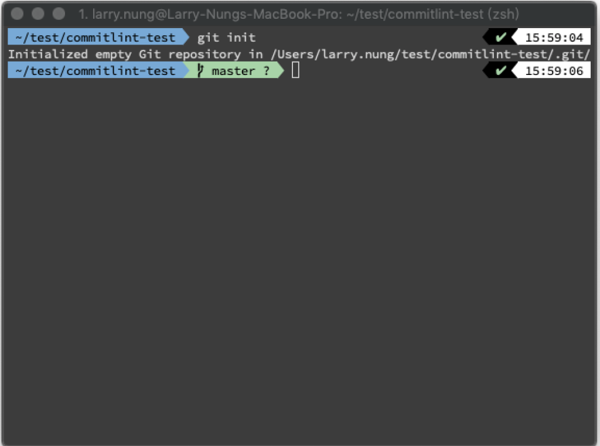

 

設定 .gitignore。  

    vim .gitignore

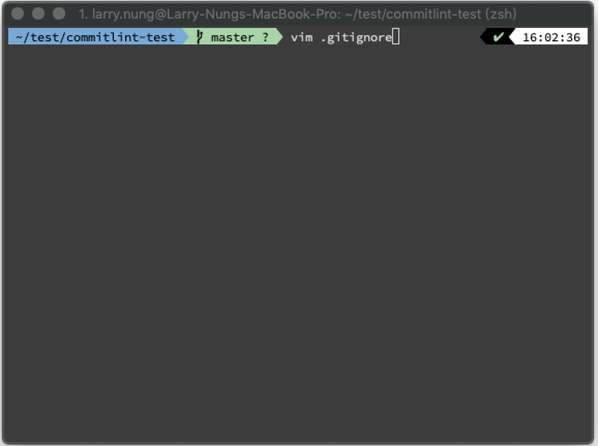

 

將 node_modules 這些不必要版控的部分設定上去。  

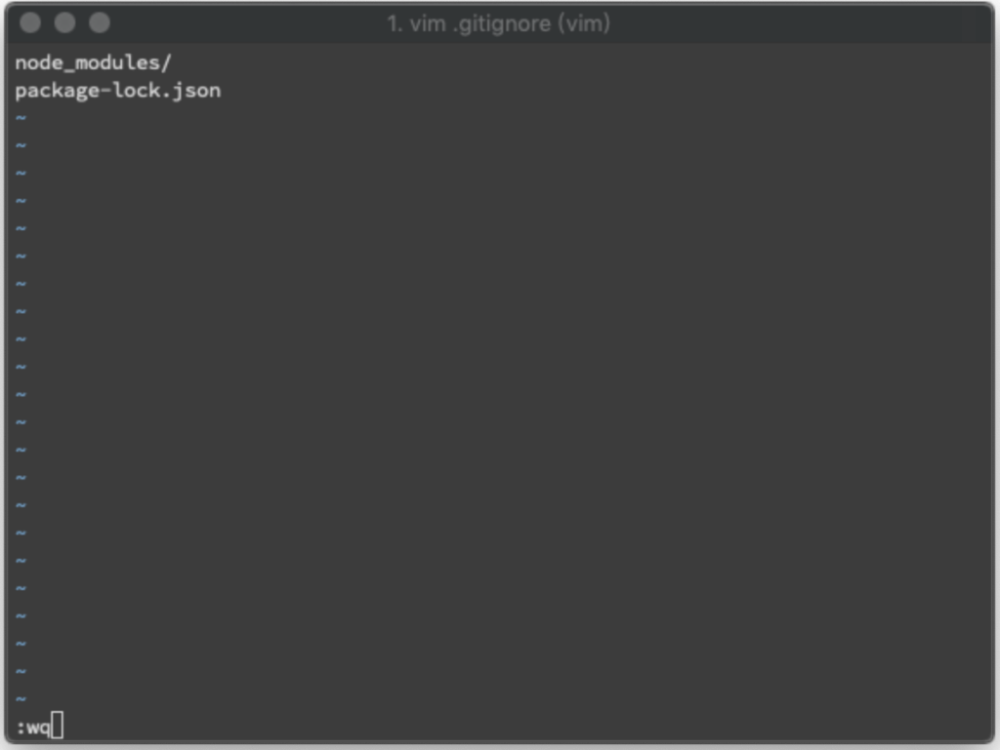

 

實際 commit 一個不符合規範的 commit message。    

    git add .

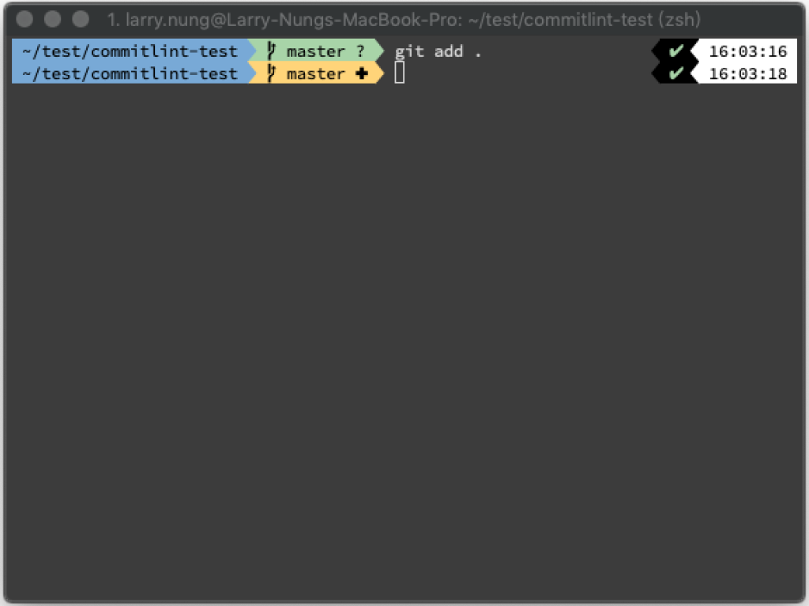

 

    git commit -m "foo: bar"

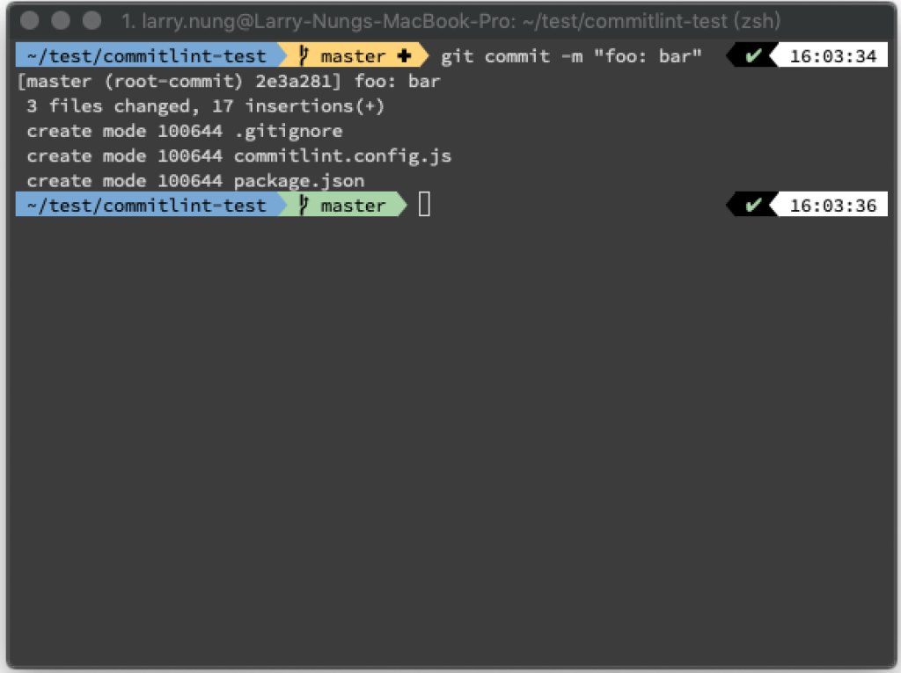

 

    git log

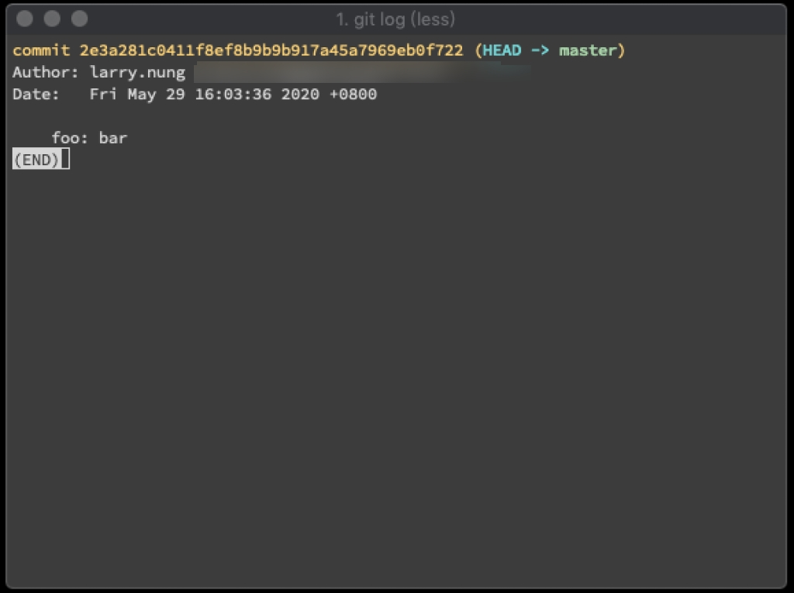

 

調用 commitlint 並帶入 --from=，commitlint 會去驗證 git commit message。  

    commitlint --from=

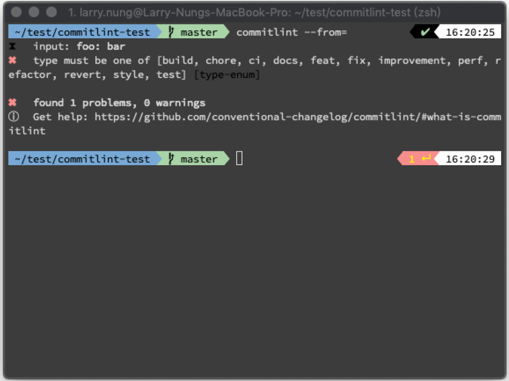

 

Link
====
* [commitlint - Lint commit messages](https://commitlint.js.org/#/?id=commitlint-nbsp-)
