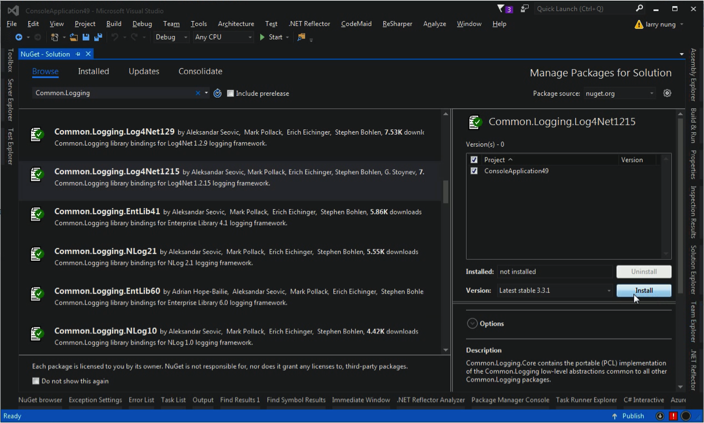
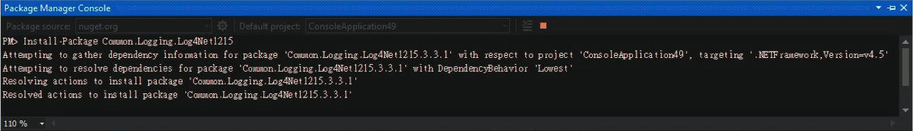
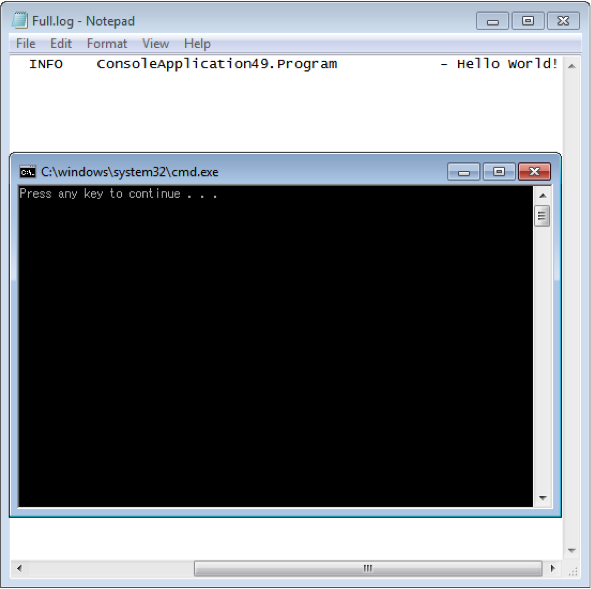

Common.Logging 是一 Log 元件，提供 Log 的抽象接口介面，以及許多不同的實作，支援 Log4net，Nlog，Microsoft Enterprise Library logging，Microsoft Application Insights，Microsoft Event Tracing for Windows，及 Serilog。  

使用上大概分為四個步驟，第一要安裝 Common.Logging 與 Adapter 的套件，接著要設定 Common.Logging，再來是設定 Adapter 的設定，最後就可以透過 Common.Logging 將 Log 寫入。  


Common.Logging 的套件透過 NuGet 安裝即可，這邊也可以直接安裝 Adapter 套件，像是要用 Log4Net 來寫 Log 的話，可以直接安裝 Common.Logging.Log4Net1215 這個套件。  





套件安裝完後要設定 Common.Logging，開啟設定檔設定 common 的 section group，在 common 的 section group 這邊要設定 Adapter 以及其參數，像這邊指定使用 Log4Net 的 Adapter 去處理 Log，指定並監控 Adapter 的設定檔 log4net.config。  

```xml

                --> 
                --> 

```

接著設定 Log4Net 設定檔。  

```xml

```

最後在程式中加入撰寫 Log 的程式：  

```c#
using Common.Logging; 
... 
var logger = LogManager.GetLogger(); 
logger.Info("Hello World!"); 
...
```

沒意外的話 Log 應該就會正常運作了。  



Link
----
* [Common.Logging](http://net-commons.github.io/common-logging/)
* [Common Infrastructure Libraries for .NET](http://netcommon.sourceforge.net/index.html)