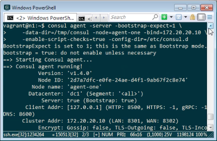
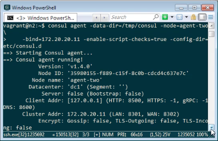
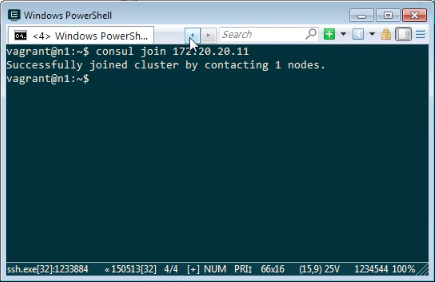
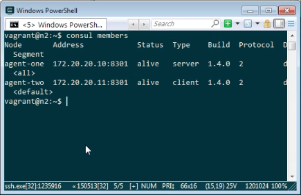

要設定 Consul Cluster，我們可以在一台電腦上用 Consul 命令啟用 Server 模式的 Agent。

consul agent -server -bootstrap-expect=1 \
-data-dir= -node= -bind= \
-enable-script-checks=true -config-dir=

然後在另外一台電腦用 Consul 命令啟用 Client 模式的 Agent。

consul agent -data-dir= -node= \
-bind= -enable-script-checks=true -config-dir=

使用 Consul 的 join 命令將他們加到同一個 Cluster。

consul join

調用 Consul 的 members 命令可查驗 Cluster 的組成，確認 Cluster 是否設定成功。

consul members

Link
----
* [Consul Cluster | Consul - HashiCorp Learn](https://learn.hashicorp.com/consul/getting-started/join)