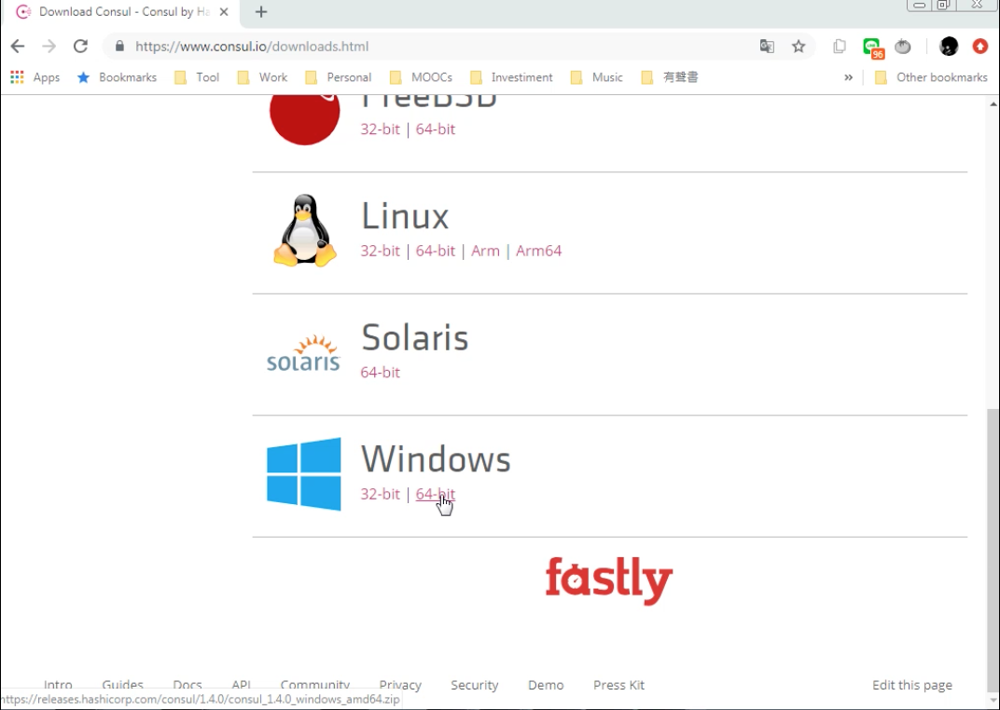
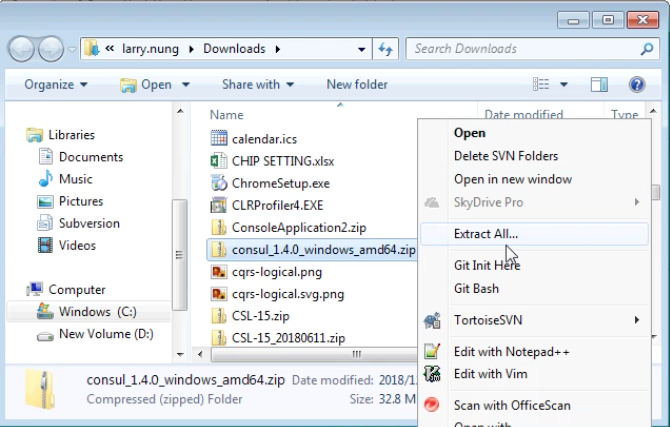
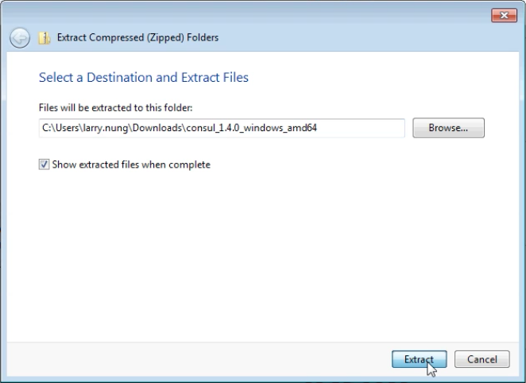
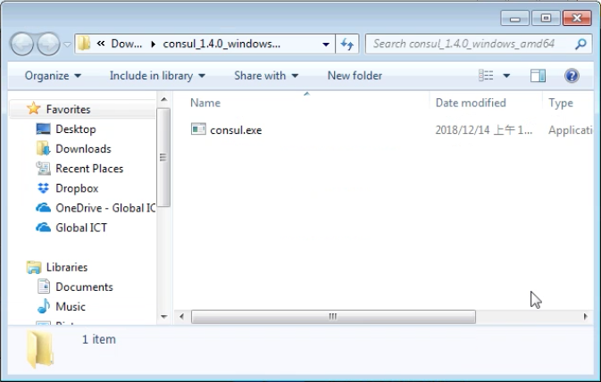
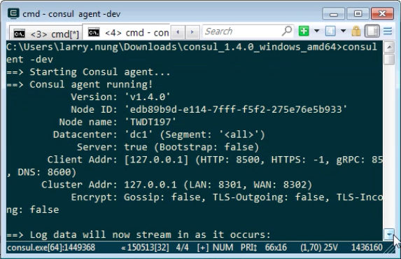

要在 Windows 安裝 Consul，要先在 [Download Consul - Consul by HashiCorp](https://www.consul.io/downloads.html) 這邊找到 Consul 檔案位置。

下載 Consul 檔案後解壓縮。

Consul 的安裝就完成了，可以簡單的輸入 Consul 命令做個測試。

Link
----
* [Install Consul | Consul - HashiCorp Learn](https://learn.hashicorp.com/consul/getting-started/install)
* [Download Consul - Consul by HashiCorp](https://www.consul.io/downloads.html)