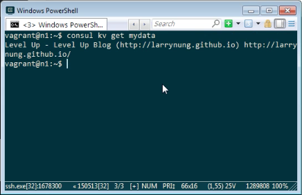

Consul 支援簡易的 Key-Value Store 功能。  

<!-- More -->

 

可用 consul kv put 將資料存入 Key-Value Store。  

    consul kv put <Key> <Value>

 

用 consul kv get 將資料取出。  

    consul kv get <Key>

 

可加帶 -detailed 參數取出更為詳細的資料，像是 Flags、ModifyIndex...等。  

    consul kv get -detailed <Key>

 

如果要設置資料的 Flags，可在放入資料時加帶 -flags 參數指定 Flags。  

    consul kv put -flags=<Flags> <Key> <Value>  

 

 

若要列出所有存放的資料，可用 consul kv get 加帶 -recurse 參數。  

    consul kv get -recurse

 

要刪除存放的特定資料，可使用 consul kv delete 帶入要刪除的 Key。  

    consul kv delete <Key>

 

 

要刪除存放的所有資料，可使用 consul kv delete 加帶 -recurse 參數。  

    consul kv delete -recurse

 

 

儲存資料的更新跟存放是一樣的，只要用 consul kv put 帶入相同的 Key 與新的存放值即可。  

 

Consul 也支援 CAS 方式的更新，先確認資料的 ModifyIndex。  

 

用 consul kv put 更新資料時，帶入 -cas 參數指定使用 Check-And-Set 的方式，帶入 -modify-index 參數指定 ModifyIndex，這樣舊只有 ModifyIndex 對得起來的命令會被成功運行。  

    consul kv put -cas -modify-index=<ModifyIndex> <Key> <Value>

 

Link
----
* [KV Data | Consul - HashiCorp Learn](https://learn.hashicorp.com/consul/getting-started/kv)
