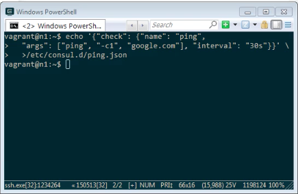
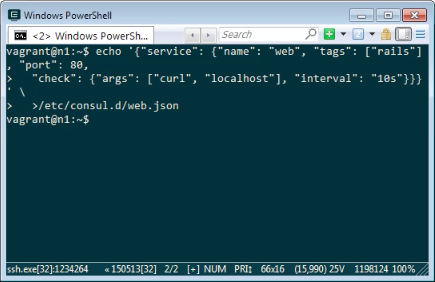
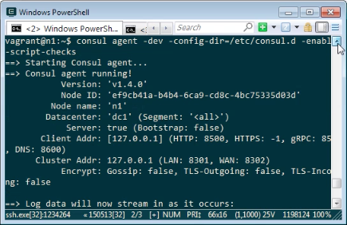
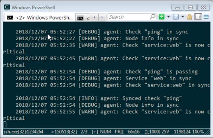
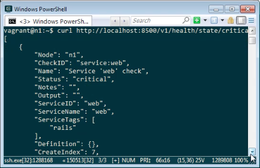
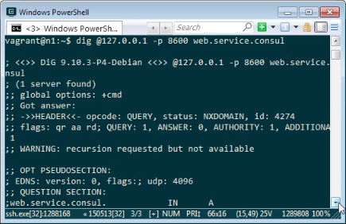
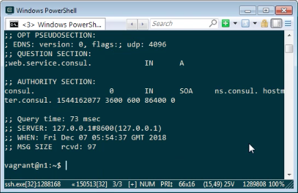

Consul health check 可透過 Consul config 設定，在 Consul config 加入 check definition。  

<!-- More -->

 

像是可以定義用定時去 ping 服務的方式去檢查服務的健康狀態。  

    echo '{"check": {"name": "ping", "args": ["ping", "-c1", "google.com"], "interval": "30s"}}' > /etc/consul.d/ping.json

 

或是定義定時用 curl 檢查服務的健康狀態。  

    echo '{"service": {"name": "web", "tags": ["rails"], "port": 80, "check": {"args": ["curl", "localhost"], "interval": "10s"}}}' > /etc/consul.d/web.json

 

定義好後啟用 Consul Agent，並帶入 enable_script_checks 參數。  

 

啟動後 Consul 會依設定定時去檢查服務的狀態，如果有檢測到服務異常，可在 Consul Agent 的訊息中看到警告訊息會標示服務目前是 Critical。  

 

要抓出異常服務的話，可用 HTTP API 檢測狀態為 Critical 的服務。   

    curl http://<IP>:<Port>/v1/health/state/critical

 

或是用 DNS API 直接檢測服務也可以，異常的服務不會正常的給予回應。  

    dig @<IP> -p <Port> <ServiceName>.service.consul

 

 

Link
