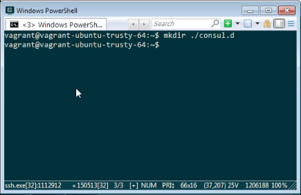
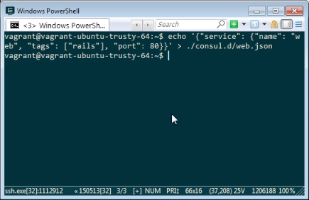
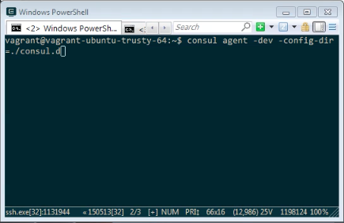
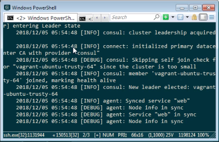
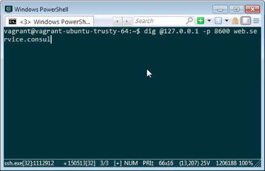
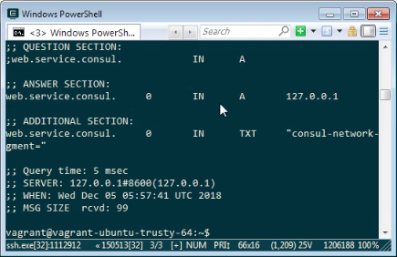
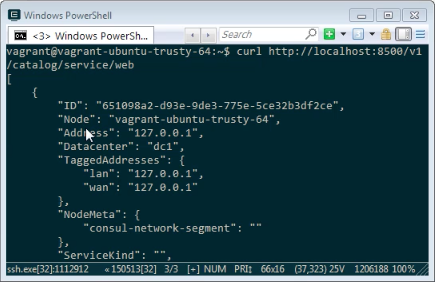

要使用 Consul 註冊服務，先準備一個目錄用來存放 Consul 的設定。

mkdir

在建立的設定檔目錄內放置 Consul 的設定檔，設定檔內會指定服務的名稱、Tag、與服務的 Port。

{"service": {"name": "", "tags": [""], "port": }}

設定檔準備好後，啟動 Consul agent，使用 -config-dir 參數指定設定檔目錄。

consul agent -dev -config-dir=

啟動後可用 DNS API 做個測試。

dig @ -p  .service.consul

或是用 HTTP API 測試也可以。

curl http:///v1/catalog/service/

Link
----
* [Registering Services | Consul - HashiCorp Learn](https://learn.hashicorp.com/consul/getting-started/services)